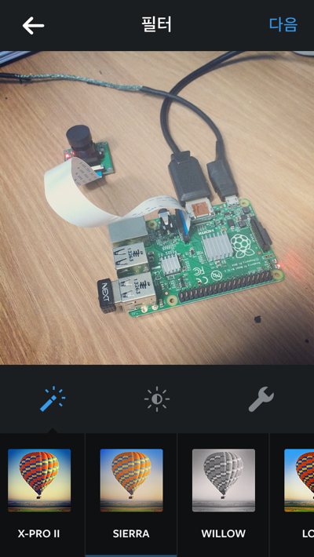
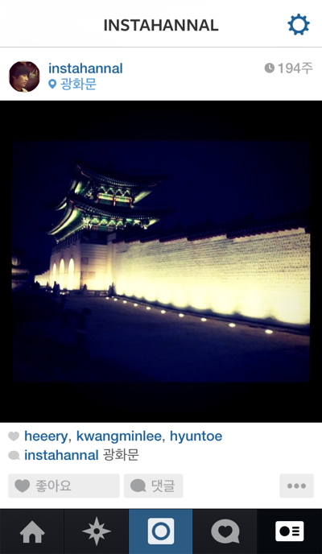
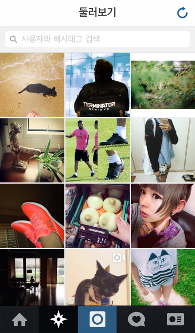
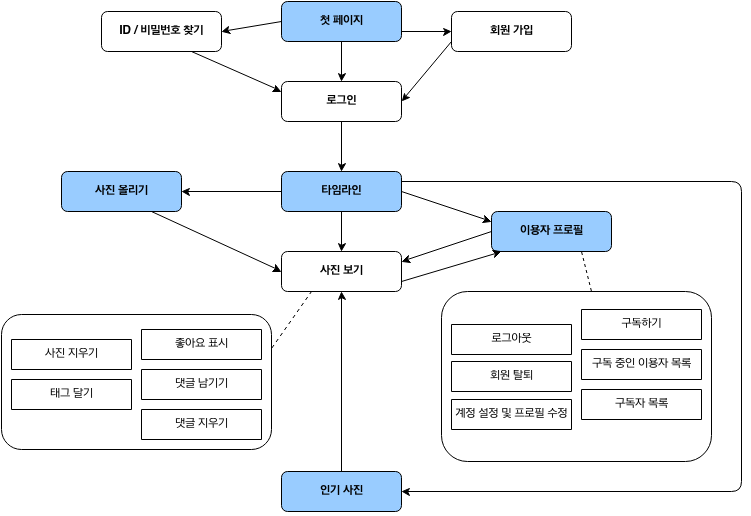

# Pystagram 기획

* 마지막 갱신일시 : 2014년 08월 16일 17시 40분

앞으로 우리는 Django를 이용해 [Instagram](http://www.instagram.com)과 비슷한 서비스를 만들 겁니다. 비슷한 서비스 중에는 [카카오 스토리](http://www.kakao.com/story?locale=ko)가 있지요. Django를 활용하여 만드는 것이지만 이름으로 조합하기 까다로우니 Python을 조합하여 Pystagram이라 이름을 짓도록 하겠습니다.

자, 이제 우리가 만들 것을 기획해 볼까요?

### 1. 개요

Instagram은 친구 및 가족들과 일상을 사진이나 동영상으로 찍어서 필터를 적용해 빠르고, 멋지고, 재미있게 공유할 수 있는 앱이라고 소개되어 있습니다. Pystagram은 Instagram을 기본으로 삼되 좀 더 단순하게 만들 겁니다. 그리고 쉽고 편하게 올리는 걸 최우선 정책 요소로 삼겠습니다. 이용자는 사진만 올릴 수 있고, 몇 가지 필터를 적용할 수 있습니다. 사진을 다루고 나면 동영상은 여러분이 직접 다룰 수 있게 될 겁니다. 

### 2. Pystagram 기능

#### (1) 사진

사진은 Pystagram에서 이용자가 활동하고 다른 사람과 교류하는 핵심 매체입니다. 서비스를 만드는 데 들어간 이미지를 제외한 모든 사진은 이용자가 올린 것이고, 이 사진에 댓글을 달거나 좋다는 표시를 남기지요. 이용자가 사진 관련해서 하는 행동을 기반으로 기능을 정리해 보겠습니다.

* 사진 올리기
	* 필터 적용
	* 미리보기 이미지(thumbnail image)
	* 사진 자르기, 크기 조절
* 사진 보기
	* 좋아요 표시 남기기
	* 댓글 남기기, 지우기
* 사진 삭제
* 사람 태그 달기

##### 사진 올리기

가장 기본 행동이죠. 사진은 오직 이용자 자신의 공간에만 올리며, 로그인한 모든 이용자가 사용하는 기능입니다. 

자신의 공간에만 올린다는 건, 서비스 안에서 사진을 소유한 사람이 누구이며, 그 권한 범위가 어디까지인지 정의한 것입니다. 다른 이용자의 공간에 사진을 올리거나 공용 공간에 사진을 올리지 않는다는 것이지요. 로그인한 모든 이용자가 사용하는 기능이란, 이용자는 서비스를 이용하려면 가입하고 로그인해야 대상을 뜻하며, 이용자라면 누구나 공통되게 사진을 올릴 수 있다는 의미입니다.

* 로그인한 이용자만 사진을 올린다.
* 사진은 이용자의 개인 공간에 올린다.

이용자는 사진을 쉽고 편하게 보정해 올릴 수 있습니다. 쉽고 편하게 하는 것이 중요합니다. 그래서 여러 보정 요소와 수치가 미리 조정된(preset) 필터를 골라서 적용하며, 이용자가 직접 정교하게 보정 요소를 조정하지 못합니다. 필터는 한 번에 하나만 고르도록 하겠습니다. 여러 가지를 중첩하면 사진이 지저분해지기 일쑤이고, 지저분해진 상태를 해제하려고 이전 단계로 돌아가는 식으로 편집 단계나 기능이 들어가면 쉽고 편하게 하겠다는 목표를 잃을 것이기 때문이지요. 그리고 이 목표를 위해 이용자는 사진을 올리는 과정 중에만 필터를 적용하며, 사진을 올리고 나면 더는 편집할 수 없습니다.

* 미리 만들어진 필터를 제공하고, 이용자는 필터를 선택해서 사진을 보정한다.
* 사진을 올릴 때에만 보정하며, 이미 올라간 사진은 보정할 수 없다.

Instagram은 가로(width) 640픽셀, 세로(height) 640픽셀짜리 정사각형 사진만 표시됩니다. 그런데 사진은 대개 직사각형이므로 정사각형 모양으로 잘라야 하는데, Instagram은 사진을 편집하는 과정 중에 정사각형 틀에 맞추어 사진을 잘라내도록 합니다. 

우리는 좀 더 단순하게 할 예정입니다. 사진을 축소한 다음에 정사각형으로 잘라내는 거죠. 어쨌든 Pystagram도 정사각형으로 사진을 잘라냅시다. 크기는 Instagram과 같게 640x640으로 하겠습니다. 그런데 이용자가 가로나 세로 길이 중 어느 하나라도 640픽셀보다 작은 사진을 올리면 어떻게 할까요? 이런 사진을 받아들인다면 640픽셀로 사진을 늘려야 하는데, 사진을 늘리면 픽셀이 뭉개져서 썩 예쁘지 않습니다. 예쁘지 않은 사진을 올려서 손해 보는 건 엄밀히 말해 이용자이지만, 물 관리(?) 차원에서 품질이 너무 떨어지는 사진은 걸러내고자 합니다. 멋진 사진은 아니더라도 크기(길이)만은 최소한 지켜야 하는 품질을 제한하는 거죠. 그래서 가로, 세로 중 어느 한 변이라도 640픽셀보다 짧은 사진은 등록할 수 없도록 하겠습니다.

이외 더 필요한 기능은 뭐가 있을까요? 미리보기 이미지(Thumbnail image)를 만들어야겠네요. 굉장히 자주 표시(호출)될 테니 최종 결과물 사진이 저장될 때마다 미리보기 이미지도 생성해야 합니다.

* 사진은 가로나 세로 길이 모두 640픽셀 이상이어야 한다.
* 최종 결과물은 640x640 정사각형으로 표시하며, 이 크기에 맞게 비율 축소/확대하거나 자른다. 이용자가 표현할 영역을 지정할 순 없다.
* 최종 결과물 사진을 저장할 때 미리보기 이미지(thumbnail image)를 만들어 저장한다.

자, 마지막으로 사진을 올릴 때 서버에 접근할 URL(Uniform Resource Locator)을 정하겠습니다. 웹과는 달리 모바일에서는 이용자가 사진을 올릴 URL을 알 필요가 없습니다. 입력하기 편하든 어렵든 상관없지요. 대신 우리는 URL을 보면 이게 어떤 작동을 하고 어떤 클래스나 함수와 관련되는지 바로 알아보기 편한 게 좋을 것 같습니다. 주소 그 자체가 자원이나 행동을 표현하는 거지요. 나중에 주소는 다시 다듬기로 하고 일단은 다음가 같은 주소로 접근해서 사진을 올리도록 하겠습니다.

protocol://domain/photo/upload/

간단히 줄여서 /photo/upload/ 입니다. 이 주소는 나중에 /photo/ 로 바꿀 겁니다. 걱정 마세요. Django에서 URL을 바꾸고 그 URL에 관련된 기능을 연결하는 건 아주 쉽고 간단합니다. 이 주소 하나로 사진 올리는 인터페이스와 사진을 실제로 받아서 처리하는 기능 모두 처리할 겁니다.

##### 사진 보기

사진 올리기만큼이나 기본 기능입니다. Pystagram에서 사진을 보는 경로는 크게 두 가지입니다. 하나는 목록으로 여러 사진을 보는 것이고, 다른 하나는 개별 사진을 보는 것입니다. Instagram은 모바일이 기본 영역이고 모바일에서 돌아가는 서비스 내 사진을 인터넷에서 접근하여 보는 것이 보조 기능이어서 개별 사진을 보는 것도 모바일에서 보는 것과 웹에서 보는 것을 구분했습니다. 대신 웹에서 여러 사진을 목록으로 볼 수 없습니다. 그런 페이지를 제공하지 않거든요. 그리고 모바일에서는 개별로 보든 목록 중에 보든 같은 화면인데, 우리도 그렇게 하겠습니다.

* 사진은 목록 형식으로 나열하거나 개별 사진만 따로 본다.
* 모바일에서는 목록으로 보든 개별로 보든 동일한 화면 디자인을 따른다.
* 웹에 개별 사진 단위로 게재(공유)할 수 있으며, 별도 화면 디자인을 따른다.
* 웹에서는 개별 사진만 볼 수 있다.

각 사진에 표시할 정보를 살펴봅시다. 그다지 많지 않습니다. 먼저 사진을 올릴 때 발생하는 정보로는 최종 결과물 사진, 올린 사람, 작성일시, 사진에 넣은 본문 정도입니다. 사진에 관련된 사람이 누구인지 태그를 달 수도 있는데, 이 태그 거는 건 손도 많이 가고 번거로우니 사진을 편집하고 올리는 과정에서는 빼겠습니다. 쉽고 편하게, 쉽고 편하게. ^^

이미 올라간 사진에 이용자가 추가 행동을 하고, 이 내용도 화면에 표시돼야 합니다. 누가 사진에 남겨진 하트(좋아요) 표식을 남겼는지, 댓글은 뭐가 있으며, 관련된 사람으로 태그 걸린 사람은 누구인지, 그리고 이외 행동을 선택하는 버튼도 필요하고요. Instagram은 관련된 위치도 지정할 수 있는데, 이 기능은 일단 빼겠습니다.

댓글도 단순하게 가겠습니다. 작성자와 댓글 본문, 작성일시. 댓글 작성자는 자신의 댓글에 한하여, 댓글이 달린 사진의 소유자는 사진에 달린 댓글에 한하여 댓글을 지우는 삭제 버튼이 출력돼야 합니다. 그리고 댓글에 답글을 달면 답글을 받은 사람에게 알려주면 좋겠네요. 

* 사진을 올릴 때 생성된 정보 : 최종결과물 사진, 작성자, 작성일시, 본문
* 사진에 추가되는 정보 : 좋아요 버튼, 좋아요 표시 남긴 사람, 댓글, 태그 걸린 사람
    * 댓글 정보 : 작성자, 댓글 본문, 작성일시
    * 댓글 관련 행동 : 삭제 버튼, 사용자 지정해서 댓글 달기

기본 기획은 이 정도로 하고, 필요한 기능이 있으면 나중에 따로 다루도록 하겠습니다. ^^

이제 사진 관련 URL을 정하겠습니다. 사진을 목록으로 보는 상황은 따로 기획하기로 하고, 개별 사진을 보고, 그 사진에 댓글을 달거나 좋아요를 누르는 행동을 하는 URL부터 정하지요.

개별 사진을 보는 건 /photo/<사진 ID>/로 하겠습니다. 사진 ID 양옆에 있는 꺾쇠는 가변하는 값을 뜻합니다. 사진 ID가 1일 수도 있고 2일 수도 있으니까요. 사진에 좋아요를 누르는 건 어떻게 할까요? /like/<사진 ID>/ 라고 해도 나쁘지 않지만, /like/ 문자열 뒤에 숫자만 있으면 이게 사진 ID를 뜻하는 것인지 좋아요 행위 자체를 기록한 좋아요 ID인지 잘 구분되지 않습니다. 우리는 특정 사진(/photo/<사진 ID>/)에 좋아요 표시를(like) 남기는 것이니 /photo/<사진 ID>/like/ 으로 좋아요 행위를 일으키는 URL을 하도록 하겠습니다. 행위나 자원을 나타내는 문자열이 있고, 그 문자열의 대상이 되는 값(ID)를 적는 구조이지요.

댓글도 마찬가지 규칙을 따르겠습니다. 댓글은 특정 사진에 다는 것이니까 /photo/<사진 ID>/comment/ 로 하겠습니다. 특정 댓글을 지우려면 어떤 댓글인지 알아야겠지요? 앞서 정한 규칙에 따라 /photo/<사진 ID>/comment/<댓글 ID>/delete/ 로 하겠습니다. /comment/<댓글 ID>/delete/ 로 해도 별 상관없습니다. 이후 강좌에서 이와 관련된 내용을 다루겠습니다.

사진에 달린 댓글은 어떻게 가져와야 할까요? /photo/<사진 ID>/comment/ 이 URL은 특정 댓글을 지칭하는 데 사용하는 주소 규칙입니다. 사진에 달린 댓글은 comment를 복수형으로 취해 /photo/<사진 ID>/comments/ 로 하겠습니다. s 한 글자 차이라서 구분이 잘 안 간다고요? 일리 있는 지적입니다. 그럼 눈에 확 들어오게 /photo/<사진 ID>/get_comments/ 라고 하겠습니다. 일단은요.

태그도 좋아요나 댓글과 별다를 바 없습니다. /photo/<사진 ID>/tag/ 라고 하겠습니다. 

개별 사진과 관련된 URL을 정리해 보겠습니다.

* 개별 사진 보기 : /photo/<사진 ID>/
* 사진에 좋아요 누르기 : /photo/<사진 ID>/like/
* 사진에 댓글 달기 : /photo/<사진 ID>/comment/
    * 사진에 달린 댓글 가져오기 : /photo/<사진 ID>/get_comments/
    * 사진에 달린 댓글 지우기 : /photo/<사진 ID>/comment/<댓글 ID>/delete/
* 사진에 태그 달기 : /photo/<사진 ID>/tag/

##### 여러 사진 보기

사진을 여러 개 나열해서 보는 상황은 어떠한 경우일까요? 우선 이용자가 자신이 올린 사진들을 보는 경우가 있습니다. 내가 구독(following)하는 이용자들이 올린 사진을 보는 경우도 있고, 사람이나 기계가 추려낸 사진들, 가령 인기 사진들도 여러 사진을 보는 경우입니다. 더 다양한 경우가 있겠지만 우리는 이 세 경우만 만들도록 하겠습니다.

여러 사진을 보는 이 세 페이지는 오직 모바일에서만 이용할 수 있습니다. 그리고 모바일에서는 개별 사진을 따로 보는 화면 디자인이나 목록으로 나열된 개별 사진의 화면 디자인을 굳이 구분할 필요는 없습니다. 개별 사진 영역을 반복 출력하면 되니까요. 결국 출력되는 사진만 다를 뿐, 화면 디자인 요소는 이 세 페이지가 같습니다. 그렇다면 따로 화면 디자인을 할 필요가 없겠군요. 사진 보기 기획할 때 다 했으니까요. ^^

그럼 각 페이지 별 기획을 하겠습니다. 먼저 내가 구독(following)하고 있는 이용자들이 올린 사진을 보는 페이지부터 볼까요. 페이스북이나 트위터를 이용하신다면 타임라인(timeline)이라는 페이지나 기능에 익숙하실 겁니다. 자신의 글이나 사진을 포함해서 친구, 혹은 나와 관련된 컨텐츠를 시간 역순으로 나열하는 컨텐츠 연대표이죠. 

이용자의 타임라인은 모든 이용자가 이용하는 기능이지만 이용자마다 표시되는 내용이 다른 공간입니다. 누구나 쓰는 공통 기능이며 다른 이용자가 내 타인라인을 볼 수 없으므로 굳이 타임라인 페이지를 URL로 구분할 필요는 없습니다. 그래서 /timeline/이라는 URL을 쓰겠습니다. 타임라인에는 어떤 정보를 표시하면 좋을까요? 자신이 올린 사진, 구독하는(following) 이용자의 사진, 나를 태그한 사진, 나를 언급한 댓글이 있는 사진을 가져와서 출력하면 얼추 그럴싸한 타임라인이 될 것 같습니다. 자세한 건 이 기능을 구현할 때 다루겠습니다.

이번엔 선정된 사진을 보는 곳. 뭘 기준으로 선정할까요? 무난하게 정해진 시간 동안 인기를 끈 사진을 가져오는 인기 사진을 가져오도록 하겠습니다. 주소는 모든 이용자가 동일한 내용을 보는 공동 구역이니 그에 어울리는 URL로 정해야겠네요. /popular/로 하겠습니다.

마지막으로 이용자가 자신이 올린 사진들을 보는 건 이용자 프로필 페이지에서 다루겠습니다. URL만 먼저 정하자면, /user/<이용자 ID>/ 로 하겠습니다.

그럼 여러 사진을 보는 페이지와 관련된 URL을 정리해 보지요.

* 인기 사진 : /popular/
* 이용자 개별 타임라인 : /timeline/
* 특정 이용자가 올린 사진 : /user/<이용자 ID>/

##### 사진 삭제

사진 삭제는 간단합니다. 자신의 사진에 한해서 삭제하며, 개별 사진 영역에서 사진 삭제 버튼을 눌러서 지우면 됩니다. 지울 때 정말 지울 건지 한 번 더 물어보면 좋겠고요.

사진을 지우는 URL은 사진에 좋아요 표시를 남기거나 댓글을 남기는 규칙을 따르면 됩니다.

/photo/<사진 ID>/delete/

사진을 지우면 사진 파일도 지우고, 사진에 달린 활동들도 지우도록 하겠습니다.

#### (2) 이용자

이용자 관련 기능은 그다지 많진 않습니다.

* 회원 가입과 탈퇴
* 로그인, 로그아웃
* 비밀번호 찾기
* 프로필 보기
* 구독하기 (팔로잉(following) 기능)

##### 회원 가입

Instagram엔 직접 가입하는 방법과 페이스북으로 연결하여 가입하는 방법으로 회원 가입합니다. Pystagram은 ID와 비밀번호를 입력하여 직접 가입하는 방법을 기본으로 하겠습니다. 페이스북으로 연결하여 가입하는 기능은 직접 구현하진 않고 원리나 방식만 설명할 예정입니다.

회원 가입에 필요한 정보는 간단하게 받습니다. 사용할 ID, 비밀번호, 그리고 전자우편 주소. 그외 정보는 가입한 후에 언제든지 입력하도록 합니다. 다만 봇(bot)으로 계정을 막 생성하려는 나쁜 사람도 있으니 [캡챠(Captcha)](http://ko.wikipedia.org/wiki/CAPTCHA) 기능을 구현할 필요는 있어 보입니다. 이용자가 회원 가입에 필요한 정보를 제출하면 전자우편 주소가 실제로 존재하는지 확인도 해보겠습니다. 가입 확인 전자우편을 보내는 거죠. 전자우편 주소 확인을 받지 않은 이용자는 로그인만 할 수 있고 나머지 기능은 사용할 수 없도록 권한을 제한합니다.

회원 가입 URL은 /accounts/registration/ 을 쓰도록 하겠습니다. 좀 긴데, 의미 전달성이 좋고 이용자가 저 URL을 인지할 일이 없는 데다 Django에서 따로 설정 안 하면 쓰게 되는 기본 주소라서 이 주소로 선택했습니다. ^^

##### 로그인, 로그아웃

특별한 건 없습니다. 이용자가 입력한 아이디와 비밀번호로 로그인을 하고, 로그인한 이용자에 한하여 로그아웃을 합니다.

URL은 무난하게 /accounts/login/ 과 /accounts/logout/ 을 쓰도록 하겠습니다. 회원 가입 URL과 관련지은 주소이지요.

##### 비밀번호 찾기

이 기능은 여러분이 직접 구현하셔야 합니다. :) 전자우편 주소 확인하는 기능을 활용하면 아주 간단하게 구현하실 수 있습니다.

##### 프로필 보기

프로필 페이지는 각 이용자의 간단한 소개와 그 이용자가 올린 사진을 나열해 보여주는 곳입니다. 특정 이용자가 올린 사진, 또는 자신이 올린 사진만 보는 곳이기도 하지요. 주소는 앞서 정한 /user/<이용자 ID>/ 입니다.

프로필 페이지에서 간단한 소개 영역에 표시할 정보는 많지 않습니다. 이용자가 입력한 정보, 그리고 이용자가 서비스를 이용하며 발생시킨 정보 정도네요.

이용자가 입력한 정보 중 겉으로 드러낼 만한 정보는 이용자 ID와 이용자 프로필 사진 정도입니다. 

이용자가 서비스를 이용하여 발생한 정보는 이용자가 구독하는(following) 이용자들, 이용자를 구독하는 이용자들(followers), 그리고 이용자가 올린 사진이 있습니다. 이용자가 구독하는 팔로잉 페이지는 /user/<이용자 ID>/following/, 이용자를 구독하는 팔로워 페이지는 /user/<이용자 ID>/followers/ 로 URL을 정하겠습니다. 이용자가 올린 사진은 이용자 프로필 페이지에 바로 나열하면 되고요. 하지만 웹에서는 사진을 나열해 표시하지 않기로 했으니 이용자가 올린 사진 중 하나를 무작위로 선택해서 표시하도록 하겠습니다.

* 간단한 소개 정보
	* 이용자 프로필 사진
	* 이용자 ID
* 이용자가 사진
	* 시간 역순으로 나열. 무한 스크롤 방식.
	* 웹에서는 이용자가 올린 사진 중 하나를 무작위로 선택해서 표시.
* 팔로잉
	* 팔로잉 수
	* URL : /user/<이용자 ID>/following/
	* 누르면 하위 페이지(팔로잉 페이지)로 이동
	* 각 이용자의 프로필 사진과 해당 이용자의 프로필 페이지 이동 UI(링크)
* 팔로워
	* 팔로워 수
	* URL : /user/<이용자 ID>/followers/
	* 이외 내용은 팔로잉과 동일

##### 구독하기 (following)

구독 기능은 구독 대상 이용자가 올리는 사진을 자신의 타임라인에서 편하게 보도록 합니다. 쌍방이 관계를 맺어야 하는 친구 관계와는 달리 구독자가 구독 대상을 구독하면 그만입니다. URL은 /user/<이용자 ID>/follow/ 로 하겠습니다. 구독과 구독 해제를 작동시키는 URL을 나눌 필요는 없습니다. 구독하고 있지 않은 상태에서 구독 기능을 호출하면 구독 상태로 바꾸고, 구독 중인 상태에서 또 호출하면 구독 상태를 해제하면 되니까요.

#### (3) 기능 총 정리

지금까지 기획한 기능을 총 정리해보겠습니다.

* 사진
	* 사진 올리기
		* 필터 적용
		* 미리보기 이미지(thumbnail image)
		* 사진 자르기, 크기 조절
	* 사진 보기
		* 좋아요 표시 남기기
		* 댓글 남기기, 지우기
	* 사진 삭제
	* 사람 태그 달기
* 이용자/회원
	* 회원 가입과 탈퇴
	* 로그인, 로그아웃
	* 비밀번호 찾기
	* 프로필 보기
	    * 간단한 소개
	    * 팔로잉, 팔로워
	    * 이용자가 올린 사진
	* 구독하기 (팔로잉(following) 기능)
* 사진 모아보기
	* 타임라인 : 친구 사진들 보기
	* 인기 사진들 보기
	* 특정 이용자의 사진 보기 => 프로필 보기

큼직하게 묶어서 정리했는데 생각보다 많네요. 하지만 Django가 제공하는 기능을 쓰면 무척 쉽게 구현할 수 있습니다.

#### 이외

이외에 필요한 페이지나 기능이 많이 남았습니다. 몇 가지만 이곳에 정리하고, 나머지는 각 기능을 구현하면서 그때 그때 만들겠습니다.

* 로그아웃 상태에서 접속한 첫 화면
* 로그인 실패
* 없는 페이지에 접속했을 때 안내하는 페이지 (일명 404 페이지)
* 허용하지 않는 페이지에 접속한 경우 처리
    * 기획 정책 상 허용하지 않는 경우
    * 접근 권한이 없는 경우
* 오류가 발생했을 때 안내하는 페이지
* 관리자 영역
* 존재하는 ID나 전자우편 주소인지 검사

### 3. 페이지 구성

정리한 기능으로 페이지(scene)를 정리해 보겠습니다.

둥근 모서리 사각형은 개별 페이지를 뜻합니다. 이 중에서 파란 바탕색이 적용된 사각형은 상위 페이지입니다. Instagram 모바일 앱으로 예를 들면, 앱 최하단에 있는 버튼들이 이 상위 페이지에 연결된 것인데, 페이지 안내(navigation) UI 등으로 접근하는 페이지이지요. 흰 바탕인 사각형은 이러한 상위 페이지에 속해있는 하위 페이지입니다.

직각 모서리 사각형은 기능을 뜻합니다. 기능 중에는 페이지로 연결되기도 하는데, 편의상 기능으로만 표시했습니다. 기능 중 왼쪽에 있는 것은 자신의 영역에서 실행하는 기능이며, 오른쪽은 다른 이용자의 영역에서 혹은 다른 이용자가 내 영역에서 실행하는 기능입니다. 

펼쳐 놓으니 뭔가 많아 보이지만, 실제로는 페이지 이동이나 기능 사용이 대부분 한두 단계 안에서 이뤄집니다. 이런 간단명료한 흐름이 Instagram의 매력이고, Pystagram도 그런 매력을 따릅니다. 고민 많이 했을 Instagram 개발자의 노고에 박수를 보내 봅니다.

--------

이것으로 강좌 첫 회를 마칩니다. 2회에선 Django도 설치하고, 개발 환경을 꾸려볼 겁니다. 내용이 그다지 많진 않을 겁니다. 그럼 강좌 2회에서 뵙겠습니다. 