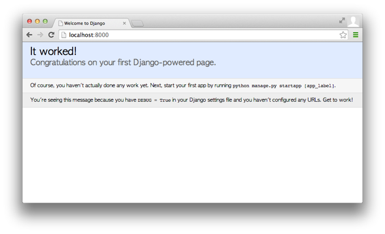

# 3. Photo 앱과 모델 만들기

* 마지막 갱신일시 : 2014년 09월 15일 2시 5분

이 강좌를 연재하는 중에 Django 1.7이 정식 출시됐습니다. 다행히(?) Django를 본격 다루기 전이니 이번 편부터 Django 1.7판을 기준으로 작성하겠습니다. 

### 1. Django Project와 App

#### (1) 개념

Python 코드가 담긴 파일을 [Python 모듈](https://docs.python.org/2/tutorial/modules.html)이라고 하며, [Python package]((https://docs.python.org/2/tutorial/modules.html#packages))는 Python module을 묶어놓은 단위입니다. 파일 체계로 보면 디렉터리지요. Python 패키지는 반드시 초기화 모듈인 `__init__.py`이 필요합니다.

Django는 [Django project](https://docs.djangoproject.com/en/1.6/glossary/#term-project) 단위로 만드는데, Python 체계로 보면 Python 패키지를 뜻합니다. Django로 만드는 프로젝트에 사용되는 코드와 Django 설정값이 Python 모듈로 존재하고 모두를 포함하는 Python 패키지로 묶은 것이지요.

우리가 Pystagram 프로젝트를 Django로 만든다는 건 Pystagram이라는 Python 패키지를 만들고, Pystagram에 들어가는 기능은 Python 모듈로 만든다는 뜻입니다. 그럼 Django를 써서 Pystagram을 만들려면 먼저 Pystagram 디렉터리를 만들어야 겠지요. 이 디렉터리는 Python 패키지니까 초기화 파일인 `__init__.py`이 필요합니다. 그리고 Django framework이 참조할 프로젝트 설정 항목은 settings라는 모듈이므로 `settings.py`라는 파일로 필요합니다. 웹 주소(URL)로 서비스에 접근하므로 각 접근 주소에 연결될 기능을 설정하는 `urls.py`라는 파일도 필요합니다. 이 중에서 `settings.py`는 필수 모듈입니다.  


#### (2) Django project 만들기

##### django-admin.py

Python 패키지인 Pystagram 디렉터리를 만들고, 여기에 필수 모듈인 `settings.py`와 `__init__.py`를 만드는 과정을 간편하게 처리하는 프로그램이 `django-admin.py`입니다. 이 파일로 Pystagram 프로젝트를 개설하겠습니다. 그 전에 지난 편에서 꾸려놓은 개발 환경을 먼저 써볼까요?

```sh
$ workon pystagram
```

virtualenv로 만든 pystagram 가상 환경에 들어가는 겁니다. 지난 편에서 우리는 이 가상 영역에 Django를 설치했지요. 

이번엔 Pystagram 프로젝트를 개설합니다. 여러분이 원하는 아무 곳(디렉터리)에 만들어도 됩니다. 저는 `~/Workspace` 안에다 프로그래밍 프로젝트를 넣어두니 이 안에 만들겠습니다. 

```sh
$ django-admin.py startproject pystagram
```

`django-admin.py` 프로그램(script file)에 첫 번째 인자로 `startproject`라는 명령어를 넣고 두 번째 인자에 만들 프로젝트 이름을 넣습니다. 그러면 두 번째 인자로 넣은 프로젝트 이름으로 디렉터리가 하나 만들어 집니다.

##### Django Project와 Python 패키지

앞으로 만들 Pystagram 소스 파일이나 각종 매체(media) 파일은 이곳에 담는데, 이 디렉터리 자체는 Python 패키지는 아닙니다. Python 패키지가 아니므로 Python으로 불러들일 수 없고(import), 그러므로 이 디렉터리 이름은 Pystagram으로 하든 HelloWorld로 하든 아무 상관 없습니다. 만약 Pystagram이라는 이름이나 기본 기능은 그대로 쓰지만, 몇 가지 실험성 기능을 넣어서 PystagramStory라는 걸 운영하고 싶다면 이 디렉터리를 복사하면 그만입니다. Django계에서 이 디렉터리를 뜻하는 별도 용어가 있진 않고 그냥 Django project를 포함하는 뿌리 디렉터리(root directory)라고 부릅니다.

실제로 Django project는 pystagram 디렉터리 안에 있는 pystagram이라는 디렉터리입니다. 그러니까 `django-admin.py`가 만든 디렉터리는 이렇게 구성되어 있습니다.

```
pystagram/
    manage.py
    pystagram/
        __init__.py
        settings.py
        urls.py
        wsgi.py
```

pystagram 디렉터리 안에 있는 pystagram 디렉터리가 실제로 사용되는 Python 패키지입니다. 이 디렉터리는 Pystagram 프로젝트에서 사용할 시작 패키지라고 보면 됩니다.

* [pystagram 프로젝트를 생성한 단계의 전체 소스 코드](https://github.com/hannal/start_with_django_webframework/tree/startproject/pystagram)


##### manage.py와 개발용 내장 웹 서버

`manage.py` 파일은 Django로 돌아가는 프로젝트를 다양하게 다루는 도구입니다. Database를 만들거나 개발용 내장 웹서버로 우리가 만드는 프로젝트를 서버로 구동하는 기능 등 여러 편의 요소를 제공합니다. 말이 나온 김에 Django project가 잘 만들어졌는지 `manage.py`로 확인해 볼까요?

```sh
$ ./manage.py runserver

또는

$ python manage.py runserver

(중략)
Django version 1.6.6, using settings 'pystagram.settings'
Starting development server at http://127.0.0.1:8000/
Quit the server with CONTROL-C.
```

`manage.py` 파일에 첫 번째 인자로 `runserver` 명령을 주어 서버를 실행하자, 쉘 프롬프트가 사라지고 Django framework이 제공하는 개발용 내장 웹 서버가 실행된 상태로 대기하고 있습니다. `pystagram` package 안에 있는 `settings` 모듈을 참조하여 `127.0.0.1` 주소와 `8000`번 포트로 개발용 서버를 띄웠다는 내용, 그리고 Control 글쇠와 C 글쇠를 누르면 이 서버를 종료한다는 내용이 나와 있습니다.

Django 내장 개발용 웹서버로 띄운 서비스에 접속할 수 있는 주소를 알게 됐으니 웹 브라우저를 열어서 확인합시다. `http://localhost:8000`이나 `http://127.0.0.1:8000`로 접속하면 됩니다.



It worked!

우린 그냥 Django project를 생성한 것 뿐인데 깔끔하게 디자인 된 환영 페이지가 뜨네요. 저도 동참하겠습니다.

*여러분, Django 웹 프레임워크 세상에 오신 걸 환영합니다.*

##### 내장 웹서버 접속 주소 바꾸기

아무 전달인자를 주지 않으면 내장 웹서버는 호스트는 127.0.0.1를, 포트는 8000를 기본으로 사용합니다. 이 주소를 바꾸려면 사용할 주소를 지정하면 됩니다.

```sh
$ ./manage.py runserver 127.0.0.1:8080
```


#### (3) Pystagram Project 초기/사전 작업

`django-admin.py`로 Pystagram project를 만들고 나면 데이터베이스를 동기화하는 과정을 거칩니다. 데이터베이스를 전혀 사용하지 않는다면 생략하기도 합니다. 데이터 자체는 외부에서 매번 요청하여 가져오고, 이 데이터를 적절히 가공하여 바로 출력하면 굳이 데이터베이스를 쓰지 않아도 됩니다. 가령 [REST API](http://www.restapitutorial.com/)로[^1] 데이터를 [JSON](http://json.org/json-ko.html) 형식으로 가져온 뒤 출력 양식만 바꾸거나 데이터에 접근하는 방식을 바꾸어 사용자 경험을 제공하는 식이지요.

하지만 Pystagram은 데이터베이스를 사용합니다. 또한 Django에서 제공하는 여러 [미들웨어](https://docs.djangoproject.com/en/1.7/topics/http/middleware/)나 앱을 사용하는데, 이러한 도구도 데이터베이스를 씁니다. 그래서 동기화 과정이 필요합니다. 방법은 간단합니다.

```sh
$ ./manage.py migrate
```

`manage.py`에 `migrate` 명령어를 주면 Django framework에서 제공하는 도구가 사용하는 데이터베이스 관련 작업을 자동으로 진행합니다. 이 `migrate` 명령어는 Django 1.7판에 생긴 명령어인데, 1.6이하 버전에서는 `syncdb`라는 명령어가 거의 비슷한 작업을 수행했습니다. 실제로 `syncdb` 명령어에 대한 코드를 보면 `migrate` 명령어를 호출합니다.

```python
    def handle_noargs(self, **options):
        warnings.warn("The syncdb command will be removed in Django 1.9", RemovedInDjango19Warning)
        call_command("migrate", **options)
```

위 코드는 `django/core/management/commands/` 패키지에 있는 `syncdb.py` 모듈에 있습니다. `syncdb` 명령어(command)를 실행하면 이 모듈에 있는 내용이 수행되는 것이지요. 위 코드에서 `call_command("migrate", **options)` 부분을 보면 `syncdb`가 넘겨받은 매개변수 `**options`를 그대로 `migrate` 명령어를 호출하며 넘깁니다. `syncdb` 명령어가 1.7판에도 여전히 존재하지만 1.9판에서는 제거될 예정이라는 안내 문구도 보이는군요. ^^

하지만 `migrate`와 `syncdb`가 똑같은 일을 수행하지는 않습니다. `syncdb`는 `migrate` 명령어를 수행한 다음에 최고 권한 이용자(super user)를 만드는 일도 합니다. 이 작업은 `createsuperuser` 명령어로 합니다. 즉 `syncdb` == `migrate` + `createsuperuser`인 셈이지요. 최고 권한 이용자도 만들겠습니다. 곧 필요하거든요.

```sh
$ ./manage.py createsuperuser
Username (leave blank to use 'hannal'): hannal
Email address: 
Password:
Password (again):
Superuser created successfully.
```

비밀번호는 언제든지 `changepassword` 명령어로 바꿀 수 있습니다. 바꿀 대상(username)을 지정하면 되지요.

```sh
$ ./manage.py changepassword hannal
```

바꿀 대상을 지정하지 않으면 처음 만든 이용자가 기본 지정됩니다.

이렇게 수행한 데이터베이스 작업은 `db.sqlite3`라는 파일에 저장됩니다. 이 파일은 [sqlite3](http://sqlite.org/)이라는 데이터베이스 엔진이 다루는 데이터베이스 파일입니다. Django framework은 따로 `settings.py`에 설정하지 않으면 기본으로 sqlite3 데이터베이스를 사용하도록 되어 있습니다. 서비스용으로는 쓰기엔 기능과 성능이 부족하지만, 가볍고 간단해서 개발용으로 쓰기엔 더할 나위없이 좋습니다. 더구나 Linux나 Mac OS X은 운영체제에서 기본 제공하며, Python도 sqlite의 데이터베이스를 다루는 API를 기본 내장하고 있습니다.

Django framework에서 제공하는 도구가 사용할 데이터베이스 관련 작업과 최고 권한 이용자를 만들었으니 이제 본격 Pystagram을 만들 차례입니다.


#### (4) Photo App 초기 작업

##### Django App

[Pystagram 기획](http://blog.hannal.net/start_with_django_webframework_01/)에서 가장 먼저 기획한 기능이 무엇일까요? 퀴즈 아니니 기억 안 나시면 기획 내용 보고 오셔도 됩니다. 제가 가장 먼저 기획한 기능은 사진 관련 기능이었습니다. 그 다음이 사용자와 회원 기능, 그 다음이 사진 모아보는 기능이었지요. 이 각각은 사진 올리기, 사진 보기와 같이 세부 기능이 묶여 있지요. 이렇게 목적을 가진 뭔가를 수행하는 애플리케이션(application)을 Django계에선 Django App이라고 부릅니다. Django project는 이러한 App이 하나 이상 조합물입니다.

보통은 Django App은 해당 App으로 분리된 Python 패키지 형식입니다. `models`와 `views` 모듈과 같이 각 App에 필요한 모듈로 구성합니다. 필수 모듈은 아니지만, “어떤 목적을 수행하는 애플리케이션”이라는 정의를 따른다면 자연스레 이런 모듈이 필요하게 됩니다. 그리고 Django project와 마찬가지로 Django app도 자동화 도구로 편하게 생성할 수 있습니다.

##### manage.py로 Photo App 만들기

`manage.py`가 Django project로 돌아가는 프로젝트를 지원하는 도구라는 것 기억하시죠? 이 파일로 App을 만들면 편합니다.

```sh
$ ./manage.py startapp photo
```

`django-admin.py`과 마찬가지로 별다른 안내 없이 생성됩니다. 뭔가 안내가 나타났다면 문제가 있는 거고요. `manage.py`로 만든 Django app인 Photo app은 다음과 같이 구성되어 있습니다.

```
pystagram/
    manage.py
    pystagram/
        __init__.py
        settings.py
        urls.py
        wsgi.py
    photo/
        __init__.py
        admin.py
        models.py
        tests.py
        views.py
```

`photo` package가 photo app입니다. 

* [photo App을 생성한 단계의 전체 소스 코드](https://github.com/hannal/start_with_django_webframework/tree/startapp_photo/pystagram)

`admin.py`는 관리자 영역에서 이 App을 다루는 코드를 담는 모듈입니다. Django의 강점이자 매력 요소인데, 다음 편에서 다룹니다.

`models.py`은 모델을 정의하는 모듈인데 모델(model)은 데이터(data)를 구성하는 항목 자체(field)와 데이터를 다루는 행위(behaviour)를 포함한 것입니다. 사진은 찍은 날짜, 사진 그 자체, 인화지, 이름과 같은 사진 구성 정보, 그리고 사진을 크게 확대해서 보거나 특정 부분을 오려내거나 복사하거나 종이로 접어 날려보내는 것과 같이 관련 행위로 구성됩니다. 이런 사진 관련 정보나 행위를 사진이라는 객체로 표현하는 것이 모델입니다. 우리가 다루고자 하는 대상 그 자체인데, 사람이 인지(recognition)하는 표현물은 아닙니다. 비유를 들자면, 하드 디스크에 있는 사진이라는 이미지 파일인 겁니다. 이미지 데이터일 뿐, 그게 어떤 사진인지는 알지 못 합니다.

`views.py`는 특정 주소(URL)에 접근하면 화면에 내용을 표시하는 Python 함수를 호출하는 내용을 담습니다. 이름만 보면 인화되거나 출력된 표현물 같지만, 정확한 용도는 우리가 인지하는 표현물로 안내하는 역할을 합니다. 비유를 들자면, 이미지 파일 뷰어나 프린터입니다. 그럼 대체 표현물은 뭘까요? MVC 패턴에서는 View가 표현물이지만, Django계에서는 `template`이 표현물입니다. Django에서 View는 데이터(모델)를 표현(템플릿)하는 연결자이자 안내자입니다. MVC 패턴으로 보면 Controller와 유사합니다.

마지막으로 `tests.py`은 [Unit test](http://ko.wikipedia.org/wiki/%EC%9C%A0%EB%8B%9B_%ED%85%8C%EC%8A%A4%ED%8A%B8) 내용을 담는 모듈입니다. 나중에 직접 겪어 보도록 하겠습니다.


#### (4) Photo App 만들기

사진을 다루는 App인 Photo App을 만들려면 무엇부터 해야 할까요? 뭔가를 만드는 시작은 [Hello world](http://ko.wikipedia.org/wiki/Hello_world_%ED%94%84%EB%A1%9C%EA%B7%B8%EB%9E%A8)류이니 템플릿으로 화면에 뭔가를 출력하는 게 미덕이겠지만, 우리가 직접 입력한 Python 코드만 없을 뿐 Django 템플릿을 이용해 “It worked!”를 이미 출력해 봤습니다. 그러니 모델을 실제로 만들어 보도록 하겠습니다.

##### Photo model 만들기

Django project에서 모델은 `db` package의 `models` 모듈에 있는 `Model` 클래스(class) 사용하여 만듭니다. 말이 복잡한데 간단히 말해서 `models` 모듈이 django의 `db` package 안에 있으니 `from django.db import models` 이렇게 접근해서 불러온다는 뜻입니다. Django로 만드는 애플리케이션의 모델은 바로 이 `Model` 클래스의 자식클래스(하위클래스, subclass)이므로 `Model` 클래스를 상속 받습니다.

그럼 `Model` 클래스를 사용하여 `photo` App에 `Photo` 모델을 만들어 보겠습니다. 이 모델은 사진을 다루는 기본 데이터를 다룹니다. 모델이니 `models.py`를 고쳐야겠지요?

```python
# coding: utf-8

from django.db import models

class Photo(models.Model):
    id = '개별 사진을 구분하는 색인값'
    image_file = '원본 사진 파일'
    filtered_image_file = '필터 적용된 사진 파일'
    description = '사진에 대한 설명문'
    created_at = '생성일시'
```

Django에서 모델의 속성(attribute)은 데이터베이스 필드(field)로 나타냅니다. Python 클래스로 놓고 보면 속성이지만, Django 모델의 데이터 요소로 다루고자 할 경우 Django 모델이 제공하는 별도 자료형(type)으로 값을 다루는데, 이 자료형인 값을 모델 필드라고 하지요. 그래서 위 모델에서 `image_file`, `description` 등은 아직은 그냥 Python 클래스 속성입니다. 각각이 무엇인지는 코드로 표현해놨으니 따로 설명드리진 않겠습니다.

이제 이 속성들을 Django 모델 필드로 바꾸겠습니다. 그래야 비로소 Django model이 제공하는 기능을 쓸 수 있습니다.

`image_file`은 이용자가 올리는 원본 이미지 파일을 담습니다. Django의 model에는 파일을 다루는 필드는 `FileField`가 있는데, 이런 필드 종류를 Django에서는 필드 타입(field type)이라고 부릅니다. 이 필드로 파일을 건내면 저장소(storage)에 파일을 저장하고 이 파일에 접근하는 연결자 역할을 하며, 파일 관련 기능이나 정보를 제공합니다. 이 필드 자체에 파일을 직접 저장하는 건 아닙니다. 그리고 파일 중에서도 이미지 파일을 대상으로 하는 `ImageField`도 있습니다. `ImageField`의 기본 바탕은 `FileField`인데, 실제로도 `FileField`를 상속 받은 클래스입니다[^2]. 이미지 면적(dimension)이나 길이(width, height)같은 정보를 제공해서 이미지 파일만 다룬다면 `ImageField`를 쓰는 게 더 편합니다.

모델 필드에는 몇 가지 선택 항목을 지정하곤 하는데, 이런 선택 항목을 필드 옵션(field option)이라고 합니다. `ImageField` 필드엔 `upload_to`, `height_field`, `width_field`, `max_length`, `storage` 등이 있는데, `height_field`, `width_field`가 `ImageField` 전용 옵션이며, 나머지는 `FileField`에서 상속받은 항목입니다. 이 항목은 필수 지정 사항은 아니며, 따로 설정하지 않으면 Django에서 기본 설정된 내용을 따릅니다. 자세한 건 나중에 다시 설명하겠습니다.

`filtered_image_file`는 원본 이미지 파일에 필터(filter)를 적용한, 즉 가공을 거친 파일입니다. 원본 이미지 파일을 저장하지 않는다면 필요없는 필드인데, 여러분을 좀 괴롭히는 기능을 만들 거라서 원본 이미지 파일과 가공을 거친 이미지 파일을 구분해서 모두 저장하겠습니다. 어쨌든 가공을 거친 파일도 이미지 파일이므로 `ImageField` 필드 타입을 쓰겠습니다.

`description`은 사진에 사진글 작성자가 기입한 내용입니다. 그냥 글자만 넣으면 되는데, 글자를 입력하는 필드 타입은 `CharField`와 `TextField`가 있습니다. 물론 `ImageField`이 `FileField`를 상속 받아서 확장된 기능을 제공하는 것처럼 `CharField` 필드 타입을 상속받아서 특별한 임무를 수행하는 클래스도 있습니다. `SlugField`나 `URLField`, `EmailField`, `CommaSeperatedIntegerField`  같은 거죠. 필드 타입명만으로 무슨 역할을 할 지 대략 예상이 가는군요. `CommaSeperatedIntegerField`는 정수(Integer)를 다루는 필드처럼 보이는데 `CharField`를 상속하는 문자형 필드인 이유는 쉼표(comma) 자체가 문자이기 때문입니다.

문자열을 다룬다는 점에서 `CharField`와 `TextField`는 같지만, 실은 전혀 다릅니다. `CharField`는 데이터베이스의 `VARCHAR`에 대응합니다. Django는 통상 200자 정도를 보장합니다. “보장”이라는 표현을 쓴 이유는 데이터베이스 시스템에 따라 `VARCHAR` 제한 길이가 다르기 때문입니다. 그에 반해 `TextField`는 이보다 훨씬 긴 문자열을 다룹니다. 이것도 데이터베이스 시스템에 따라 길이 제한이 다른데, SQLite3는 약 1기가 바이트까지 저장하는 `text`, PostgreSQL은 길이 제한이 없는 `text`, MySQL은 약 4기가 바이트까지 담는 `longtext`, Oracle은 약 8~12테라 바이트까지 담는 `NCLOB`에 대응합니다[^3][^4]. 보통은 긴 문자열을 담는 저러한 필드형에는 데이터베이스 인덱스가 걸리지 않으므로 Django의 `TextField` 필드에도 데이터베이스의 인덱스가(필드 옵션 : `db_index`) 걸리지 않습니다.

어쨌든 데이터베이스 시스템에 따라서 `TextField` 필드의 길이제한 단위가 무시무시한데, 굳이 저렇게 긴 문자열을 저장하진 않을 겁니다. 안 예쁘잖아요. 최대 길이를 500자로 제한하겠습니다. `CharField`와 `TextField` 둘 다 `max_length`라는 필드 옵션으로 최대 문자열 길이를 제한하며, `CharField`는 `max_length` 필드 옵션을 반드시 넣어야 합니다. 

`created_at`은 Photo 모델이 생성되어 데이터베이스에 저장되는 시각을 담는데, Django에는 날짜를 다루는 `DateField`, 시간을 다루는 `TimeField`, 그리고 날짜와 시간을 같이 다루는 `DateTimeField`가 있습니다. 생성일시 정보를 다루니 `DateTimeField`를 쓰겠습니다. 이 필드에는 `auto_now` 옵션과 `auto_now_add` 옵션이 있는데, 자동으로 현재 시간 정보를 담을 지 여부를 `True`와 `False`로 지정합니다. `auto_now_add`는 객체가 처음 생성될 때, `auto_now`는 객체가 저장될 때 자동으로 시간 정보를 담습니다. `auto_now`는 `False`, `auto_now_add`는 `True`로 설정한다면, 데이터가 처음 저장되는 시간 정보만 잡히고, 이후에 그 데이터를 수정하여 저장하더라도 자동으로 시간 정보가 담기진 않겠지요. 코드로 표현한다면 이런 모습일 겁니다.

```python
from datetime import datetime

the_photo.save()

if the_photo.is_created is True:
    the_photo.created_at = datetime.now()
    the_photo.save()
```

저 두 옵션을 활용하면 이런 코드를 생략하는 것이니 깔끔하고 편하지요.

마지막으로 `id`는 값이 겹치지 않는 색인이며, 이 값이 각 사진을 구분 짓는 고유값입니다. Django에서는 `id`라는 필드를 따로 정하지 않으면 관례에(conventional) 따라 `AutoField`로 `id`를 Django framework가 알아서(자동으로) 만들어 다룹니다. 그러니 우리는 굳이 `id`를 정의하지 않아도 됩니다.

자, 이제 그냥 클래스 속성으로 구성된 기존 `Photo` 모델을 Django 모델로 바꿔 보겠습니다. 아참, 이 필드들은 `models` 모듈에 있습니다.

```python
class Photo(models.Model):
    image_file = models.ImageField()
    filtered_image_file = models.ImageField()
    description = models.TextField(max_length=500)
    created_at = models.DateTimeField(auto_now_add=True, auto_now=False)
```

##### 데이터베이스에 반영 (migration)

Django 1.7 이전 판에서는 `manage.py`에 `syncdb` 명령으로 우리가 만든 모델을 데이터베이스에 반영했지만, 1.7판부터는 `makemigrations`과 `migrate` 명령어를 이용합니다. `Photo` 모델을 마이그레이션 하려면 `settings.py`에 `photo` 앱을 추가해야 하니 `settings.py`에서 `INSTALLED_APPS` 항목을 찾아서 다음과 같이 `photo`를 추가합니다. 

```python
INSTALLED_APPS = (
    'django.contrib.admin',
    'django.contrib.auth',
    'django.contrib.contenttypes',
    'django.contrib.sessions',
    'django.contrib.messages',
    'django.contrib.staticfiles',
    'photo',
)
```

그 다음에 `makemigrations`으로 마이그레이션 작업 내용을 만듭니다.

```sh
$ ./manage.py makemigrations 
Migrations for 'photo':
  0001_initial.py:
    - Create model Photo
```

마이그레이션 작업 내용은 `0001_initial.py`에 있으며, `Photo` 모델을 생성하는 것만 있네요. 실제 코드는 `photo` 디렉터리의 `migrations` 디렉터리 안에 `0001_initial.py` 있습니다. 이 작업을 실제로 수행하려면 `migrate` 명령을 내리면 됩니다.

```sh
$ ./manage.py migrate
Operations to perform:
  Apply all migrations: admin, photo, contenttypes, auth, sessions
Running migrations:
  Applying photo.0001_initial... OK
```

이렇게 해서 `Photo` 모델을 데이터베이스에 반영하여 연결하였습니다. 이제부터는 `Photo` 모델로 데이터를 데이터베이스에 저장하고 찾아 꺼내며 다룰 수 있습니다.

### 2. 부록

#### (1) MTV와 MVC

Django는 Model, Template, View의 앞자를 따서 MTV 패턴을 따릅니다. Model-View-Controller인 [MVC 패턴](http://opentutorials.org/course/697/3828)과 유사한데, 실제로 많은 사람은 이 패턴의 개념에 별 차이를 두지 않습니다. Django의 View는 MVC 패턴의 Controller, Template은 MVC 패턴의 View로 적당히 퉁쳐서 이해합니다. 역할로 보면 그다지 틀린 말도 아니지만, [Django framework가 지향하는 철학면에서 보면 MTV 패턴과 MVC 패턴엔 미묘한 차이](https://docs.djangoproject.com/en/1.6/faq/general/#django-appears-to-be-a-mvc-framework-but-you-call-the-controller-the-view-and-the-view-the-template-how-come-you-don-t-use-the-standard-names)가 있습니다.

재료를 가공하여 손에 닿는 결과물로 만드는 상황을 가정하지요. 여기서 재료란 Data, 즉 Model이고, 재료로 만들어 낸 결과물이 View입니다. 가공하는 행위자가 바로 Controller지요. 이게 MVC 패턴이라면, [Django 소프트웨어 재단](https://www.djangoproject.com/foundation/)에서는 MVC 패턴의 Controller 역할은 Django framework 그 자체가 하고 있다고 봅니다.

무슨 말인지 알 듯 하기도 하고 모를 듯 하기도 하네요. :)

#### (2) 한날이 아이디어를 구체화 하는 과정

저는 막연한 아이디어를 구현하고자 할 땐 표현물부터 만듭니다. 가령 고객을 대상으로 하는 제품 설명서를 작성하거나 정해놓은 흐름대로만(시나리오) 작동하는 견본(sample)을 만듭니다.

표현물을 먼저 만드는 이유는 사용 경험 수단을 만들어서 겪어보고, 그러면서 저 스스로 만들 대상을 실체화하는 데 좋기 때문입니다. 왜(why) 만드는지 고민하는 것이지요. 실체화(구체화)가 되면 모델을 구상합니다. 모델도 행위를 중심으로 구상합니다. 어떤 정보(데이터)가 있는지는 정보를 어떻게 보일 것인지 고민하면 얼개를 짤 수 있습니다. 그리고 보여진 데이터로 어떤 행위를 할 수 있는지 생각하면 데이터 간 관계, 연관 데이터를 예상할 수 있습니다. 어떻게(how) 목표에 달성하는지 고민한 것입니다. 그런 과정을 얼추 마치면 방법(how)에 필요한 재료를 제한합니다. 물론 만들면서 그때 그때 필요한 재료를 추가하거나 필요없는 재료를 빼기도 합니다.

이렇게 하는 이유는 이런 개발 과정이 재밌어서 그렇습니다. 취향이자 성향이지요. 이 강좌를 보시는 여러분의 취향이나 성향, 철학은 각양각색이니 제 취향과 성향대로 개발하고 설명해 나가겠습니다. ^^

--------

이것으로 강좌 3편을 마칩니다. 모델을 만들고 데이터를 실제로 저장하는 부분까지 하려 했는데, 분량이 많아져서 3편을 여기서 끊네요. 4편에서는 꼭 데이터를 저장하고 꺼내 봅시다! :)

* [3편까지 진행한 전체 소스 코드](https://github.com/hannal/start_with_django_webframework/tree/03-fullsource/pystagram)

-----

[^1]: [REST API 설계](https://speakerdeck.com/leewin12/rest-api-seolgye) 발표 자료에서 한국어로 잘 설명 해놨습니다.

[^2]: `django/db/models/fields/files.py` 모듈에 정의되어 있는 `ImageField` 클래스를 참조하세요.

[^3]: `django/db/backends/`에서 mysql, oracle, sqlite3 패키지 안에 있는 `creation.py` 모듈을 참조하세요.

[^4]: 글자 수가 아니라 바이트입니다.