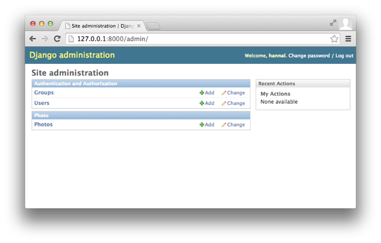
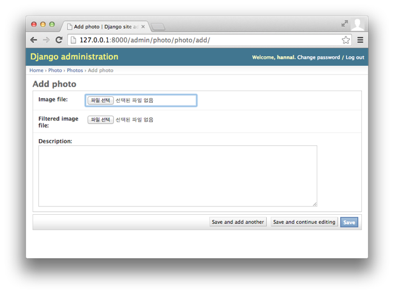
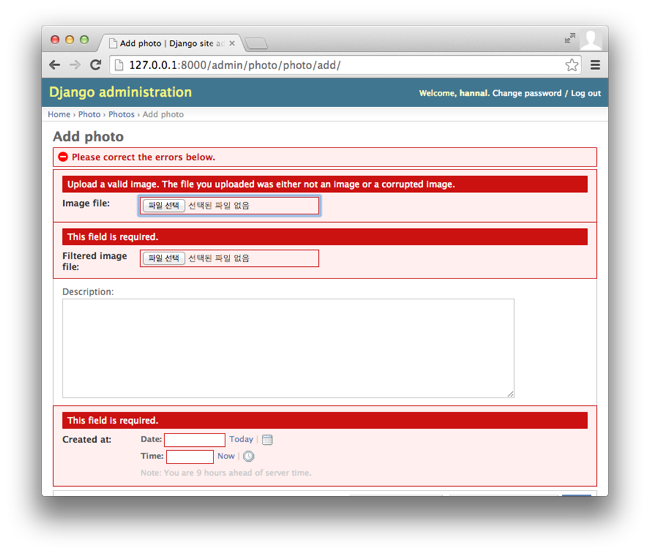
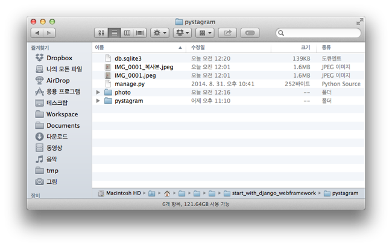

# 4. Photo 모델로 Admin 영역에서 데이터 다루기

* 마지막 갱신일시 : 2014년 10월 5일 3시 15분

이번 편에서는 Django framework이 제공하는 Admin 기능을 이용하여 Photo 모델로 데이터를 추가하거나 내용을 고치거나 삭제해 보겠습니다.

### 1. Photo 모델로 데이터 넣기

#### (1) Admin에서 Photo 모델에 데이터 넣기

`Photo` 모델을 이용하여 데이터베이스를 넣겠습니다. View에 관련 기능을 구현해도 되지만, Django의 장점 중 하나인 Admin 기능을 이용해서 자료를 관리해 보겠습니다. `photo` 앱에 있는 `admin.py` 파일에 관련 코드를 작성해 넣으면 됩니다.

```python
# coding: utf-8

from django.contrib import admin

from photo.models import Photo

admin.site.register(Photo)
```

Django framework에는 Admin 기능이 admin이라는 **앱** 형태로 제공되는데, `contrib` 패키지 안에 `admin` 패키지로 존재합니다. `admin.site.register`는 `admin` 패키지에 있는 `sites` 모듈에서 `AdminSite` 클래스를 `site`라는 이름을 갖는 인스턴스로 만들고, 이 `site` 객체의 인스턴스 메서드인 `register`로 지정한 모델을 Admin 영역에서 관리하도록 등록합니다. 즉, `sites.py`에 이렇게 되어 있는 겁니다.

```python
class AdminSite(object):
    # code들
    pass

site = AdminSite()
```

복잡하게 느껴지신다면 그냥 `admin.site.register`라고 외우시면 됩니다. 따로 건드릴 일이 없거든요.

`photo`앱의 `admin.py`를 저장하고 나면 Django의 개발용 내장 웹서버(이하 내장 웹서버)가 자동으로 재실행 됩니다. 재실행이 되고 나면 웹 브라우저에서 `http://127.0.0.1:8000/admin/`로 접속해 보세요. 로그인에 필요한 ID와 비밀번호를 묻는데, 지난 3편에서 `manage.py`로 만든 계정 정보로 접속하면 됩니다. 비밀번호가 기억이 나질 않는다면 `manage.py`에 `changepassword` 명령어로 비밀번호를 새로 생성하면 됩니다.



로그인을 했다면 `Photo`라는 영역이 있고 그 아래에 `Photos`라는 항목이 보입니다. 그 항목이 바로 `Photo` 모델입니다. `Photo` 항목 오른쪽에 `Add`를 눌러보세요. `Photo` 모델에 데이터를 넣는 **Form**이 나타납니다.



어차피 싹 지우고 다시 데이터는 채워 넣을 거니까 아무 자료나 넣어보세요. 사진이 아닌 파일도 지정해보고 본문(description) 입력란에 아무 내용도 넣지 말고 저장도 해보세요. 또 본문 입력란에 500글자가 넘는 글자를 넣어 보세요. 우리가 뭔가 따로 조치를 취한 게 없는데도 파일이 이미지 파일인지 아닌지, 본문이 채워져 있는지를 검사하고 본문에 500자 이상 입력이 안 되게 제한됩니다. 

Django의 `forms` 기능(패키지)이 이런 처리를 하며, 이미지 파일이어야 하고 본문은 반드시 내용이 있어야 한다거나 본문 길이와 같은 검사 항목과 정보를 우리가 만든 `Photo` 모델에서 참조합니다. `image_file` 모델 속성을 `ImageField`라는 필드 타입으로 지정해서 업로드 되는 파일이 이미지 파일인지 검사하는 것이며, `description` 모델 속성을 최대 길이 500자로 지정한 `TextField` 필드 타입으로 지정해서 문자열 길이가 500자 이하인지 검사합니다. 생성일시인 `created_at`은 자동으로 값이 저장되는 옵션을 주어서 입력란으로 등장하지 않았습니다. 

몇 가지 실험해보죠. `photo` 앱의 `Photo` 모델에서 `created_at`을 고치겠습니다. `auto_now_add`와 `auto_now` 필드 옵션을 모두 제거하겠습니다. 그리고 `description`의 필드 타입에 `blank`라는 필드 옵션을 `True`로 추가 지정하겠습니다. 코드로 보면 이렇습니다.

```python
class Photo(models.Model):
    image_file = models.ImageField()
    filtered_image_file = models.ImageField()
    description = models.TextField(max_length=500, blank=True)
    created_at = models.DateTimeField()
```

모델 모듈(파일)을 저장하여 내장 웹서버가 재실행되게 한 후, `Photo` 모델에 데이터를 추가하는 입력란 영역으로 다시 가보거나 열어보세요. `Created at`이라는 입력란이 추가 됐습니다. 이제 Save 버튼을 눌러보세요.



뭔가 달라졌지요? 본문란에 아무 내용을 넣지 않았는데도 무섭게 시뻘건 경고 안내가 나타나지 않습니다. 그리고, 생성일시 정보를 넣지 않았다고 경고합니다.

`blank` 필드 옵션은 이름 그대로 빈칸을 뜻합니다. 즉 `blank=True`는 빈칸을 허용하겠다는 뜻입니다. 이와 비슷한 옵션으로 `null`이 있는데, `null`은 Python의 `None` 자료형 객체를 뜻합니다. `null=True`는 `None` 자료형을 허용하겠다는 뜻입니다. 빈칸과 `None`(null)은 의미가 완전히 다른데, 빈칸은 내용이 비어있는 **문자형** 객체입니다. 데이터베이스의 테이블 구성(schema)도 전혀 달라서, `null=True`이라고 하면 해당 컬럼(column)은 `NULL`을 허용하도록 지정되고, `blank=True`만 있으면 `null=True`가 없어서 기본값인 `null=False`로 지정되어 데이터베이스 테이블의 컬럼도 `NULL`이 허용되지 않는 `NOT NULL`로 지정됩니다. 그래서 `description`에 `blank=True` 옵션만 설정한 상태에서 빈칸인 문자형 객체 조차 넣지 않으면 데이터베이스에 자료를 넣는 중에 오류가 발생합니다.

대개는 Django framework이 알아서 처리해 줍니다. 우리가 `description`에 `None` 객체를 직접 지정해 넣지 않는 한 보통은 별 문제 없이 작동합니다. 또 정밀하게 자료형을 검사할 게 아니라면 굳이 `null`과 `blank` 모두를 `True`라고 옵션을 설정할 필요는 없습니다. 만약 두 옵션을 `True`라고 지정한다면 우리는 다음과 같이 자료형을 검사해야 합니다.

```python
if not isinstance(photo.description, type(None)):
  _description = photo.description.lower()
```

`description`이 `None` 자료형이 아닌 경우(즉 문자형인 경우), 모든 영문자를 소문자로 바꾸어서 `_description`이라는 변수에 담는 코드입니다. `lower`라는 함수는 Python의 문자형 객체에 존재하는 인스턴스 메서드이므로 `description`이 `None` 자료형이라면 `lower`라는 속성이 `None` 자료형에 없다는 `AttributeError: 'NoneType' object has no attribute 'lower'` 오류가 발생합니다.

자, 이제 다음과 같이 변경한 모델 내용을 데이터베이스에도 반영해 보겠습니다.

```python
class Photo(models.Model):
    image_file = models.ImageField()
    filtered_image_file = models.ImageField()
    description = models.TextField(max_length=500, blank=True)
    created_at = models.DateTimeField(auto_now_add=True, auto_now=False)
```

데이터베이스에 반영하는 방법은 `manage.py`의 `makemigrations`과 `migrate` 명령어를 이용하면 됩니다.

```sh
$ ./manage.py makemigrations
Migrations for 'photo':
  0002_auto_20141004_1518.py:
    - Alter field description on photo
```

0001은 `Photo` 모델을 처음 데이터베이스에 반영할 때 만들었으니 0002라는 일련번호가 붙은 마이그레이션 파일이 생성됩니다. `photo`에 `description` 필드를 변경(alter)하는 내용이라고 나오네요. `./manage.py migrate`를 실행하면 `makemigrations`으로 만들어진 마이그레이션 파일을 실제로 반영합니다. 번거롭게 데이터베이스 테이블을 우리가 변경하지 않아도 되니 참 편합니다.

자, Admin 영역에서 이제 실제로 이미지 파일을 지정하여 Photo 모델에 데이터를 실제로 넣어 보세요.


#### (2) 파일 업로드 경로 지정

`Photo` 모델에 데이터를 추가하면 업로드한 이미지 파일은 `manage.py` 파일이 있는 곳에 저장됩니다.



관리하기 편하게 업로드 되는 파일을 `static_files/uploaded/`에 저장하겠습니다. `Photo` 모델에서 `ImageField` 필드 타입에 필드 옵션인 `upload_to`를 이용하면 됩니다.

```python
image_file = models.ImageField(upload_to='static_files/uploaded')
filtered_image_file = models.ImageField(upload_to='static_files/uploaded')
```

위와 같이 `Photo` 모델을 고쳐서 저장한 후 Admin 영역에서 `Photo` 모델에 데이터를 추가해 보세요. 업로드한 이미지 파일이 `static_files/uploaded`에 저장되어 있습니다. 

파일이 저장되는 경로에 자동으로 내용이 채워지는 몇 가지 규칙이 있습니다. 예를 들어, 2014년도에 올라오는 파일은 `static_files/uploaded/2014`에 넣고, 2015년도에 올라오는 파일은 `static_files/uploaded/2015`에 넣고자 한다면, 따로 그런 기능을 구현하지 않아도 됩니다. 우리는 네 자리 년도, 두 자리 월, 두 자리 일로 디렉터리를 구분해서 업로드 되는 파일을 저장하겠습니다.

```python
image_file = models.ImageField(upload_to='static_files/uploaded/%Y/%m/%d')
filtered_image_file = models.ImageField(upload_to='static_files/uploaded/%Y/%m/%d')
```

`%Y`, `%m`, `%d`가 그런 역할을 하는데, 이 문자열은 [Python의 strftime](https://docs.python.org/2.7/library/time.html#time.strftime)의 포맷팅(formatting)에 사용되는 형태잡기 문자열(format string) 중에서 날짜와 시간과 같은 규칙을 따릅니다.

자, 이제 마지막으로 원본 이미지 파일과 필터가 적용된 이미지 파일을 다른 디렉터리에 분리해 저장하도록 하겠습니다. 원본 이미지 파일은 `static_files/uploaded/original/...`에, 필터가 적용된 이미지 파일은 `static_files/uploaded/filtered/...`에 저장하겠습니다. 간단하겠죠?

```python
image_file = models.ImageField(upload_to='static_files/uploaded/original/%Y/%m/%d')
filtered_image_file = models.ImageField(upload_to='static_files/uploaded/filtered/%Y/%m/%d')
```

위 코드를 반영하여 내장 웹서버가 재실행되면 Admin 영역에서 사진을 올려보세요. 새 경로로 파일이 저장됩니다.

##### 업로드 경로를 중간에 변경해도 괜찮을까?

여기서 잠깐. 우리는 중간 중간 업로드 경로를 바꾸면서 이미지 파일을 업로드 했습니다. 이러면 혹시 이전 업로드 경로로 올린 이미지 파일에 접근하지 못하는 문제가 발생하지 않을까요? 발생하지 않습니다. `upload_to`는 업로드 된 파일을 지정한 경로에 저장할 때 참조합니다. 그래서 해당 데이터 객체의 경로는 이전 업로드 경로를 포함하여 지정됩니다.


#### (3) 첨부 파일 삭제하기

혹시 Admin 영역에서 추가한 `Photo` 모델의 객체를 지워보셨나요? Admin 영역에서는 모델 객체를 추가하는 것 뿐만 아니라 기존 모델 객체를 수정하거나 지우는 기능을 기본 제공합니다. 한 번 모델 객체를 지워 보세요.

이상한 점 발견하셨나요? 모델 객체를 지우면 객체 자체는 지워지는데 그 객체에 연결된 파일들, 그러니까 업로드한 두 개 파일은 지워지지 않고 여전히 남아 있습니다. Django의 모델 기능은 모델 객체가 삭제되어도 그 모델 객체의 파일 필드에 연결된 파일을 지우지 않습니다. 그래서 삭제할 모델 객체를 먼져 가져와서 연결된 파일을 일일이 지워준 후에 모델 객체를 지워야 합니다. 

모델 객체가 삭제될 때 그 모델 객체에 연결된 파일도 자동으로 함께 지우는 기능은 따로 구현해야 합니다. 몇 가지 방법이 있습니다.

1. 모델을 삭제하는 기능이 호출되면 파일 삭제 기능도 실행
2. 모델이 삭제되는 신호가 감지되면 파일 삭제 기능도 실행 

2번은 나중에 알아보기로 하고, 이번 편에서는 1번 방법을 구현해 보겠습니다.

Django framework은 `delete`라는 인스턴스 메서드를 호출하여 모델 객체를 지웁니다. Admin 영역에 있는 삭제 기능도 이 메서드를 호출하는 겁니다. 이 메서드는 `Model` 클래스에 정의되어 있습니다. 우리가 Django 모델을 만들 때 클래스에 `models.Model`을 상속받도록 지정했기 때문에 우리가 만든 모델에 `delete` 메서드를 따로 만들지 않아도 됐던 것이지요. 그렇다면 우리가 만든 모델에 `delete` 인스턴스 메서드를 만들고 이 메서드가 호출되면 업로드 파일을 지우고 나서 모델 객체를 지우는 원래 `delete` 메서드 기능을 수행하면 되겠군요. 그런 기능을 구현한 코드부터 보겠습니다.

```python
class Photo(models.Model):
    # 중략
    
    def delete(self, *args, **kwargs):
        self.image_file.delete()
        self.filtered_image_file.delete()
        super(Photo, self).delete(*args, **kwargs)

```

먼저 `def delete(self, *args, **kwargs):`는 특별한 내용은 없습니다. `delete` 함수는 인스턴스 메서드이므로 첫 번째 인자로 객체 자신을 `self`라는 이름으로 넘겨 받습니다. [`*args`와 `**kwargs`는 함수가 넘겨받는 인자를 미리 알지 못하는 경우에 함수가 넘겨받는 인자를 담는 객체](http://stackoverflow.com/questions/3394835/args-and-kwargs)입니다. `delete` 메서드로 뭘 인자로 넘길 지는 모르겠지만 어쨌든 넘겨받은 그대로 `Model`클래스의 `delete` 메서드로 넘겨줘야 해서 저렇게 받습니다.

`self.image_file.delete()`에서 `self.image_file`는 `image_file` 모델 필드를 뜻합니다. Python 클래스의 인스턴스 메서드 안에서 속성(attribute)에 접근하려면 `self.속성이름`으로 접근하지요. `self`는 `delete` 인스턴스 메서드에서 첫 번째 인자로 넘겨 받았고요. 인스턴스 밖에서 접근하려면 `photo.image_file` 이렇게 접근하겠고요. 이 `image_file` 모델 필드는 Django의 모델 필드인 `ImageField` 클래스의 인스턴스입니다. `ImageField` 클래스로 만든 인스턴스는 `delete`라는 인스턴스 메서드를 제공하며, 이름에서 알 수 있듯이 해당 모델 필드에 연결된 파일을 삭제합니다. `self.filtered_image_file.delete()`는 무슨 코드인지 예측되지요? 필터가 적용된 이미지 파일을 지우는 겁니다. 

맨 마지막 줄인 `super(Photo, self).delete(*args, **kwargs)`는 `Photo` 모델이 상속받은 부모 클래스의 `delete` 인스턴스 메서드를 호출합니다. 넘겨받은 인자를 그대로 전달하려고 `*args, **kwargs`로 인자를 보내지요. 이 코드가 없으면 첨부된 업로드 파일만 삭제되고 모델 객체는 삭제되지 않습니다. 모델 객체를 지우는 건 `Model` 클래스에 있는 `delete` 메서드거든요. 만약 `Model` 클래스의 `delete` 메서드를 사용해서 모델 객체를 삭제하지 않고 여러분이 독자 구현한 코드로 모델 객체를 지우고자 한다면 `super(...)` 이 부분을 지우고 직접 구현하면 됩니다.

자, 여기까지 구현한 기능을 한 번 Admin 영역에서 시험 작동해 보세요. 모델 내용이 바뀌어서 마이그레이션 하라는 안내가 나올텐데, 해주죠, 뭐. :)

```python
from django.db import models

class Photo(models.Model):
    image_file = models.ImageField(upload_to='static_files/uploaded/%Y/%m/%d')
    filtered_image_file = models.ImageField(upload_to='static_files/uploaded/%Y/%m/%d')
    description = models.TextField(max_length=500, blank=True)
    created_at = models.DateTimeField(auto_now_add=True, auto_now=False)

    def delete(self, *args, **kwargs):
        self.image_file.delete()
        self.filtered_image_file.delete()
        super(Photo, self).delete(*args, **kwargs)
```

아직 `Photo` 모델에 추가할 내용이 많습니다. 누가 사진을 올렸는지 회원 정보도 담아야 하고, 사진을 올리는 경로도 손볼 것입니다. 차근 차근 구현해 나가겠습니다.


### 2. 부록

#### (1) Django Admin 주소

Django에서 제공하는 Admin 기능은 `settings.py`에 설정되어 있습니다. `INSTALLED_APPS`라는 변수를 찾아 보시면 `django.contrib.admin`이라는 줄이 보입니다. 우리가 만든 `photo` 앱도 이곳에 추가했지요. 

그럼 `http://127.0.0.1:8000/admin` 주소(URL)에서 `admin` 부분도 어딘가에 미리 설정되어 있는 걸까요? 맞습니다. `urls.py`에 기본으로 설정되어 있습니다. `pystagram` 패키지(디렉터리)에 있는 `urls.py`을 열어 보시면 `url(r'^admin/', include(admin.site.urls)),`이라는 내용이 보일 겁니다. 경로 맨 앞에 `admin`이 있는 모든 경로를 `admin.site.urls`에 설정되어 있는 경로에 연결(matching)하겠다는 내용입니다. 이건 `django.contrib.admin` 패키지에서 `sites.py` 파일에 보면 `AdminSite` 클래스가 있는데, 그 클래스의 `get_urls`라는 인스턴스 메서드를 호출하는 겁니다. 메서드를 프로퍼티화 하는 `@property` 장식자(decorator)를 이용하여 `urls`를 호출하면 `get_urls` 인스턴스 메서드가 반환하는 정보를 던져주는 것이지요.

`http://127.0.0.1:8000/admin` 이 주소 대신 `/_admin`으로 접근하고 싶다면 `^admin/` 부분을 `^_admin/`으로 고치면 됩니다.

#### (2) Django Admin 필요성

Django Admin은 이용자가 꽤 유연하게 변경하도록 만들어져 있습니다. 서비스는 고객이 사용하는 제품부 뿐만 아니라 운영에 필요한 관리 영역을 만드는 데에도 상당한 노고가 필요한데, Django Admin을 쓰면 그런 노고가 줄어 듭니다. Django Admin은 그 자체만으로도 확장성 있게 잘 만들어져 있고, Django의 모델이나 미들웨어 체계와 강하게 연계되어 있어서 직접 구현하려면 번거로운 기능을 쉽고 편하게 구현하도록 합니다.

저는 이 강좌에서 Django Admin 부분만 따로 할당하지 않고, 그때 그때 필요한 내용을 설명하도록 하겠습니다.


--------

이것으로 강좌 4편을 마칩니다. 늦어서 죄송합니다. 요즘 많이 바빠서 연재하기 힘드네요. ㅜㅜ 한 편에 너무 많은 내용을 담느라 연재 주기가 늘어지지 않도록 해보겠습니다. 

* [4편까지 진행한 전체 소스 코드](https://github.com/hannal/start_with_django_webframework/tree/04-fullsource/pystagram)
