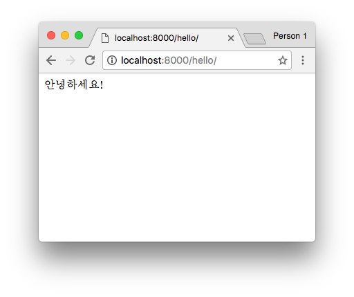
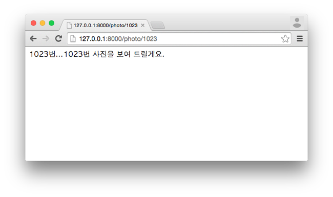
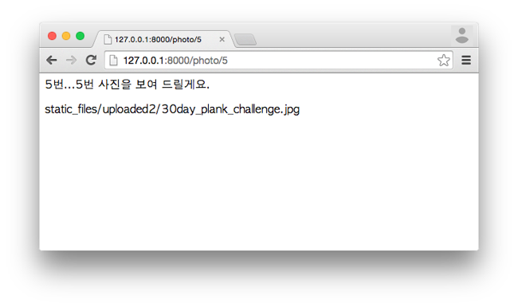
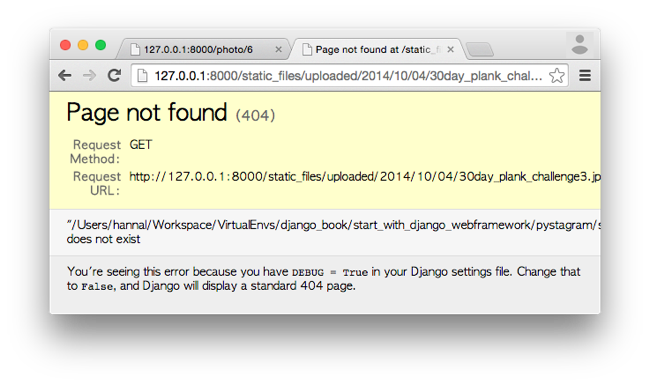

## 5. url에 view 함수 연결해서 사진 출력하기

이번 편에서는 인터넷 주소에 접속하여 Photo 모델로 올린 사진 데이터를 가져와서 View 기능을 이용하여 웹 브라우저에 관련 내용을 출력해보겠습니다.

### 1. URL에 Photo View 연결

#### (1) URL Resolver


이용자가(client) 인터넷 주소(URL : Uniform resource locator, 이하 URL)로 접속하면 웹 서버는 접속한 주소에 해당하는 내용물을 보여줍니다. Django로 운용되는 서비스도 마찬가지여서, 이용자가 URL로 접근하여 뭔가를 요청하면 그 URL에 대한 정보를 `urls.py`로 대표되는 URL dispatch에서 찾아서 연결된 구현부를 실행합니다. 구현부는 데이터를(Model) 가져와 출력물을 바로(?) 출력하기도 하고 Template을 거쳐서 출력물을 만들어낸 후 출력하기도 합니다. 이렇게 URL과 구현부을 연결해주는 역할을 Django의 View 영역인 `views.py`가 합니다. 지난 [3회 강좌](http://blog.hannal.net/start_with_django_webframework_03/)에서 설명한 MTV 개념인데, View에서 URL로 요청받은 걸 이런저런 방법으로 처리하여 결과(출력물)를 내보낸다고 보면 됩니다.

Django에서는 URL Resolver(`urlresolver`)라는 모듈이 URL Dispatch 역할을 하며, `django/core/urlresolvers.py`에 있습니다. 이 `urlresolvers` 모듈에 있는 `RegexURLResolver` 클래스가 요청받은 URL을 되부를 함수(callback function) 덩어리로 바꿔줍니다. 이 덩어리는 View 함수와 함수 인자로 된 tuple 자료형이며, HTTP Handler가 받아서 View 함수를 실행하고 그 결과를 응답(response)합니다. HTTP Handler는 `django/core/handlers/base.py` 모듈에 있는 `BaseHandler` 클래스를 뜻합니다. 정리하면 다음과 같이 진행됩니다.

1. `BaseHandler` 클래스가 URL로 요청(request) 받음
2. `RegexURLResolver`로 URL을 보냄
3. `RegexURLResolver`가 URL에 연결된 View를 찾아서 callback 함수와 인자 등을 `BaseHandler`로 반환
4. `BaseHandler`에서 이 함수를 실행하여 결과값인 출력물을 받음.
5. 출력

중간 중간에 middleware 등과 같은 과정이 있지만 큰 흐름은 이러합니다.

위 내용은 몰라도 Django를 다루는 데 아무 지장 없습니다. 저는 다음 두 문장을 쓰기 위해 위 설명을 쓴 겁니다.

1. Model이나 View에 기능을 구현
2. 이용자가 서버에 있는 자원에 접근하는 경로인 URL을 URL Dispatch 처리 모듈인 `urls.py`에 등록하고 그 URL에 구현부를 연결

우리는 앞으로 이런 흐름으로 기능을 구현합니다.

#### (2) 개별 사진 보기 View - 1

`photo` 앱, 그러니까 `photo` 디렉터리 안에 있는 views.py 파일을 엽니다. 별 내용은 없습니다. 세상에 인사하는 View부터 구현해보겠습니다.

```python
# coding: utf-8

from django.shortcuts import render
from django.http import HttpResponse

def single_photo(request):
    return HttpResponse('3번...3번 사진을 보여 드릴게요.')
```

이번엔 `urls.py` 파일이 있는 `pystagram` 디렉터리에서 `urls.py` 파일을 열어서 `url(r'^photo/$', 'photo.views.single_photo', name='view_single_photo'),` 이 줄을 추가합니다.

```python
urlpatterns = patterns('',
    url(r'^photo/$', 'photo.views.single_photo', name='view_single_photo'),
    url(r'^admin/', include(admin.site.urls)),
)
```

끝났습니다. 웹브라우저에서 `http://127.0.0.1:8000/photo/`로 접속하면 `HttpResponse`로 넘긴 문장이 출력되는 걸 보실 겁니다.



#### (3) urls.py

`urls.py`에는 Django의 `urls` 모듈에 있는 `url` 함수를 이용하여 URL 연결자를 만들어서 `urlpatterns`에 넣습니다. `urlpatterns`는 url 함수로 만든 객체를 담은 객체이며 그냥 `list` 자료형입니다.

`patterns` 함수는 두 종류 인자를 받습니다. 하나는 `prefix`인데, 맨 앞에 있는 아무 내용이 없는 문자형 자료(객체)인 `''`가 `prefix`입니다. `prefix`는 따로 설명하겠습니다. `prefix` 뒤에 나오는 부분은 `url` 함수로 만든 URL 연결자들입니다. 그냥 쭈욱 나열한 것 뿐입니다.

그럼 주소 연결자를 만드는 `url` 함수 부분을 보겠습니다. 이 함수는 총 다섯 개 인자를 받습니다. 

* regex : 주소 패턴 (정규표현식)
* view : 연결할 View
* prefix : 연결할 View 이름에 대한 접두사
* name : 주소 연결자 이름
* kwargs : `urls`에서 View로 전달할 `dict`형(사전형) 인자

`regex`와 `view`는 필수 인자이고, 나머지는 생략해도 됩니다. 우리가 `urls.py`에 추가한 `url(r'^photo/$', 'photo.views.single_photo', name='view_single_photo'),`를 기준으로 놓고 보면 이러합니다.

* regex : `r'^photo/$'`
* view : `'photo.views.single_photo'`
* name : `name='view_single_photo'`

`name` 인자는 생략해도 된다고 했으니, 한 번 생략해서 `urls.py`를 저장한 후 웹브라우저에서 `/photo/`로 접속해보세요. 아무 이상 없을 겁니다. 이 `name` 인자는 템플릿에서 URL 연결자 이름으로 주소를 출력하는 등 몇 가지 편의에 쓰이며 유용합니다.

`view` 인자엔 실행할 함수의 이름경로를 문자열을 지정합니다. `photo.views.single_photo`란 `photo` 앱(패키지, 디렉터리) 안에 있는 `views` 모듈(`views.py`)의 `single_photo` 함수를 뜻합니다. `single_photo` 함수는 `views.py`에서 “3번...3번 사진을 보여 드릴게요”라는 문자열을 반환하는 함수지요. 앞서 “4. `BaseHandler`에서 이 함수를 실행하여 결과값인 출력물을 받음.”라고 설명한 부분이 바로 이 부분입니다. View 함수는 “3번...” 문자열을 반환하는데(`return`) 그 반환받는 주체가 바로 `BaseHandler`입니다. 물론 이 View 함수를 실행하는 주체이기도 하고요.

`prefix`는 `view` 인자에 문자열로 지정하는 View 경로를 간결하게 줄여주는 편의 요소입니다. `photo` 앱의 `views` 모듈에 있는 여러 함수를 URL에 연결한다면 `urls.py`가 이런 모양이 될 겁니다.

```python
urlpatterns = patterns('',
    url(r'^photo/$', 'photo.views.single_photo'),
    url(r'^photo/2$', 'photo.views.single_photo2'),
    url(r'^photo/3$', 'photo.views.single_photo3'),
    url(r'^photo/4$', 'photo.views.single_photo4'),
    url(r'^photo/5$', 'photo.views.single_photo5'),
    url(r'^photo/6$', 'photo.views.single_photo6'),
    url(r'^photo/7$', 'photo.views.single_photo7'),
    url(r'^photo/8$', 'photo.views.single_photo8'),
)
```

어우, 기계가 할 일을 사람이 하고 있는 광경이네요. `prefix`를 이용해서 View 명기되는 이름경로를 줄여보겠습니다.

```python
urlpatterns = patterns('photo.views',
    url(r'^photo/$', 'single_photo'),
    url(r'^photo/2$', 'single_photo2'),
    url(r'^photo/3$', 'single_photo3'),
    url(r'^photo/4$', 'single_photo4'),
    url(r'^photo/5$', 'single_photo5'),
    url(r'^photo/6$', 'single_photo6'),
    url(r'^photo/7$', 'single_photo7'),
    url(r'^photo/8$', 'single_photo8'),
)
```

매번 `photo.views`를 `prefix`에 명기하고 이후에 붙는 URL 연결자의 View 지정 부분에선 생략했습니다. Django 내부에서도 이 `prefix`는 되게 단순하게 처리합니다. (`django/conf/urls/__init__.py` 참조)

```python
if prefix:
    view = prefix + '.' + view
```

즉, `prefix`가(가령, `'photo.view'`) 있으면 `view` 이름(가령, `'single_photo'`) 앞에 덧붙이는 거지요. 그냥 덧붙이면 `'photo.viewsingle_photo'`처럼 돼버리니 접두사와 이름 사이에 `.`을 추가한 것이고요.

그런데 `url` 함수의 인자로 들어가는 `prefix` 인자인데 `patterns` 함수의 `prefix` 인자에 접두사를 넣었네요? 실제로 우리에게 의미있게 쓰이는 `prefix`는 `patterns` 함수의 `prefix`입니다. `patterns` 함수로 `prefix`를 지정하면, 이후에 지정된 URL 연결자인 `url` 함수로 `prefix`를 넘겨줍니다. 다시말해, `url` 함수의 `prefix`는 우리가 직접 쓰기 보다는 Django가 쓰는 데 필요한 겁니다.

주의할 점은 `patterns` 함수의 `prefix`는 이 함수가 실행되면서 넘겨받는 URL연결자들 모두에 적용이 된다는 점입니다. 예를 들어, `single_photo5`부터 `single_photo8`은 `image` 앱의 `views`에 있는 함수라고 가정하지요. 이럴 경우 `prefix`를 다시 지정해야 합니다. 어떻게 해야 할까요? 힌트는 `patterns` 함수의 결과값을 담는 `urlpatterns`가 그냥 `list` 자료형이라는 점입니다. 힌트가 아니라 답이군요.

```python
urlpatterns = patterns('photo.views',
    url(r'^photo/$', 'single_photo'),
    url(r'^photo/2$', 'single_photo2'),
    url(r'^photo/3$', 'single_photo3'),
    url(r'^photo/4$', 'single_photo4'),

urlpatterns += patterns('image.views',
    url(r'^photo/5$', 'single_photo5'),
    url(r'^photo/6$', 'single_photo6'),
    url(r'^photo/7$', 'single_photo7'),
    url(r'^photo/8$', 'single_photo8'),
)
```

다른 `prefix`를 지정한 `patterns` 함수를 실행하고, 그 결과값을 `urlpatterns`에 덧이으면 됩니다. `urlpatterns`가 `list` 자료형이니 `urlpatterns.append( ... )` 이렇게 추가해도 됩니다.

기왕 기계가 할 일을 사람이 하지 않고 기계가 하도록 한 김에 좀 더 간결히 줄여보겠습니다. 

```python
urlpatterns = patterns('photo.views',
    url(r'^photo/(?P<photo_id>\d+)$', 'single_photo')
),
```

`/photo/` URL 뒤에 붙는 숫자를 정규표현식으로 패턴화하여 지정한 겁니다. `\d+` 부분이 바로 숫자(Decimal)가 하나 이상 있다는 걸 뜻하며, URL이 이 패턴에 해당되면 `single_photo` 함수로 연결됩니다. Pystagram 기획 내용에 따르면 개별 사진을 보는 URL은 `/photo/<사진 ID>/`이니 `urls.py`도 위 내용으로 정하겠습니다. 아참, `name` 인자까지 덧붙이겠습니다.

```python
from django.conf.urls import patterns, include, url
from django.contrib import admin

urlpatterns = patterns('',
    url(r'^photo/(?P<photo_id>\d+)$', 'photo.views.single_photo', name='view_single_photo')),
    url(r'^admin/', include(admin.site.urls)),
)
```

이 정도로 Django의 URL Dispatch 기능의 작동법과 사용법 설명을 마치고, 추가 기능은 필요하면 그때 그때 설명하겠습니다. 아참, `url` 함수가 받는 마지막 인자인 `kwargs`는 부록에서 설명하겠습니다. 


#### (4) 개별 사진 보기 View - 2

웹브라우저에서 `/photo/<사진 ID>/`, 예를 들어 `/photo/3`으로 접근하면 “TypeError at /photo/3”이라는 오류가 뜹니다. 내용은 
“single_photo() got an unexpected keyword argument 'photo_id'”이고요. `single_photo` 함수로 `photo_id`라는 인자를 넘길려는데 `single_photo` 함수가 받지 않아서 그렇습니다. `photo_id`는 `urls.py`에서 `(?P<photo_id>\d+)` 바로 이 부분입니다. 정규표현식 패턴에 해당되는 문자열이 `?P<이름>`에 지정된 `이름`에 저장되어 View 함수의 인자로 넘겨집니다. `/photo/숫자` URL에서 숫자가 `photo_id`라는 이름을 갖는 인자에 저장되어 `single_photo` 함수로 전달됩니다. 그래서 `single_photo` 함수가 이 인자를 받도록 해야 합니다.

```python
def single_photo(request, photo_id):
    return HttpResponse('{0}번...{0}번 사진을 보여 드릴게요.'.format(photo_id))
```

첫 번째로 받는 인자인 `request`는 View 함수가 받는 기본 인자입니다. 요청(request)과 관련된 여러 정보와 기능을 수행합니다. 많은 일을 수행하는 객체이니 앞으로 그때 그때 설명하겠습니다.

`urls.py`에서 View 함수로 넘길 인자 이름을 지정하지 않아도 별 문제는 없습니다.

```
url(r'^photo/(\d+)$', 'photo.views.single_photo', name='view_single_photo'),
```

`urls.py`에서 위와 같이 `?P<photo_id>`을 빼서 인자 이름을 없애면, 인자는 이름없이 배열 형태로 View 함수로 넘겨집니다. 인자를 받는 View 함수에서는 `*args` 인자로 받으면 됩니다.

```python
def single_photo(request, *args):
    return HttpResponse('{0}번...{0}번 사진을 보여 드릴게요.'.format(args[0]))
```

인자가 여러 개라면 넘겨받은 순서대로 `args`에 인자들이 `args[0]`, `args[1]`, `args[2]`, ... 이런 식으로 담깁니다. 하지만 코드를 알아보기 안 좋으니 어지간히 변수 이름 짓는 게 고통스러운 게 아니라면 인자 이름을 지정하길 권합니다.

자, 넘겨받은 `photo_id` 인자를 Python의 문자형 객체의 포맷 메서드를 이용해 출력하고 있으니, 웹브라우저에서 `/photo/` 뒤에 여러가지 **숫자**를 넣어서 접근해보세요.



숫자없이 `/photo/`로 또는 숫자가 아닌 문자가 포함된 주소(가령 `/photo/3-1023`이나 `/photo/3번/`)로도 접근해보세요. “Page not found (404)” 오류가 출력됩니다. `urls.py`에 지정한 URL 패턴에 해당되는 게 없으면 `404` 오류가 발생합니다. `urlresolver`에서 일으키지요.


### 2. Photo 모델에서 사진 정보를 가져와 출력하기

#### (1) Photo 모델로 객체 찾기(lookup)

코드부터 보겠습니다.

```python
from .models import Photo

def single_photo(request, photo_id):
    photo = Photo.objects.get(pk=photo_id)

    response_text = '<p>{photo_id}번...{photo_id}번 사진을 보여 드릴게요.</p>'
    response_text += '<p>{photo_url}</p>'

    return HttpResponse(response_text.format(
            photo_id=photo_id,
            photo_url=photo.image_file.url
        )
    )
```

먼저 `from .models import Photo`문으로 `photo` 앱에 있는 `models` 모듈에서 `Photo` 모델을 가져옵니다. `.models`는 `photo.models`와 같은 내용인데, `views.py` 파일과 같은 디렉터리(경로)에 있기 때문입니다.

그 다음에 `Photo` 모델의 `objects` 객체의 `get` 메서드를 이용해 `photo_id`에 해당하는 사진 데이터(Photo 모델의 객체(instance)) 가져와서 `photo`라는 변수에 담습니다. `Photo` 모델에 있는 `image_file`이라는 필드에 접근해서 `url` 속성(property)를 이용해 지정한 사진의 URL을 출력합니다.

모델을 다루는 건 나중에 자세히 다루니, 이번 편에서는 모델을 이용해 데이터를 가져오는 것만 다뤘습니다.

#### (2) 찾는 객체가 없으면 404 오류 출력
`/photo/숫자` URL 중 숫자를 되게 큰 값, 예를 들어 1023을 넣어보세요. “DoesNotExist at /photo/1023”라는 오류가 출력됩니다. 사진 ID 중 1023번인 자료가 없어서 모델 영역에서 발생한 오류입니다. 이 오류 대신 “사진이 없다”는 안내를 하려면 이 오류에 대한 예외(exception) 처리를 해야 합니다.

```python
    try:
        photo = Photo.objects.get(pk=photo_id)
    except Photo.DoesNotExist:
        return HttpResponse("사진이 없습니다.")
```

`DoesNotExist`라는 `Exception`이 발생하면 이를 try/except 문으로 잡아내서 예외처리를 한 겁니다. 그런데 `Photo` 모델로 사진 데이터를 가져오려는데 데이터가 없는 상황은 “없는 페이지”라고 봐도 됩니다. 그래서 이런 상황에선 `404` 오류를 일으키고 `404` 오류 안내 페이지를 따로 만들어 제공하는 게 낫습니다. 이걸 간편하게 해주는 것이 `get_object_or_404` 함수입니다. 이 함수는 `django.shortcuts` 모듈에 있습니다.

```python
from django.shortcuts import render, get_object_or_404

def single_photo(request, photo_id):
    photo = get_object_or_404(Photo, pk=photo_id)
```

이런 식으로 사용하면 됩니다. 첫 번째 인자로 모델을 넣고, 그 뒤로는 탐색 키워드 인자를 넣습니다. 탐색 키워드 인자란 `pk=photo_id`와 같이 모델에서 객체를 찾는 데 쓰이는 내용을 뜻합니다.

내용을 변경한 전체 코드를 보겠습니다.

```python
# coding: utf-8

from django.shortcuts import render, get_object_or_404
from django.http import HttpResponse

from .models import Photo

def single_photo(request, photo_id):
    photo = get_object_or_404(Photo, pk=photo_id)

    response_text = '<p>{photo_id}번...{photo_id}번 사진을 보여 드릴게요.</p>'
    response_text += '<p>{photo_url}</p>'

    return HttpResponse(response_text.format(
            photo_id=photo_id,
            photo_url=photo.image_file.url
        )
    )
```



`photo` 모델을 이용해 사진 데이터를 가져와 관련 정보를 웹 브라우저에 출력까지 했습니다. 관련 정보를 출력한다고 했지 사진을 출력한다고는 안 했습니다. ^^ 하지만, 이대로 끝마치기엔 서운하니 사진 출력까지만 하고 설명은 다른 편에서 다루겠습니다.

#### (3) 업로드한 파일을 URL로 접근하기

먼저 화면에 출력된 사진 파일 URL로 이미지를 출력하도록 HTML 태그를 출력할 내용에 추가하겠습니다. `img` 태그를 쓰는 것이지요.

```python
    response_text += '<p></p>'
```

이 줄을 기존 `response_text` 변수가 있는 줄 아래에 추가합니다. 그런 뒤 웹브라우저에서 접속해보세요. 이미지가 출력되지 않습니다. 화면에 출력된 이미지 파일 URL을 서버 호스트 내용과 합쳐서, 그러니까 `http://localhost:8000/static_files/...` 이렇게 만들어서 웹브라우저로 접근해보세요.



`404` 오류가 발생합니다.

Django는 이용자가 업로드한 파일은 `MEDIA_URL`과 `MEDIA_ROOT`라는 설정값을 참조하여 제공(serve)합니다. 모델의 `FileField` 필드 클래스나 `ImageField` 필드 클래스로 지정하는 `upload_to` 인자는 `MEDIA_URL`과 `MEDIA_ROOT` 경로 아래에 위치합니다. 이 두 설정값을 무시하는 것도 가능하지만 운영하는 데 번거롭고 보안에도 좋진 않습니다.

자, 그럼 `MEDIA_URL`과 `MEDIA_ROOT`를 설정하겠습니다. `pystagram` 패키지(디렉터리) 안에 있는 `settings.py` 파일을 열고 맨 아래에 다음 두 줄을 추가합니다.

```python
MEDIA_URL = '/'
MEDIA_ROOT = os.path.join(BASE_DIR, 'static_files')
```

업로드된 파일은 `static_files` 라는 URL을 따르므로 `urls.py`에도 이와 관련된 내용을 등록해야 합니다. 원리는 이렇습니다. `static_files` 뒤에 나오는 경로를 받은 뒤 지정된 경로에 있는 이미지 파일을 읽어온 후 웹브라우저에 보내는 겁니다. 경로에 없으면 `404` 오류를 일으키고요. 아, 생각만 해도 귀찮습니다. 다행히 Django엔 이런 걸 처리해주는 기능이 이미 있습니다. `django.conf.urls.static` 모듈에 있는 `static` 함수지요. `urls.py` 맨 아래에 다음 줄을 추가해보세요.

```python
from django.conf import settings
urlpatterns += static('static_files', document_root=settings.MEDIA_ROOT)
```

자, 끝났습니다. 이제 다시 웹브라우저에서 개별 사진 URL로 접근해보세요.


실은 업로드한 파일의 URL에 들어가는 `static_files`은 모델에서 지정하지 않고 `settings.py`에서 지정해야 합니다. 강좌 진행을 위해 `photo` 모델의 `image_file`과 `filtered_image_file` 필드에 `static_files` 경로를 넣은 것이지요. 나중에 이와 관련된 내용을 자세히 다루면서 손보도록 하겠습니다. :)

### 3. 부록

#### (1) url 함수의 kwargs 역할

`url` 함수에 사용되는 인자인 `kwargs`는 View 함수로 임의 인자를 건내는 데 사용됩니다. View 함수는 URL 패턴에서 지정된 값을 인자로 건내받는데, URL에는 어떤 상태나 정보를 나타내지 않으면서 상황에 따라 View 함수에 넘기는 값을 따로 지정하려면 `kwargs` 인자를 활용해야 합니다. 예를 들어, 개별 사진을 `/photo/<숫자ID>/`이나 `/hidden_photo/<숫자ID>/` URL로 접근할 수 있고, 두 URL 모두 `single_photo` 함수가 대응한다고 가정하겠습니다. 어떤 URL로 접근했는지 `single_photo` 함수에서 알려면 접근한 URL을 분석해도 되지만, URL엔 보이지 않는 정보를 `single_photo` 함수에 인자로 보내면 좀 더 편할 겁니다. 이 인자를 `hidden`이라고 하겠습니다. 먼저 `urls.py`에 `kwargs` 인자를 정의합니다.

```python
    url(r'^photo/(?P<photo_id>\d+)$', 'photo.views.single_photo', name='view_single_photo'),
    url(r'^hidden_photo/(?P<photo_id>\d+)$', 'photo.views.single_photo', name='view_hidden_single_photo', kwargs={'hidden':True}),
```

이번엔 `single_photo` View 함수가 `hidden` 인자를 받을 차례입니다.

```python
def single_photo(request, photo_id, hidden=False):
    if hidden is True:
        # todo: 뭔가 은밀한 작업을 합시다
        pass
```

`single_photo` 함수는 따로 `hidden` 인자를 넘기지 않으면 `False` 값으로 `hidden` 인자를 받습니다. 즉, `/photo/<숫자ID>/`로 접근하는 경우입니다. 하지만, `/hidden_photo/<숫자ID>/`로 접근하면 `hidden` 인자는 `True`로 `single_photo` 함수에 넘겨집니다. `/hidden_photo/<숫자ID>/` URL을 아는 사람만 `hidden`이 `True`인 상황을 만끽하게 되겠지요.

#### (2) render와 HttpResponse

`views.py`를 처음 열면 맨 위에 `from django.shortcuts import render`라는 부분이 있습니다. 그런데 우리는 이 `render` 함수를 한 번도 쓰지 않고, `HttpResponse`를 따로 불러들여서 이를 이용해 화면에 뭔가를 출력했습니다. 이 둘의 차이는 뭘까요?

`HttpResponse`는 Django의 View가 HTTP handler로 보내는 출력물의 가장 기본 형태인 객체를 만드는 클래스입니다. HTTP handler가 건내받는 출력물의 가장 기본형이지요. 그래서 `HttpResponse` 자체는 템플릿을 같은 걸 처리하는 기능을 담고 있지 않습니다. 그래서 템플릿을 따로 처리하여 그려낸(rendered) 출력물을 문자열 그 자체(plain text)로 받아서 출력해야 합니다. 이런 처리에 필요한 코드는 꽤 반복되므로 반복되는 부분을 별도 함수로 만들어서 편하게 템플릿으로 그려낸 출력물을 `HttpResponse`로 보내는 함수가 바로 `render`입니다. `render` 함수를 보면 반환하는 최종 값도 결국은 `HttpResponse` 클래스로 만든 객체입니다.

```python
    return HttpResponse(loader.render_to_string(*args, **kwargs),
        **httpresponse_kwargs)
```

#### (3) 소스 파일에 한글을 입력하니 오류가 떠요!

혹시 `views.py` 파일 맨 위에 `# coding: utf-8` 내용을 넣지 않은 채 `views.py` 파일 안에 한글을 직접 입력했다면 `SyntaxError` 오류가 발생합니다. 오류 내용은 `Non-ASCII character '무엇' in file`인데, 파일에 ascii 문자가 아닌 문자가 있다는 뜻입니다. Python 버전 2대를 쓰는 입문자라면 영원히(?) 고통 받는 상황입니다.

이 문제는 Python 모듈(파일)에 ascii 문자의 표현 범위를 벗어나는 한글이나 한자 같은 문자가 포함되면 Python 인터프리터가 “어?! 이 문자 뭐임? 몰라, 무서워. 뱉어”라며 Syntax 예외를 일으켜서 발생합니다. 이 문제를 예방하려면 소스 파일에 ascii 문자만 입력하거나 [소스 파일이 어떤 문자형(charset)으로 작성됐는지 Python 인터프리터에게 알려줘야 합니다](http://legacy.python.org/dev/peps/pep-0263/). 그 알려주는 방법이 소스 파일 상단에 `# coding: utf-8`를 명기한 것이지요. Emacs 같은 편집기를 위해 `# -*- coding: utf-8 -*-` 라고 명기하기도 합니다. 

Python 2의 기본 문자형(charset)이 ascii이기 때문에 Python 2를 쓰는 이상 유니코드와 관련된 고통은 감수해야 합니다. :) 아, 이런 문제는 Python 3에선 발생하지 않습니다.


--------

이것으로 강좌 5편을 마칩니다. 이번에도 늦어서 죄송합니다.

* [5편까지 진행한 전체 소스 코드](https://github.com/hannal/start_with_django_webframework/tree/05-fullsource/pystagram)

