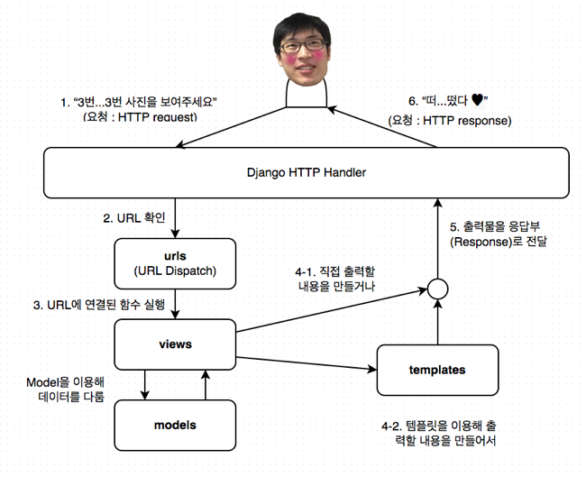

## 5. url에 뷰 함수 연결해서 사진 출력하기

* 마지막 갱신일시 : 2017년 1월 29일 21시 30분

이번 편에서는 인터넷 주소에 접속하여 Photo 모델로 올린 사진 데이터를 가져와서 View 기능을 이용하여 웹 브라우저에 관련 내용을 출력해보겠습니다.

### 1. URL에 Photo View 연결

#### (1) URL Resolver



이용자가(client) 인터넷 주소(URL : Uniform resource locator, 이하 URL)로 접속하면 웹 서버는 접속한 주소에 해당하는 내용물을 보여줍니다. Django로 운용되는 서비스도 마찬가지여서, 이용자가 URL로 접근하여 뭔가를 요청하면 그 URL에 대한 정보를 `urls.py`로 대표되는 URL dispatch에서 찾아서 연결된 구현부를 실행합니다. 구현부는 데이터를(Model) 가져와 출력물을 바로(?) 출력하기도 하고 Template을 거쳐서 출력물을 만들어낸 후 출력하기도 합니다. 이렇게 URL과 구현부을 연결해주는 역할을 Django의 View 영역인 `views.py`가 합니다. 지난 [3회 강좌](http://blog.hannal.com/2014/9/start_with_django_webframework_03/)에서 설명한 MTV 개념인데, View에서 URL로 요청받은 걸 이런저런 방법으로 처리하여 결과(출력물)를 내보낸다고 보면 됩니다.

Django에서는 URL Resolver(`urlresolver`)라는 모듈이 URL Dispatch 역할을 하며, `django/core/urlresolvers.py`에 있습니다. 이 `urlresolvers` 모듈에 있는 `RegexURLResolver` 클래스가 요청받은 URL을 되부를 함수(callback function) 덩어리로 바꿔줍니다. 이 덩어리는 뷰 함수와 함수 인자로 된 tuple 자료형이며, HTTP Handler가 받아서 뷰 함수를 실행하고 그 결과를 응답(response)합니다. HTTP Handler는 `django/core/handlers/base.py` 모듈에 있는 `BaseHandler` 클래스를 뜻합니다. 정리하면 다음과 같이 진행됩니다.

1. `BaseHandler` 클래스가 URL로 요청(request) 받음
2. `RegexURLResolver`로 URL을 보냄
3. `RegexURLResolver`가 URL에 연결된 View를 찾아서 callback 함수와 인자 등을 `BaseHandler`로 반환
4. `BaseHandler`에서 이 함수를 실행하여 결과값인 출력물을 받음.
5. 출력

중간 중간에 middleware 등과 같은 과정이 있지만 큰 흐름은 이러합니다.

위 내용을 몰라도 Django를 다루는 데 아무 지장 없습니다. 저는 다음 두 문장을 쓰기 위해 위 설명을 쓴 겁니다.

1. Model이나 View에 기능을 구현
2. 이용자가 서버에 있는 자원에 접근하는 경로인 URL을 URL Dispatch 처리 모듈인 `urls.py`에 등록하고 그 URL에 구현부를 연결

우리는 앞으로 이런 흐름으로 기능을 구현합니다.

#### (2) 개별 사진 보기 View - 1

`photos` 앱, 그러니까 `photo` 디렉터리 안에 있는 views.py 파일을 엽니다. 별 내용은 없습니다. 세상에 인사하는 View부터 구현해보겠습니다.

```
from django.shortcuts import render
from django.http import HttpResponse


def hello(request):
    return HttpResponse('안녕하세요!')
```

이번엔 `pystagram` 디렉터리에서 `urls.py` 파일을 열어서 주석으로 표기한 두 줄을 추가합니다.
```
from django.conf.urls import url
from django.contrib import admin

from photos.views import hello  # 이 줄을 추가하고, 


urlpatterns = [
    url(r'^hello/$', hello),  # 이 줄도 추가합니다.
    url(r'^admin/', admin.site.urls),
]
```

끝났습니다. 웹브라우저에서 `http://127.0.0.1:8000/hello/`로 접속하면 `HttpResponse`로 넘긴 문장이 출력되는 걸 보실 겁니다.


#### (3) urls.py

`urls.py`에는 Django의 `urls` 모듈에 있는 `url` 함수를 이용하여 URL 연결자를 만들어서 `urlpatterns`에 넣습니다.

주소 연결자를 만드는 `url` 함수 부분을 보겠습니다. 이 함수는 총 네 개 인자를 받습니다. 

* regex : 주소 패턴 (정규표현식)
* view : 연결할 View
* name : 주소 연결자 이름
* kwargs : `urls`에서 View로 전달할 `dict`형(사전형) 인자

`regex`와 `view`는 필수 인자이고, 나머지는 생략해도 됩니다. 우리가 `urls.py`에 추가한 `url(r'^hello/$', hello),`를 기준으로 놓고 보면 이러합니다.

* regex : `r'^hello/$'`
* view : `hello`

`view` 인자엔 실행할 함수 객체를 전달합니다. `from photos.views import hello`는 photos에 있는 views에서 hello라는 객체를 가져오는 것인데, 이를 풀어쓰면 `photos` 앱 디렉터리에 있는 `views.py` 파일(Python 모듈)에서 `hello` 객체, 즉 `hello` 함수 객체를 가져온 것입니다. 함수를 호출하지 않고 함수 자체를 가져온 것에 유의하세요. 앞서 “4. `BaseHandler`에서 이 함수를 실행하여 결과값인 출력물을 받음.”라고 설명한 부분이 바로 이 부분입니다. 뷰 함수는 “3번...” 문자열을 반환하는데(`return`) 그 반환받는 주체가 바로 `BaseHandler`입니다. 물론 이 뷰 함수를 실행하는 주체이기도 하고요.

이번엔 개별 사진을 보는 URL을 만들겠습니다. Pystagram 기획 내용에 따르면 개별 사진을 보는 URL은 `/photo/<사진 ID>/`이니 `urls.py`도 이 내용으로 정하겠습니다. 하는 김에 `name` 인자까지 덧붙이겠습니다.

```
from django.conf.urls import url
from django.contrib import admin

from photos.views import hello
from photos.views import detail  # 이 줄이 추가됐고,


urlpatterns = [
    url(r'^hello/$', hello),
    url(r'^photos/(?P<pk>[0-9]+)/$',  # 이 줄과
        detail, name='detail'),  # 이 줄도 추가
    url(r'^admin/', admin.site.urls),
]
```

hello URL과 달리 이상한 기호가 섞여 있습니다. 그 유명한 정규표현식입니다.

사진 게시물을 보는 URL은 `/photos/<사진 ID>/'입니다. 

- /photos/1/
- /photos/2/
- ...
- /photos/1023/

사진 ID는 숫자이므로 URL은 이런 구조입니다. 주소 중 숫자 ID 부분만 다르고 나머지는 동일합니다. 그리고 숫자 ID는 숫자로 구성되어 있습니다. 이런 문자열 패턴을 다루는 방법 중 하나가 정규표현식입니다. `^photos/(?P<pk>[0-9]+/$'`를 하나씩 파헤쳐 봅시다.

- `^` : `^` 문자 뒤에 나열된 문자열로 시작
- `[0-9]` : 0부터 9까지 범위에 속하는 문자
- `+` : 앞에 지정한 문자열 패턴이 한 번 이상 반복
- `()` : 패턴 부분을 묶어냄(grouping)
- `?P<pk>` : 묶어낸 패턴 부분에 이름을 `pk`로 붙임.
- `$` : `$` 문자 앞에 나열된 문자열로 끝

`+`을 빠뜨리지 마세요. `[0-9]`로만 패턴을 정하면, 숫자 ID는 한 자리 숫자만 뜻합니다.

만약 사진 게시물 식별자가 숫자 ID가 아니라 영소문자로만 구성되어 있다면 `[0-9]+` 대신 `[a-z]+` 패턴을 쓰면 됩니다. 

이번엔 `photos` 앱 디렉터리의 `views.py` 파일을 열고 `detail` 뷰 함수를 만듭니다. `photos.views`에 있는 `detail`을 가져와야(`import detail`) 하는데, 아직 `detail` 뷰 함수는 만들지 않았거든요.

```
def detail(request):
    return HttpResponse('detail 뷰 함수')
```

이 정도로 Django의 URL Dispatch 기능의 작동법과 사용법 설명을 마치고, 추가 기능은 필요하면 그때 그때 설명하겠습니다. 아참, `url` 함수가 받는 마지막 인자인 `kwargs`는 부록에서 설명하겠습니다. 


#### (4) 개별 사진 보기 View - 2

웹브라우저에서 `/photos/<사진 ID>/`, 예를 들어 `/photos/1023/`으로 접근하면 “TypeError at /photos/1023/”이라는 오류가 뜹니다. 내용은 
“detail() got an unexpected keyword argument 'pk'”이고요. `detail` 함수로 `pk`라는 인자를 넘길려는데 `detail` 함수가 받지 않아서 그렇습니다. `pk`는 `urls.py`에서 `(?P<pk>[0-9]+)` 바로 이 부분입니다. 정규표현식 패턴에 해당되는 문자열이 `?P<이름>`에 지정된 `이름`에 저장되어 뷰 함수의 인자로 넘겨집니다. `/photos/숫자/` URL에서 숫자가 `pk`라는 이름을 갖는 인자에 저장되어 `detail` 뷰 함수로 전달됩니다. 그래서 `detail` 함수가 이 인자를 받도록 해야 합니다.

```
def detail(request, pk):
    msg = '{}번 사진 보여줄게요.'.format(pk)
    return HttpResponse(msg)
```

첫 번째로 받는 인자인 `request`는 뷰 함수가 받는 기본 인자입니다. 요청(request)과 관련된 여러 정보와 기능을 수행합니다. 많은 일을 수행하는 객체이니 앞으로 그때 그때 설명하겠습니다.

`urls.py`에서 뷰 함수로 넘길 인자 이름을 지정하지 않아도 별 문제는 없습니다.

```
url(r'^photos/([0-9]+)$', detail, name='detail'),
```

`urls.py`에서 위와 같이 `?P<pk>`을 빼서 인자 이름을 없애면, 인자는 위치 인자로(positional argument) 뷰 함수로 넘겨집니다.

```
def detail(request, photo_id):
    msg = '{}번 사진 보여줄게요.'.format(pk)
    return HttpResponse(msg)
```

위치 인자이므로 인자 이름은 편한대로 정해도 됩니다. `?P<이름>`을 지정하면 뷰 함수엔 키워드 인자(keyword argument)로 전달되므로 뷰 함수가 전달받는 인자 이름과 일치해야 합니다.

숫자없이 `/photos/`로 또는 숫자가 아닌 문자가 포함된 주소(가령 `/photos/3-1023/`이나 `/photos/3번/`)로도 접근해보세요. “Page not found (404)” 오류가 출력됩니다. `urls.py`에 지정한 URL 패턴에 해당되는 게 없으면 `404` 오류가 발생합니다.


### 2. Photo 모델에서 사진 정보를 가져와 출력하기

#### (1) Photo 모델로 객체 찾기(lookup)

코드부터 보겠습니다.

```
from .models import Photo


def detail(request, pk):
    photo = Photo.objects.get(pk=pk)

    messages = (
        '<p>{pk}번 사진 보여줄게요</p>'.format(pk=photo.pk),
        '<p>주소는 {url}</p>'.format(url=photo.image.url),
    )
    return HttpResponse('\n'.join(messages))
```

먼저 `from .models import Photo`문으로 `photos` 앱에 있는 `models` 모듈에서 `Photo` 모델을 가져옵니다. `.models`는 `photo.models`와 같은 내용인데, `views.py` 파일과 같은 디렉터리(경로)에 있기 때문입니다.

그 다음에 `Photo` 모델의 `objects` 객체의 `get` 메서드를 이용해 뷰 함수의 인자 `pk`에 해당하는 사진 데이터(Photo 모델의 객체(instance)) 가져와서 `photo`라는 변수에 담습니다. `Photo` 모델에 있는 `image`이라는 필드에 접근해서 `url` 속성(property)를 이용해 지정한 사진의 URL을 출력합니다.

모델을 다루는 건 나중에 자세히 다루니, 이번 편에서는 모델을 이용해 데이터를 가져오는 것에 만족하겠습니다. :)


#### (2) 찾는 객체가 없으면 404 오류 출력

`/photos/숫자/` URL 중 숫자를 되게 큰 값, 예를 들어 1023을 넣어보세요. “DoesNotExist at /photos/1023/”라는 오류가 출력됩니다. 사진 ID 중 1023번인 자료가 없어서 모델 영역에서 발생한 오류입니다. 이 오류 대신 “사진이 없다”는 안내를 하려면 이 오류에 대한 예외(exception) 처리를 해야 합니다.

```
    try:
        photo = Photo.objects.get(pk=pk)
    except Photo.DoesNotExist:
        return HttpResponse("사진이 없습니다.")
```

`DoesNotExist`라는 `Exception`이 발생하면 이를 try/except 문으로 잡아내서 예외처리를 한 겁니다. 그런데 `Photo` 모델로 사진 데이터를 가져오려는데 데이터가 없는 상황은 “없는 페이지”라고 봐도 됩니다. 그래서 이런 상황에선 `404` 오류를 일으키고 `404` 오류 안내 페이지를 따로 만들어 제공하는 게 낫습니다. 이걸 간편하게 해주는 것이 `get_object_or_404` 함수입니다. 이 함수는 `django.shortcuts` 모듈에 있습니다.

```
from django.shortcuts import get_object_or_404


def detail(request, pk):
    photo = get_object_or_404(Photo, pk=pk)
    # 후략
```

이런 식으로 사용하면 됩니다. 첫 번째 인자로 모델을 넣고, 그 뒤로는 탐색 키워드 인자를 넣습니다. 탐색 키워드 인자란 `pk=pk`와 같이 모델에서 객체를 찾는 데 쓰이는 내용을 뜻합니다.

`Photo` 모델을 이용해 사진 데이터를 가져와 관련 정보를 웹 브라우저에 출력까지 했습니다. 관련 정보를 출력한다고 했지 사진을 출력한다고는 안 했습니다. ^^ 하지만, 이대로 끝마치기엔 서운하니 사진 출력까지만 하고 설명은 다른 편에서 다루겠습니다.

#### (3) 업로드한 파일을 URL로 접근하기

먼저 화면에 출력된 사진 파일 URL로 이미지를 출력하도록 HTML 태그를 출력할 내용에 추가하겠습니다. `img` 태그를 쓰는 것이지요.

```
    messages = (
        '<p>{pk}번 사진 보여줄게요</p>'.format(pk=photo.pk),
        '<p>주소는 {url}</p>'.format(url=photo.image.url),
        '<p></p>'.format(url=photo.image.url),
    )
```

웹브라우저로 접속해보세요. 이미지가 출력되지 않습니다. 화면에 출력된 이미지 파일 URL을 서버 호스트 내용과 합쳐서, 그러니까 `http://localhost:8000/uploads/.../` 이런 식으로 만들어서 웹브라우저로 접근해보세요. `404` 오류가 발생합니다.

Django는 이용자가 업로드한 파일은 `MEDIA_URL`과 `MEDIA_ROOT`라는 설정값을 참조하여 제공(serve)합니다. 모델의 `FileField` 필드 클래스나 `ImageField` 필드 클래스로 지정하는 `upload_to` 인자는 `MEDIA_URL`과 `MEDIA_ROOT` 경로 아래에 위치합니다. 이 두 설정값을 무시하는 것도 가능하지만 운영하는 데 번거롭고 보안에도 좋진 않습니다.

자, 그럼 `MEDIA_URL`과 `MEDIA_ROOT`를 설정하겠습니다. `pystagram` 패키지(디렉터리) 안에 있는 `settings.py` 파일을 열고 맨 아래에 다음 두 줄을 추가합니다.

```
MEDIA_URL = '/upload_files/'
MEDIA_ROOT = os.path.join(BASE_DIR, 'uploads')
```

이번엔 `models.py`를 열고, `image`와 `filtered_image` 모델 필드에 지정된 `upload_to`를 변경합니다.

```
class Photo(models.Model):
    image = models.ImageField(upload_to='%Y/%m/%d/orig')
    filtered_image = models.ImageField(upload_to='%Y/%m/%d/filtered')
    content = models.TextField(max_length=500, null=True, blank=True)
    created_at = models.DateTimeField(auto_now_add=True)
```

업로드된 파일은 `upload_files` 라는 URL을 따르므로 `urls.py`에도 이와 관련된 내용을 등록해야 합니다. 원리는 이렇습니다. `upload_files` 뒤에 나오는 경로를 받은 뒤 지정된 경로에 있는 이미지 파일을 읽어온 후 웹브라우저에 보내는 겁니다. 경로에 없으면 `404` 오류를 일으키고요. 아, 생각만 해도 귀찮습니다. 다행히 Django엔 이런 걸 처리해주는 기능이 이미 있습니다. `django.conf.urls.static` 모듈에 있는 `static` 함수지요. `urls.py` 파일에서 기존 `urlpatterns` 변수 아래에, 간단히 말해 맨 아래에 다음 줄을 추가하세요.

```
from django.conf import settings
from django.conf.urls.static import static

urlpatterns += static('static_files', document_root=settings.MEDIA_ROOT)
```

자, 끝났습니다. 이제 다시 웹브라우저에서 개별 사진 URL로 접근해보세요. 404 오류 나던 것이 몇 가지 조치를 취하자 이미지가 잘 나오는데, 이는 정적 파일 처리와 관련된 내용이며 나중에 자세히 다루겠습니다. :)

### 3. 부록

#### (1) url 함수의 kwargs 역할

`url` 함수에 사용되는 인자인 `kwargs`는 뷰 함수로 임의 인자를 건내는 데 사용됩니다. 뷰 함수는 URL 패턴에서 지정된 값을 인자로 건내받는데, URL에는 어떤 상태나 정보를 나타내지 않으면서 상황에 따라 뷰 함수에 넘기는 값을 따로 지정하려면 `kwargs` 인자를 활용해야 합니다. 예를 들어, 개별 사진을 `/photos/<숫자ID>/`이나 `/hidden-photos/<숫자ID>/` URL로 접근할 수 있고, 두 URL 모두 `detail` 함수가 대응한다고 가정하겠습니다. 어떤 URL로 접근했는지 `detail` 함수에서 알려면 접근한 URL을 분석해도 되지만, URL엔 보이지 않는 정보를 `detail` 함수에 인자로 보내면 좀 더 편할 겁니다. 이 인자를 `hidden`이라고 하겠습니다. 먼저 `urls.py`에 `kwargs` 인자를 정의합니다.

```
    url(r'^photos/(?P<pk>[0-9]+)$', detail, name='detail'),
    url(r'^hidden-photos/(?P<pk>[0-9]+)$', detail, kwargs={'hidden':True}),
```

이번엔 `detail` 뷰 함수가 `hidden` 인자를 받을 차례입니다.

```
def detail(request, pk, hidden=False):
    if hidden is True:
        # todo: 뭔가 은밀한 작업을 합시다
        pass
```

`detail` 함수는 따로 `hidden` 인자를 넘기지 않으면 `False` 값으로 `hidden` 인자를 받습니다. 즉, `/photos/<숫자ID>/`로 접근하는 경우입니다. 하지만, `/hidden-photos/<숫자ID>/`로 접근하면 `hidden` 인자는 `True`로 `detail` 함수에 넘겨집니다. `/hidden-photos/<숫자ID>/` URL을 아는 사람만 `hidden`이 `True`인 상황을 만끽하게 되겠지요.

#### (2) render와 HttpResponse

`views.py`를 처음 열면 맨 위에 `from django.shortcuts import render`라는 부분이 있습니다. 그런데 우리는 이 `render` 함수를 한 번도 쓰지 않고, `HttpResponse`를 따로 불러들여서 이를 이용해 화면에 뭔가를 출력했습니다. 이 둘의 차이는 뭘까요?

`HttpResponse`는 Django의 View가 HTTP handler로 보내는 출력물의 가장 기본 형태인 객체를 만드는 클래스입니다. HTTP handler가 건내받는 출력물의 가장 기본형이지요. 그래서 `HttpResponse` 자체는 템플릿을 같은 걸 처리하는 기능을 담고 있지 않습니다. 그래서 템플릿을 따로 처리하여 그려낸(rendered) 출력물을 문자열 그 자체(plain text)로 받아서 출력해야 합니다. 이런 처리에 필요한 코드는 꽤 반복되므로 반복되는 부분을 별도 함수로 만들어서 편하게 템플릿으로 그려낸 출력물을 `HttpResponse`로 보내는 함수가 바로 `render`입니다. `render` 함수를 보면 반환하는 최종 값도 결국은 `HttpResponse` 클래스로 만든 객체입니다.

```
    return HttpResponse(loader.render_to_string(*args, **kwargs), **httpresponse_kwargs)
```

--------

이것으로 강좌 5편을 마칩니다. 이번에도 늦어서 죄송합니다.

* [5편까지 진행한 전체 소스 코드](https://github.com/hannal/start_with_django_webframework/tree/l05)

