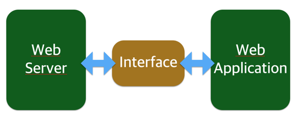
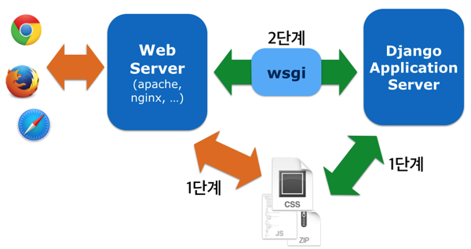

## 6. Django 정적 파일 기능 이해하기

지난 5회에서 다룬 정적 파일을 Django에서 어떻게 다루는지 자세히 알아 보겠습니다.

### 1. Django와 정적 파일

#### 웹 서버와 웹 애플리케이션, 그리고 정적 파일

웹 게시판이나 블로그, 또는 우리가 만들 Pystagram은 웹 프로그램 또는 웹 애플리케이션입니다. 이런 웹 애플리케이션이 필요한 이유는 뭘까요?

웹 서버는 웹 클라이언트가 특정 위치에(URL) 있는 서버 저장소(storage)에 있는 자원(resource)을 요청(HTTP request) 받아서 제공(serving)하는 응답(HTTP response) 처리가 기본 동작입니다. 이러한 기본 동작은 자원과 접근 가능한 주소가 정적으로 연결된 관계입니다. PC 스토리지의 `/Users/hannal/Pictures/private_photo.png` 경로에 사진 파일이 있다고 예를 들면, 파일 경로는 웹 주소이고 사진 파일은 자원입니다. 사진 파일을 읽어 들여 보거나 수정하거나 지우는 행위는 HTTP method(GET, POST, PUT, DELETE 등)로 표현합니다. 정리하면 웹 서버는 요청받은 URL과 방식으로 서버에 존재하는 자원을 제공하며, 이 동작을 정적 자원(static resource)을 제공하는 것입니다.

그런데 사진 파일 자체를 제공하는 데 그치지 않고, 사진에 설명도 달고 댓글도 단다면 자원(사진, 본문, 댓글 등)을 정적으로 제공하는 건 그다지 효율성이 좋지 않습니다. 본문을 수정하거나 댓글을 단다는 건 내용물이 고정되어 있지 않고 언제든지 변하는 상황인데, 언제든지 가변하는 내용물을 고정된 자원으로 제공하려면 내용물이 바뀔 때마다 고정된 자원도 매번 바꿔서 정적인 상태로 만들어야 합니다[^1].

가변하는 자원을 운용하려면 동적으로 자원을 처리하는 기능을 구현해야 하는데, 웹 서버에 이러한 기능을 추가하는 건 그리 좋은 생각은 아닙니다. 웹 서버는 대부분 C나 C++ 언어로 작성되어 있고, 동적인 웹 자원을 다루는 처리는 대부분 문자열을 가공하는 과정입니다. C나 C++ 언어로 문자열을 다루는 건 불편할 뿐더러 웹 서버에 동적 자원을 다루는 기능을 직접 탑재하는 것도 까다롭습니다. 문자열 가공을 더 쉽게 다루는 다른 언어(Python, Perl 등)로 동적 자원을 처리하는 별도 웹 서버 애플리케이션을 웹 서버와 분리해서 만들고 관리하는 게 낫습니다. 그리고 웹 애플리케이션과 웹 서버가 통신하는 인터페이스를 중간에 두어 서로를 연결합니다.



#### Django는 정적 파일을 제공하는 실 서비스용 기능을 제공하지 않는다

Django는 실 서비스 환경에서 사용할 정적 파일을 제공하는 기능을 제공하지 않습니다. 서버에 저장된 정적 파일을 읽어들여서 그대로 웹 클라이언트에 보내기만 하면 그만인 단순한 기능인데도 Django는 그런 기능을 제공하지 않습니다. 왜냐하면 그럴 필요가 없기 때문인데, 앞서 설명한 바와 같이 그런 작업에 대해서는 웹 서버가 전문가이기 때문입니다.



게다가 웹 애플리케이션은 웹 서버와 연결하는 중간 인터페이스를 거치므로 효율이 더 떨어집니다.

하지만, 개발 상황인 경우는 효율보다는 기능(역할)이 중요한 경우가 많습니다. 정적 파일이 제대로 제공되는지 확인하려고 항상 웹 서버를 구동할 필요는 없습니다. Django는 개발 단계에서 쓸 정적 파일 제공 기능을 제공합니다. 성능은 웹 서버가 직접 정적 파일을 제공하는 것 보다 떨어지지만 정적 파일 제공에 필요한 기능은 대부분 지원합니다.

#### Static file과 Media file

Django은 정적 파일을 크게 두 종류로 구분합니다.

Static file은 Javascript, CSS, Image 파일처럼 웹 서비스에서 사용하려고 미리 준비해 놓은 정적 파일입니다. 파일 자체가 고정되어 있고, 서비스 중에도 수시로 추가되거나 변경되지 않고 고정되어 있습니다.

Media file은 이용자가 웹에서 올리는(upload) 파일입니다. 파일 자체는 고정되어 이지만, 언제 어떤 파일이 정적 파일로 제공되고 준비되는지 예측할 수 없습니다.

Static file과 Media file은 정적 파일이라는 점에서는 같지만, 정적 파일을 제공하는 상황을 예측할 수 있는지 여부는 다릅니다. Static file은 서비스에 필요한 정적 파일을 미리 준비해놓기 때문에 `manage.py` 도구에 `findstatic`과 `collectstatic`이라는 기능으로 정적 파일을 모으고 찾는 관리 기능을 제공합니다. `manage.py`은 Django 프로젝트를 관리하는 일에 필요한 기능을 명령줄 쉘(shell)에서 수행하는 도구입니다. 그에 반해 Media file은 이용자가 웹에서 올리는 파일이므로 미리 예측해서 준비할 수 없습니다. 그래서 Static file 관련된 관리 기능인 `findstatic`과 `collectstatic` 기능을 사용하지 못합니다.


### 2. Static file

Static file은 웹 서비스에 사용할 정적 파일을 미리 준비하여 제공하는 데 사용합니다. Django로 운영되는 프로젝트의 설정을 관리하는 `settings.py`에 Static file와 관련된 항목이 다섯 가지 존재하며, 보통은 다음 세 가지를 사용합니다.

- `STATICFILES_DIRS`
- `STATIC_URL`
- `STATIC_ROOT`

#### `STATICFILES_DIRS`

`STATICFILES_DIRS`은 개발 단계에서 사용하는 정적 파일이 위치한 경로들을 지정하는 설정 항목입니다. 특정 Django App[^2]에만 사용하는 정적 파일이 있거나 혹은 정적 파일을 관리하기 용이하게 하기 위해 여러 경로(path)에 정적 파일을 배치하였다면, 이 경로들을 Python의 `list`나 `tuple`로 담으면 됩니다.

```
STATICFILES_DIRS = (
    os.path.join(BASE_DIR, 'static'),
)
```

대개는 `static`이라는 디렉터리에 정적 파일을 담습니다. 주의할 점은 정적 디렉터리 경로가 하나이더라도 반드시 `list`나 `tuple`로 담아야 한다는 점입니다. 흔히 하는 실수는 다음과 같이 항목 뒤에 쉼표를 빠뜨리는 것입니다.

```
STATICFILES_DIRS = (
    os.path.join(BASE_DIR, 'static')
)
```

이런 경우 Django는 `ImproperlyConfigured: Your STATICFILES_DIRS setting is not a tuple or list; perhaps you forgot a trailing comma?`라는 경고를 출력하며 정적 파일을 제대로 제공(serving)하지 못합니다.

`manage.py`에서 제공하는 명령어 중 `findstatic`은 `STATICFILES_DIRS`에 설정한 경로에서 지정한 정적 파일을 찾습니다. 실습해보지요. [jQuery download](http://jquery.com/download/)에서 “Download the compressed, production jQuery x.x.x”로 된 링크를 찾은 뒤 그 링크에 걸려있는 jQuery 파일을 내려 받습니다. 이 강좌를 쓰는 시점에서 저는 2.1.3판을 받았습니다. 이제 `manage.py` 파일이 있는 경로에 `static`이라는 이름으로 디렉터리를 만들고, 다시 `static` 디렉터리 안에 `js`라는 디렉터리를 만든 다음에 `js` 디렉터리에 내려 받은 jQuery 파일을 넣습니다. `settings.py`에는 앞서 나온 예시대로 `STATICFILES_DIRS` 항목을 추가합니다. 이제 `findstatic` 명령어로 파일을 찾아 보겠습니다.

```
$ python manage.py findstatic js/jquery-2.1.3.min.js
Found 'jquery-2.1.3.min.js' here:
  /(중략)/pystagram/static/js/jquery-2.1.3.min.js
```

물론 `$` 기호는 입력하지 않습니다. 쉘의 프롬프트 기호이니까요.

이번엔 `STATICFILES_DIRS`에 `os.path.join(BASE_DIR, 'static2')` 항목을 추가합니다.

```
STATICFILES_DIRS = (
    os.path.join(BASE_DIR, 'static'),
    os.path.join(BASE_DIR, 'static2'),
)
```

그런 뒤 `manage.py` 파일이 있는 경로에 `static2` 디렉터리를 만들고 이 안에 `js` 디렉터리를 만들어서 그곳에 jQuery 파일을 복사합니다. 마지막으로 `photo` 디렉터리(Django `photo` 앱)에 `static` 디렉터리를 만들고 이 디렉터리에 jQuery 파일을 복사하고, 또 `static` 디렉터리 안에 `js` 디렉터리를 더 만든 뒤 그 안에 jQuery 파일을 복사합니다. 디렉터리 구조는 다음과 같으며, 강좌 연재가 너무 지연되어서 `photo` 디렉터리가 뭔지 기억이 나지 않는다면 “[3. Photo 앱과 모델 만들기](http://blog.hannal.com/2014/9/start_with_django_webframework_03/)”편을 참고하시길 바랍니다. :)

- .
- static/
    - js/
- static2/
    - js/
- photo/
    - static/
    - static/js/

그런 뒤 다음 세 줄을 실행하여 화면에 나온 결과가 무엇을 의미하는지 고민해 보세요.

```
$ python manage.py findstatic jquery-2.1.3.min.js
$ python manage.py findstatic js/jquery-2.1.3.min.js
$ python manage.py findstatic javascript/jquery-2.1.3.min.js
```

충분히 고민하셨으리라 믿습니다. `js/jquery-2.1.3.min.js`를 찾으려 하면 `static` 디렉터리에 있는 것과 `static2` 디렉터리에 있는 것, 그리고 `photo/static` 디렉터리에 있는 것이 나타납니다. 나타난 순서는 `static`, `static2`, `photo/static` 디렉터리 순인데, 이 배치된 순서는 실제로 정적 파일을 찾아다 사용할 때 우선순위로 작용합니다. 이 우선순위는 `STATICFILES_DIRS`에 명기된 디렉터리가 더 상위인데, `STATICFILES_FINDERS`라는 `settings.py` 설정 항목에서 기본 파일 시스템 파인더(finder)가 Django App 디렉터리보다 상위순위로 지정되어 있기 때문입니다.

이와 같이 정적 파일 경로가 일치할 경우 우선순위에 따라 실제 사용하는 정적 파일이 결정됩니다. 실제 물리 경로는 그대로 유지하지만 우선순위 문제를 겪지 않으려면 접두사(prefix)를 붙여서 구분하면 됩니다. `static2`는 이제 곧 지울 항목이니까 `byebye`라는 접두사를 쓰겠습니다.

```
STATICFILES_DIRS = (
    os.path.join(BASE_DIR, 'static'),
    ('byebye', os.path.join(BASE_DIR, 'static2'),),
)
```

이 설정을 적용하면 `static2` 디렉터리가 마치 `byebye`라는 디렉터리 안에 위치한 것처럼 `static2`에 있는 정적 파일에 접근해야 합니다. 다음 두 명령을 실행해 보세요.

```
$ python manage.py findstatic js/jquery-2.1.3.min.js
$ python manage.py findstatic byebye/js/jquery-2.1.3.min.js
```

#### `STATIC_URL`

`STATIC_URL`은 웹 페이지에서 사용할 정적 파일의 최상위 URL 경로입니다. 이 최상위 경로 자체는 실제 파일이나 디렉터리가 아니며, URL로만 존재하는 단위입니다. 그래서 이용자 마음대로 정해도 무방하며, 저는 `assets`라는 URL 경로를 쓰겠습니다.

```
STATIC_URL = '/assets/'
```

문자열은 반드시 `/`로 끝나야 합니다. `findstatic` 명령어로 탐색되는 정적 파일 경로에 `STATIC_URL` 경로를 합치면 실제 웹에서 접근 가능한 URL이 됩니다.

- `findstatic js/jquery-2.1.3.min.js` : http://pystagram.com**/assets/js/jquery-2.1.3.min.js**
- `findstatic byebyejs/jquery-2.1.3.min.js` : http://pystagram.com**/assets/byebye/js/jquery-2.1.3.min.js**

`STATIC_URL`은 정적 파일이 실제 위치한 경로를 참조하며, 이 실제 경로는 `STATICFILES_DIRS` 설정 항목에 지정된 경로가 아닌 `STATIC_ROOT` 설정 항목에 지정된 경로입니다. 그런데 `static2` 경로는 `byebye` 접두사가 붙어서 실제 물리 경로와 다릅니다. 이에 대해선 `STATIC_ROOT`에서 자세히 다루겠습니다.

#### `STATIC_ROOT`

`STATIC_ROOT`는 Django 프로젝트에서 사용하는 모든 정적 파일을 한 곳에 모아넣는 경로입니다. 한 곳에 모으는 기능은 `manage.py` 파일의 `collectstatic` 명령어로 수행합니다. Django가 모든 파일을 검사하여 정적 파일로 사용하는지 여부를 확인한 뒤 모으는 건 아니고, 각 Django 앱 디렉터리에 있는 `static` 디렉터리와 `STATICFILES_DIRS`에 지정된 경로에 있는 모든 파일을 모읍니다.

개발 과정에선, 정확히는 `settings.py`의 `DEBUG`가 `True`로 설정되어 있으면 `STATIC_ROOT` 설정은 작용하지 않으며, `STATIC_ROOT`는 실 서비스 환경을 위한 설정 항목입니다. 그래서 개발 과정에선 `STATIC_ROOT`에 지정한 경로가 실제로 존재하지 않거나 아예 `STATIC_ROOT` 설정 항목 자체가 없어도 문제없이 동작합니다.

그렇다면 실 서비스 환경에서 `STATIC_ROOT`는 왜 필요할까요? 이 경로에 있는 모든 파일을 웹 서버가 직접 제공(serving)하기 위함입니다. 실제 실습하며 확인해 보겠습니다.

`settings.py`에 다음과 같이 `STATIC_ROOT` 설정 항목을 추가합니다.

```
STATIC_ROOT = os.path.join(BASE_DIR, 'collected_statics')
```

`list`나 `tuple`형인 `STATICFILES_DIRS`와는 달리 문자열 경로를 할당합니다. 이제 `collectstatic` 명령어로 현 프로젝트가 사용하는 모든 정적 파일을 모읍니다.

```
$ python manage.py collectstatic
```

지정한 경로에 있는 기존 파일을 전부 덮어 쓰는데 정말로 모을 거냐고 묻습니다. 원본 파일을 덮어 쓰는 게 아니니 `yes`라고 입력합니다. 정적 파일을 모을 경로를 `manage.py` 파일이 있는 경로에 `collected_statics` 디렉터리로 지정했으므로 이 디렉터리가 만들어지고, 이 안에 사용하는 모든 정적 파일이 **복사**됩니다. 이 디렉터리 안을 보면 `STATICFILES_DIRS`에 넣은 경로들 중 `byebye`라는 접두사를 붙인 디렉터리도 보입니다. 마음으로 “hi”라고 인사 보내셨다면 당신은 친절한 사람. :)

이렇게 정적 파일을 모아놓은 `STATIC_ROOT`는 Django가 직접 접근하진 않습니다. Django가 접근하여 다루는 설정은 `STATICFILES_DIRS`이며, `STATIC_ROOT`는 정적 파일을 직접 제공(serving)할 웹 서버가 접근합니다. `collectstatic` 명령어를 수행하면 `STATICFILES_DIRS`나 앱 디렉터리에 있는 `static` 디렉터리 안에 있는 파일을 `STATIC_ROOT`에 모으는데, `STATICFILES_DIRS`에 지정된 경로인 경우 따로 명시한 접두사으로 디렉터리를 만들어 그 안에 파일을 복사하고, 앱 디렉터리에 있는 `static` 디렉터리인 경우는 앱 이름으로 디렉터리를 만들어 그 안에 `static` 디렉터리 안에 있는 파일을 복사합니다. 즉, 개발 단계(`DEBUG = True`)에서는 정적 파일 URL 경로가 논리 개념이고, 서비스 환경(`DEBUG = False`)에서는 실제 물리 개념인 정적 파일 URL 경로가 되는 것입니다.

그렇다면 경로가 동일해서 우선순위가 발생하는 경우에 `collectstatic`을 수행하면 어떤 파일이 실제로 복사될까요? 물론 1순위 경로에 위치한 파일이 복사됩니다. `photo/js/jquery-2.1.3.min.js` 파일을 열어서 내용을 몽땅 지워서 0 byte 파일로 만들고, `collected_static` 디렉터리를 지운 뒤에 다시 `collectstatic` 명령어를 실행해 보세요. `collected_static` 디렉터리 안의 `js` 디렉터리 안에 있는 `jquery-2.1.3.min.js` 파일을 보면 0 byte인 `photo/js/jquery-2.1.3.min.js`이 아닌 정상 파일인 `js/jquery-2.1.3.min.js`이 복사되어 있습니다.

주의할 점. `STATIC_ROOT` 경로는 `STATICFILES_DIRS` 등록된 경로와 같은 경로가 있어서는 안 됩니다. 남들이 잘 안 쓸만한 이상한 이름(`collected_statics`?)을 쓰세요.

#### `'django.contrib.staticfiles'`

개발 단계에서 정적 파일을 제공(serving)하는 기능은 Django에서 제공하는데, 사용 방법은 아주 간단합니다. `django.conf.urls.static` 모듈에 있는 `static` 함수를 이용해 URL 패턴을 만들어 `urls.py`의 `urlpatterns`에 추가하는 것입니다. 지난 5회 강좌분에서 이미 사용한 바로 그 방식입니다. 이 함수를 조금 더 살펴볼까요?

이 함수를 `urls.py`에서 URL 패턴을 만드는 데 사용한 걸 보면 이 함수 자체가 정적 파일을 제공한다기 보다는 정적 파일 URL에 그런 기능을 하는 무언가를 연결할 것이라 예상되지요? 실제로 그렇게 동작합니다. 정적 파일에 접근할 URL 접두사(`staticfiles`)를 첫 번째 인자로 넣고 정적 파일이 위치한 경로를 `document_root`라는 키워드 인자로 전달하면, 이런 내용을 `django.views.static.serve`라는 뷰 함수가 사용합니다. 이 `serve` 함수는 서버에 위치한 파일을 읽어서(`open(fullpath, 'rb')`) 스트리밍 방식으로 응답(`StreamingHttpResponse`)합니다. 실제 파일 서빙을 하는 것입니다. 물론 성능은 웹 서버가 직접 서빙하는 것보다 떨어지므로 개발 단계에서만 쓰는 게 좋을텐데, `django.conf.urls.static`의 `static` 함수는 `settings`의 `DEBUG`가 True인 경우에만 이런 정적 파일 제공에 필요한 URL 패턴을 만듭니다. 간단히 말해서 `DEBUG=True`인 경우에만 `static` 함수는 우리가 원하고 기대하는 동작을 합니다.

그런데 **Static file**은 이런 처리를 하지 않아도 개발 단계에서는 잘 제공(serving)됩니다. Media file(업로드 파일)은 `urls.py`에 `static` 함수를 사용해 정적 파일을 제공하도록 강제했지만, Static file은 그런 처리를 하지 않아도 저절로 제공(serving)됩니다. 이런 **저절로** 동작하는 기능은 Django 프레임워크에 내장된 Django App인 `'django.contrib.staticfiles'`가 맡고 있습니다. `settings.py` 파일을 열어서 `INSTALLED_APPS` 항목을 보면 우리가 앞서 추가한 `'photo'` 외에도 `django.contrib`으로 시작하는 몇 가지가 더 있는데, 그 중에 `'django.contrib.staticfiles'`가 있습니다. `'django.contrib.admin'` 항목을 보니 지난 강좌에서 사용해 본 Django admin 기능도 Django App이라는 걸 알 수 있습니다.

`django.contrib.staticfiles` 앱에는 이 앱이 사용하는 URL 패턴을 담은 `urls.py` 파일이 있는데, 이 파일 내용은 다음과 같습니다.

```
def staticfiles_urlpatterns(prefix=None):
    """
    Helper function to return a URL pattern for serving static files.
    """
    if prefix is None:
        prefix = settings.STATIC_URL
    return static(prefix, view='django.contrib.staticfiles.views.serve')

# Only append if urlpatterns are empty
if settings.DEBUG and not urlpatterns:
    urlpatterns += staticfiles_urlpatterns()
```

단순하지요? `settings.py`의 `STATIC_URL` 항목의 URL에 `django.contrib.staticfiles.views.serve` 뷰 함수를 연결했는데, 이 내용은 `settings.DEBUG`가 `True`인 경우에 반영됩니다.

#### 정리

정리하면, 정적 파일이 있는 경로를 `STATICFILES_DIRS`에 지정하면 개발 단계에서는 더 신경쓸 게 없습니다.

### 3. Media file

#### 간단히 설명

Media file은 이용자가 웹에서 업로드한 정적 파일입니다. 미리 준비해놓고 제공하는 Static file과는 달리 언제 어떤 파일이 추가될 지 모르므로 `findstatic`과 `collectstatic`같은 명령어는 Media file에 대해서는 무의미합니다.

`settings.py`에 Media file와 관련된 항목이 두 가지 존재합니다.

- `MEDIA_ROOT`
- `MEDIA_URL`

파일 업로드와 관련하여 세부 조정하는 설정이 몇 가지 더 있지만, 대개는 기본 설정(`global_settings`)대로 써도 무방합니다.

`MEDIA_ROOT`는 이름이 `STATIC_ROOT`과 비슷한데, 업로드가 끝난 파일을 배치할 최상위 경로를 지정하는 설정 항목입니다. `STATIC_ROOT`보다는 `STATICFILES_DIRS`이 더 비슷한 역할을 하는데, [`STATICFILES_DIRS`는 Django 1.3판에 새롭게 도입](https://docs.djangoproject.com/en/dev/releases/1.3/#extended-static-files-handling)된 설정이자 기능이다 보니 설정 항목 이름을 미처 교통정리하지 못했나 봅니다. `MEDIA_ROOT`는 `STATIC_ROOT`와 다른 경로를 지정해야 합니다.

`MEDIA_URL`은 `STATIC_URL`과 이름도 비슷하고 역할도 비슷합니다. `/`로 끝나는 URL 경로 문자열로 설정해야 한다는 점도 같습니다. `MEDIA_URL`도 `MEDIA_ROOT`와 마찬가지로 `STATIC_URL`과 URL 경로가 달라야 합니다.

주요 개념을 Static file 영역에서 설명하니 Media file은 간결하게 정리 되는군요.

#### 지난 Media file 관련 코드 수정

지난 5회에서 파일 업로드를 경험해 봤지만, 흐름을 파악하는 데 목표가 있는 코드여서 올바른(?) 코드는 아니었습니다. 이번 6회 강좌로 Django가 정적 파일을 다루는 방식을 이해했으니 지난 번 코드도 보다 적확하게 고치겠습니다.

먼저 `settings.py`에서 `MEDIA_ROOT` 부분을 고치겠습니다.

```
MEDIA_ROOT = os.path.join(BASE_DIR, 'static_files')
```

기존엔 이와 같이 설정했는데, Static file과 혼돈할 여지가 있으니 업로드 파일이 저장될 디렉터리 이름을 `uploaded_files`로 바꾸겠습니다. 그리고, 업로드 URL 경로는 `/uploads/`로 보다 명확하게 표현하겠습니다.

```
MEDIA_URL = '/uploads/'
MEDIA_ROOT = os.path.join(BASE_DIR, 'uploaded_files')
```

이번엔 `urls.py`에 Media file을 제공(serving)하는 URL 패턴 등록 부분을 고치겠습니다.

```
if settings.DEBUG:
    urlpatterns += static(
        settings.MEDIA_URL, document_root=settings.MEDIA_ROOT
    )
```

`'static_files'`을 `settings.MEDIA_URL`로 바꾼 것입니다.

이번엔 `photo` 앱의 `models.py` 파일을 열어서 업로드 된 이미지 파일이 저장될 경로를 지정한 `upload_to` 필드 옵션을 고칩니다.

```
class Photo(models.Model):
    image_file = models.ImageField(upload_to='%Y/%m/%d')
    filtered_image_file = models.ImageField(upload_to='static_files/uploaded/%Y/%m/%d')
    description = models.TextField(max_length=500, blank=True)
    created_at = models.DateTimeField(auto_now_add=True)
    # 후략
```

`upload_to='static_files/uploaded/%Y/%m/%d'` 부분에서 `static_files/uploaded/`를 떼버린 것입니다. `static_files`는 이미 `MEDIA_ROOT`에 지정되어 있고, `uploaded`는 업로드 파일을 구분하기 위한 경로였는데 Static file과 Media file이 정적 파일이라는 큰 범주에 속하지만 역할은 다르다는 걸 이번 강좌에서 이해했으므로 더이상 업로드 경로에 넣을 필요가 없습니다.

덤으로 `created_at`도 조금 바뀌었는데, `auto_now` 필드 옵션을 제거 했습니다. Django 1.8판에서는 `auto_now_add`와 `auto_now`를 병행하지 못하도록 정책이 바뀌었거든요.

--------

강좌 6편을 마칩니다. 5편과 6편 사이에 6개월이 흘렀네요. 그동안 Django는 1.8판이 나왔고, Python과 Django 입문자를 대상으로 오프라인 강의도 두 차례 했으며, 저는 딸바보가 되었습니다. 딸이 첫 돌을 맞이하기 전에 이 강좌 연재를 완주하면 좋겠습니다. :)

* [6편까지 진행한 전체 소스 코드](https://github.com/hannal/start_with_django_webframework/tree/05-fullsource/pystagram)

----

[^1]: 2015년 4월 기준으로 제 블로그는 실제로 이런 방식으로 운영합니다. 그다지 자주 내용물을 고치거나 새로 만들지 않기 때문에 오히려 정적으로 자원을 제공하는 것이 더 효율성 있기 때문입니다. 주 자원은 [Github Pages](https://pages.github.com/)라는 기능을 이용하여 제공하고, 가변하는 내용물인 댓글은 [Disqus](https://disqus.com/)라는 서비스를 이용하여 본문에서 분리해서 운영합니다.

[^2]: Django로 생성한 프로젝트를 Django 프로젝트라 하고, Django 프로젝트는 뭔가를 수행하는 기능 단위인 Django App을 모아놓은 좀 더 큰 단위입니다.
