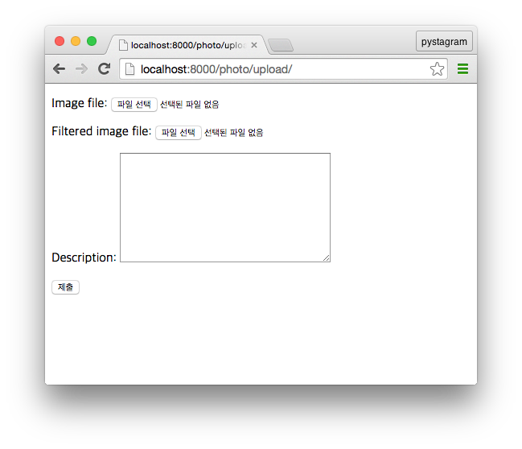
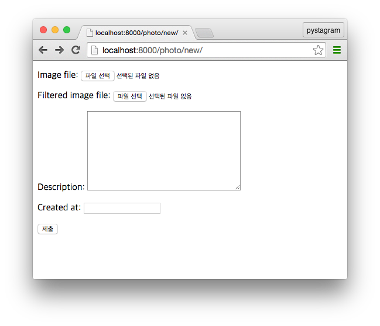
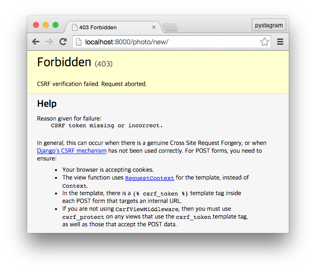
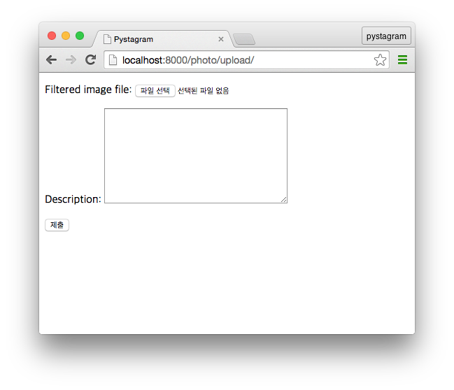
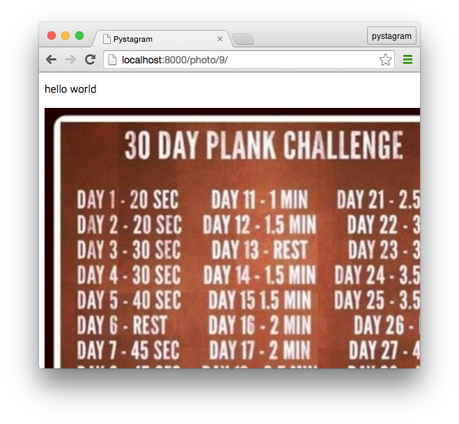
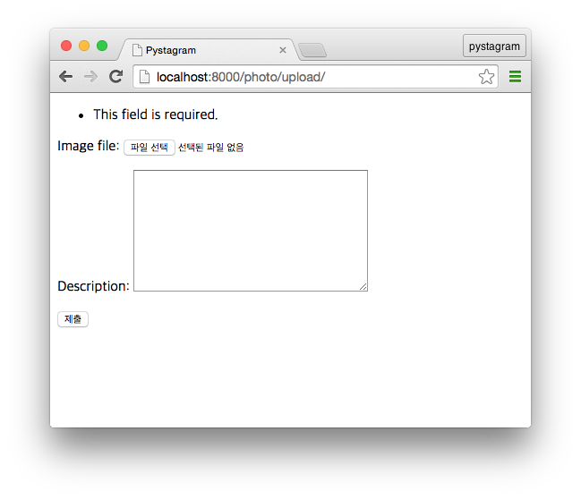
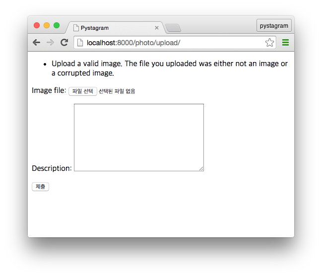

## 7. 사진 게시물 제출하여 게시하기

* 마지막 갱신일시 : 2015년 9월 26일 21시 10분

그동안 우리는 사진 게시물을 Django Admin에서 게시했습니다. 이번엔 사진 게시물을 게시하는 기능을 구현하겠습니다. Django Form을 이용할 것인데, 이번 편에서는 왜 Django Form을 쓰면 좋고, 어떻게 동작하는 지 흐름을 이해하는 내용을 다루겠습니다.

### 1. Django Form

Django Form은 Django의 주요 매력 요소 중 하나라 생각합니다. [Django는 MTV 패턴을 따른다](http://blog.hannal.com/2014/9/start_with_django_webframework_03/)고 하는데, Django Model과 Form을 활용하면 반복되는 처리를 Django가 대신 하고 이용자는 데이터(model)와 표현물(template)에 집중하게 됩니다.

Form은 이름에서 드러나듯이 입력 양식(form)을 다루는 기능입니다. “입력 양식”이란 Django가 웹 프레임워크이니 웹 입력 양식을 뜻합니다. Django Form은 HTML로 만든 웹 화면의 form 태그에서 서버로 전달된 항목이 유효한 지 검증(validation)할 뿐만 아니라 웹 입력 항목에 필요한 HTML 태그를 생성해 출력합니다. 유효하지 않은 항목이 있으면 어떻게 유효하지 않은 지 안내말을 출력하기도 합니다.

유효성은 꼼꼼하게 검사(validation)해야 합니다. 보안 측면에서 클라이언트(서비스 이용자)가 서버로 보내오는 데이터는 그다지 신뢰해서는 안 됩니다. 우리 서비스를 위태롭게 할 코드가 숨겨져 있을지도 모릅니다. 운영 측면에서도 이용자가 system이나 admin과 같이 운영자를 사칭하는 계정 이름을 짓거나 화면을 망가뜨리거나 다른 이용자의 권한을 가로채는 서비스 앞단(front-end)용 코드를 심을지도 모릅니다.

보안성을 높이려면 마냥 뚫고 들어오지 못 하게 폐쇄하기만 할 게 아니라 개방할 필요도 있습니다. 개발자 또는 개발팀이 아무리 뛰어난 능력을 가졌어도 갈수록 증가하는 소프트웨어 복잡성에서 발생하는 수많은 경우와 상황에 대응하는 건 불가능합니다. 또한 서비스에 구현된 모든 기능을 완전히 직접 구현하여 제공하는 것이 아닌 이상 우리가 만드는 소프트웨어는 다른 소프트웨어나 도구와 연결되는데, [우리가 만든 소프트웨어의 바깥 환경이 변하면서 우리가 만든 소프트웨어도 녹슬어](http://blog.dahlia.kr/post/82482810330) 끊임없이 새로운 문제에 부딪히게 됩니다. 이 문제는 폐쇄하여 감출 게 아니라 오히려 개방하여 더 드러내서 많은 사람이 문제를 발견하는 게 낫습니다. Django는 오픈소스 프로젝트이며, 많은 개발자가 참여하고 기여하고 사용합니다. Django처럼 애용되고 활성화 된 오픈소스 프로젝트는 사람이 유발하는 보안 구멍을 주시하는 눈이 많아서 우리가 직접 구현하는 것보다 더 신뢰할 만하다고 생각합니다. 우리의 능력이 뛰어나든 그렇지 않든 말이지요.

운영 측면에서 대응해야 할 대응은 반복되는 처리가 많습니다. 예를 들어, 숫자만 입력받을 항목에 숫자 외 다른 글자가 입력되었는지 검사하고 들어 있으면 예외 처리하거나 첨부한 이미지 파일이 제대로 된 파일인지 검사하는 처리는 항목 개수만큼이나 반복되는 과정입니다. 이를 일일이 코드로 검사한다면 실수할 가능성이 큽니다. 일관성과 관리 차원에서 그러한 역할을 하는 검사기(validator)를 만들어 처리하는 게 좋습니다.

이렇게 클라이언트로부터 전송받은 데이터가 유효한지 검사하고 걸러내는 역할을 Django Form가 합니다. Django Form을 사용하면 상당히 다양한 입력 형식에 대해 수 년에 걸쳐 쌓인 경험으로 유효성을 검사합니다. 가령, Django Form의 `EmailField` 폼 필드를 사용하면, 다국어나 `.wiki`나 `.google`과 같은 새로운 최상위 도메인(Top-level domain), 심지어 IPv4나 IPv6와 같이 IP주소로 구성된 전자우편 주소에 대응 가능합니다.

물론 어디까지나 유효성을 검사하는 것이므로 제가 앞서 언급한 보안성에 대해 무결하지는 않습니다. 예를 들어, Django Form의 `ImageField` 폼 필드는 클라이언트가 제출한 파일이 [이미지 파일로 유효한지 확인하는 방법을 Image Library인 PIL이나 Pillow의 `verify()`에 의존](https://github.com/django/django/blob/1.8.1/django/forms/fields.py#L691)합니다. `verify()` 메서드는 파일의 헤더 영역을 읽어 들여서 유효한 파일인지 검사할 뿐입니다. 그 마저도 일부 파일에 대해서만 제공하여, [GIF 파일](https://github.com/python-pillow/Pillow/blob/master/PIL/GifImagePlugin.py)을 처리하는 모듈엔 `verify()`가 아예 없습니다. GIF, PNG, Jpeg과 같은 이미지 파일은 일반 문자열을 담는 Metadata 영역(chunk)을 지원하는데, 이 요소를 악용하여 보안을 위협하는 코드를 삽입하여 서버나 클라이언트(방문자)에게 해를 끼칠 가능성이 있습니다[^1].

하지만, 이는 Django Form이 보안에 초점을 맞춘 기능은 아니니 보안 대응용으로 Django Form에 의존하지 않아야 한다는 의미이며, 입력 항목이 유효한 지에 대한 필수 검사 요소는 갖추고 있으므로 Django Form을 가장 기본으로 사용하고 보안에 필요한 조치를 추가하는 것이 나을 것입니다.

#### Form과 ModelForm

Django Form은 `django.forms` 모듈에서 `Form`과 `ModelForm` 클래스로 제공됩니다. `Form`은 앞서 설명한 내용을 그대로 담고 있는 클래스입니다. `ModelForm`은 Django Model과 연계한 Form 클래스입니다. Django Model을 사용한다면 `ModelForm`을 이용하여 입력 양식과 입력 항목 검증, 그리고 검증된 입력 데이터를 데이터베이스에 저장하는 과정을 편하게 처리합니다.

자세한 건 코드로 구현하면서 다루겠습니다.

### 2. 사진 게시물을 Form을 이용하여 게시하기

#### Form 만들기

`photo` 디렉터리에 `forms.py` 파일을 만듭니다. 앞으로 `photo` 앱에서 사용하는 Form은 이 모듈에 만듭니다. 이제 사진 게시물을 편집하는(생성하거나 수정) 폼을 `PhotoEditForm`이라는 이름으로 만듭니다.

```
# coding: utf-8

from __future__ import unicode_literals

from django import forms

from photo.models import Photo


class PhotoEditForm(forms.ModelForm):
    class Meta:
        model = Photo
```

아주 간결한 코드입니다. `forms` 모듈에 있는 `ModelForm` 클래스를 상속받는 `PhotoEditForm` 클래스를 만들면 이 클래스는 Form 클래스입니다. `ModelForm`이므로 클래스 안에 `Meta` 클래스를 또 만들고, 그 안에 `model = Photo`라는 코드로 이 Model form에 연계하는 Model을 `Photo`로 지정한 것입니다. 이 `Photo` 모델 클래스는 `photo` 앱 디렉터리의 `models.py` 모듈에 있으니 `from photo.models import Photo`로 읽어 들인 것입니다.

`ModelForm`은 Form에 연결한 Model의 모델 필드를 기반으로 폼 필드를 만듭니다.

```
class Photo(models.Model):
    image_file = models.ImageField(upload_to='%Y/%m/%d')
    filtered_image_file = models.ImageField(upload_to='static_files/uploaded/%Y/%m/%d')
    description = models.TextField(max_length=500, blank=True)
    created_at = models.DateTimeField(auto_now_add=True, auto_now=False)
```

`Photo` 모델이 이와 같은 모델 필드로 구성되어 있으니 `PhotoEditForm`을 일반 `Form` 클래스를 상속받아 만든다면 다음과 같이 만드는 셈입니다.

```
class PhotoEditForm(forms.Form):
    image_file = forms.ImageField()
    filtered_image_file = forms.ImageField()
    description = forms.CharField(
        max_length=500,
        required=False,
        widget=forms.Textarea
    )
    created_at = forms.DateTimeField(required=False)
```

Model과 비슷하게 생겼습니다. 웹페이지에 사용할 HTML도 거의 비슷합니다.



앞 화면은 `ModelForm`으로 만든 `PhotoEditForm` 폼이 만든 HTML 화면이고, 다음 화면은 `Form`으로 만든 `PhotoEditForm` 폼이 만든 HTML 화면입니다.



거의 동일하지요?

Model은 데이터베이스와 연관되어 있어서 모델 필드형(type)이 데이터베이스의 컬럼(column)형(type)에 맞추어져 있고, Form은 웹 입력 양식인 form 관련 태그의 종류에 맞추어져 소소한 차이가 있지만, 결국 웹에서 넘겨받은 데이터를 데이터베이스에 넣는 것이라 서로 비슷한 인터페이스를 갖습니다. `ModelForm`을 쓰면 모델 필드와 폼 필드 간 차이 마저도 별로 의식하지 않습니다. 그래서 Model을 잘 만들고 `ModelForm`을 이용하여 Model form을 만들면 우리는 데이터 유효성을 검사하고 이를 데이터베이스에 넣거나 찾아 쓰는 데이터 관리와 처리를 날로 먹게 됩니다.


#### 사진 게시물 작성 화면 만들기

사진 게시물을 게시하려면 사진 파일을 선택하고, 사진을 설명하는 본문 등 사진 게시물에 필요한 사항을 입력해야 합니다. 본 강좌 중 [Pystagram 기획](http://blog.hannal.com/2014/8/start_with_django_webframework_01/)편에서 사진 게시물을 작성하고 게시하는 URL을 `/photo/upload/`로 하기로 했으니 `urls.py`에 이 주소 패턴을 등록합니다. 시작 패키지(`settings.py` 파일이 있는 디렉터리)에 있는 `urls.py` 파일을 열고 다음 URL 패턴을 추가합니다.

```
url(r'^photo/upload/$', 'photo.views.new_photo', name='new_photo'),
```

이 내용을 반영하면 다음과 같은 코드가 됩니다.

```
urlpatterns = patterns(
    '',
    url(
        r'^photo/(?P<photo_id>\d+)/$',
        'photo.views.single_photo',
        name='view_single_photo'
    ),
    url(r'^photo/upload/$', 'photo.views.new_photo', name='new_photo'),
    url(r'^admin/', include(admin.site.urls)),
)
```

`/photo/upload/` URL에 `photo.views.new_photo`을 연결(mapping)한 것입니다. `photo` 앱의 `views` 모듈에 있는 `new_photo`라는 객체를 가리키는 이름영역(namespace)입니다. 간단히 말해서, `photo` 앱 디렉터리에 있는 `views.py` 파일에 있는 `new_photo`라는 실행 가능한(callable) 객체를 연결한 것이며, 이 `new_photo`는 뷰 함수(View function)입니다.

이번엔 `views.py` 파일에 `new_photo` 뷰 함수를 만듭니다.

```
from photo.forms import PhotoEditForm

def new_photo(request):
    edit_form = PhotoEditForm()

    return render(
        request,
        'new_photo.html',
        {
            'form': edit_form,
        }
    )
```

`new_photo.html` 템플릿 파일에 템플릿 맥락 요소(Context)로 앞서 만든 `PhotoEditForm` 클래스 객체를 전달하는데, 폼 클래스 자체가 아니라 폼 클래스를 인스턴스 객체로 생성하여 `edit_form`에 할당하고, 이 `edit_form`을 전달합니다.

`render()` 함수는 [5. url에 view 함수 연결해서 사진 출력하기](http://blog.hannal.com/2014/11/start_with_django_webframework_05/) 편에서 역할을 설명했고, 이번 편에서 처음 사용합니다. 이 함수는 대개 세 가지 인자를 필요로 합니다.

- `request`
- 템플릿 파일 이름
- 사전형 객체로 전달되는 템플릿 맥락 요소(context)

`request` 객체는 뷰 함수에 첫 번째 인자로 전달되는 객체입니다. [HTTP Request](https://docs.djangoproject.com/en/1.8/ref/request-response/#httprequest-objects)를 뜻합니다. 뷰 함수는 언제나 첫 번째 인자로 `request` 객체를 전달 받는데, 이 객체를 `render()` 함수의 첫 번째 인자로 전달합니다. 템플릿에서 템플릿 맥락 요소로 `request` 객체를 지정하는(mapping) 데 사용됩니다. 두 번째 인자는 템플릿 파일 경로를 문자열로 지정하며, 이 인자 역시 필수 인자입니다. 마지막으로, 세 번째 인자는 템플릿 파일 안에서 사용할 템플릿 맥락 요소를 사전형(`dict`) 객체로 전달합니다. `{'form': edit_form}`에서 `Key`인 `'form'`은 템플릿 파일 안에서 `form`이라는 이름으로 사용하는 템플릿 변수가 되고, `Value`인 `edit_form`(`PhotoEditForm()`의 인스턴스 객체)가 이 템플릿 변수에 연결된(mapped) 객체인 셈이지요.

이번엔 템플릿 파일인 `new_photo.html`을 만듭니다. `photo` 디렉터리에 `templates` 디렉터리를 만들고, 그 안에 `new_photo.html` 파일을 만들어 다음 내용을 담습니다.

```



<form
    method="POST"

    action=""

    enctype="multipart/form-data"
>
    
    {{form.as_p}}

    <p>
        <input type="submit" />
    </p>
</form>


```

Django Template은 추후 연재에서 자세히 다루겠습니다. 이 `new_photo.html`는 뷰 함수에서 지정한 템플릿 파일이니 이후엔 **뷰 템플릿 파일**이라 부르겠습니다. 템플릿 내용 중 눈여겨 볼 점은 `{{form.as_p}}` 코드입니다. `form`은 `new_photo` 뷰 함수가 `edit_form` 폼 객체를 `form`이라는 템플릿 변수로 지정해 전달한 것입니다. 이 객체의 인스턴스 메서드인 `as_p()`를 호출하면 각 폼 필드를 HTML 태그인 `<p></p>`(paragraph, 문단 태그)로 감싸서 출력합니다. 실제로 출력되는 HTML 코드는 다음과 같습니다.


```
<p><label for="id_image_file">Image file:</label> <input id="id_image_file" name="image_file" type="file" /></p>

<p><label for="id_filtered_image_file">Filtered image file:</label> <input id="id_filtered_image_file" name="filtered_image_file" type="file" /></p>

<p><label for="id_description">Description:</label> <textarea cols="40" id="id_description" maxlength="500" name="description" rows="10">
</textarea></p>
```

`Photo` 모델에 있는 모델 필드 네 개 중 세 개가 HTML form 입력항목 태그로 표현 되었습니다. `created_at`은 없는데, 날짜나 시간 관련 모델 필드(`DateTimeField`, `DateField`, `TimeField`)에 `auto_now_add`나 `auto_now` 필드 옵션 중 하나라도 `True`로 지정되면 Model form으로 폼 필드를 만들 때 기본 입력 항목으로 지정되지 않고, 그래서 HTML 태그로도 만들어 내지 않습니다.

``는 [CSRF(Cross Site Request Forgery)](https://goo.gl/Bw90sV) 토큰을 만드는 템플릿 태그입니다. Django로 만든 웹 페이지에 접속하면 각 세션을 기반으로 CSRF 토큰을 만들며, 이 토큰이 조작되거나 존재하지 않으면 Form 데이터를 Django로 동작하는 웹 애플리케이션 서버에 보내지 못합니다[^2]. CSRF 토큰 검사를 하지 않도록 하면 되지만, 보안 상 좋지 않으니 HTML 폼 영역에 CSRF 토큰을 생성하도록 ``을 습관처럼 넣길 권합니다. 빠뜨리면 CSRF 검증을 실패하였다는 오류가 발생합니다.



뷰 템플릿 파일인 `new_photo.html`는 레이아웃 구조를 잡는 역할을 하는 `layout.html` 템플릿 파일로 확장하므로(``) 이 `layout.html` 파일도 만들어야 합니다.

이번엔 `manage.py` 파일이 있는 디렉터리에 `templates` 디렉터리를 새로 만들고, 그 안에 `layout.html` 파일을 만들어 다음 내용을 담습니다.

```



<!DOCTYPE html>
<html lang="ko">

<head>
    <title>Pystagram</title>
    <meta charset="utf-8">
    <script type="text/javascript" src=""></script>
</head>

<body>

</body>

</html>
```

지난 6회 연재 글에서 다룬 정적(static) 파일 내용이 얼핏 보이네요. 이것도 Django Template을 다루는 연재 글에서 자세히 다루겠습니다.

`layout.html`은 여러 뷰 템플릿에서 공통으로 사용하므로 앱 디렉터리가 아닌 별도 템플릿 디렉터리를 만들어 배치했습니다. 이 템플릿 디렉터리를 `settings.py`에 설정합니다.

```
TEMPLATE_DIRS = (
    os.path.join(BASE_DIR, 'templates'),
)
```

참고로 이 설정은 Django 1.8에서는 유효하지 않으며, Django 1.8부터는 다음과 같이 설정해야 합니다.

```
TEMPLATES = [
    {
        'BACKEND': 'django.template.backends.django.DjangoTemplates',
        'DIRS': [os.path.join(BASE_DIR, 'templates'), ],
        'APP_DIRS': True,
        'OPTIONS': {
            'context_processors': [
                'django.template.context_processors.debug',
                'django.template.context_processors.request',
                'django.contrib.auth.context_processors.auth',
                'django.contrib.messages.context_processors.messages',
            ],
        },
    },
]
```

이제 Django의 개발용 내장 웹 서버를 구동하고(`python manage.py runserver`) `/photo/upload/` URL로 접속하면 사진 게시물을 작성하는 편집 화면이 나옵니다. 그런데 `filtered_image_file`은 이미지 필터를 적용하여 가공된 이미지 파일을 담는 모델 필드입니다. 다시 말하면, 사진 게시물을 편집하는 단계에서 이용자가 접근해서는 안 되는 필드입니다. 그래서 화면에 나타나지 않게 감추겠습니다. 방법은 간단합니다. `PhotoEditForm` 모델 폼의 메타 클래스에서 폼 필드로 사용할 모델 필드를 지정하면 됩니다.

```
class PhotoEditForm(forms.ModelForm):
    class Meta:
        model = Photo
        fields = ('image_file', 'description', )
```

`fields`는 폼에서 사용할 모델 필드를 지정하는 데 사용하며, 모델 필드 이름을 문자열로 리스트(`list`)나 튜플(`tuple`) 객체에 나열해 담으면 됩니다. 그런데 폼 필드로 사용하지 않을 모델 필드는 `filtered_image_file` 하나이고, 사용할 모델 필드는 221개쯤 있다고 가정하겠습니다. 고작 하나를 사용하지 않으려고 221개 모델 필드 이름을 나열하면 무척 고통스럽습니다. 이런 경우는 사용하지 않을 모델 필드만 지정해야 편한데, `exclude`에 지정하면 됩니다.

```
class PhotoEditForm(forms.ModelForm):
    class Meta:
        model = Photo
        exclude = ('filtered_image_file', )
```

이 코드에서 유의할 점은 `exclude` 역시 리스트나 튜플 객체를 할당해야 하므로 `'filtered_image_file'` 뒤에 쉼표 하나 더 찍어줘야 합니다[^3].



이제 필터가 적용된 이미지 파일 모델 필드는 폼에서 다루지 않습니다.

#### 사진 게시물 게시하기

우리는 사진 게시물 내용을 작성하는 URL과 사진 게시물을 제출하여 게시하는 URL을 같이 쓰겠습니다. 즉, `/photo/upload/`에 HTTP Get 방식으로 접근하면 사진 게시물을 작성하는 화면이 나오고, POST 방식으로 접근하면 게시물을 제출합니다.

```
def new_photo(request):
    if request.method == "GET":
        edit_form = PhotoEditForm()
    elif request.method == "POST":
        edit_form = PhotoEditForm(request.POST, request.FILES)

        if edit_form.is_valid():
            new_photo = edit_form.save()

            return redirect(new_photo.get_absolute_url())

    return render(
        request,
        'new_photo.html',
        {
            'form': edit_form,
        }
    )
```

`request.method`가 `GET`인 경우는 기존 코드를 그대로 사용하면 됩니다. `POST` 방식, 즉, 게시물 내용과 파일을 제출 받는 부분을 추가했습니다.

```
PhotoEditForm(request.POST, request.FILES)
```

`PhotoEditForm` 폼에 첫 번째 인자로 `request.POST`를, 두 번째 인자로 `request.FILES`를 전달합니다. 첫 번째 인자는 폼에서 다룰 데이터를 뜻하며, 사전형(`dict`) 객체나 사전형 객체처럼 동작하는(비슷한 인터페이스를 제공하는) 객체[^4]여야 합니다. 파일을 제외한 HTML Form에서 `POST` 방식으로 전송해온 모든 데이터가 `request.POST`에 있습니다. 파일은 `request.FILES`에 있습니다. 그래서, 이 둘을 분리하여 첫 번째 인자, 두 번째 인자로 전달한 것입니다.

여기까지는 폼에서 처리할 데이터를 인자로 전달하여 설정한 것일 뿐이므로, `edit_form = PhotoEditForm()`와 다를 바 없습니다. 그렇다고 해서 다음과 같이 코드를 작성해서는 안 됩니다.

```
    edit_form = PhotoEditForm()
    if request.method == "POST":
        edit_form.data = request.POST
        edit_form.files = request.FILES

        if edit_form.is_valid():
            new_photo = edit_form.save()
```

Django Form은 첫 번째 인자로 넘어온 데이터는 `data` 멤버에, 파일은 `files` 멤버에 할당하는 걸 이용한 것인데, Form 클래스로 인스턴스 객체를 생성해 할당하는 과정에서(`__init__()`) 인자로 전달된 데이터나 파일이 있으면 `is_bound`라는 멤버에 `True`가 할당되고, 이 `is_bound`가 `True`여야만 `is_valid()`를 비롯한 폼 검사를 수행하기 때문입니다. 물론,

```
    if request.method == "POST":
        edit_form.is_bound = True
        edit_form.data = request.POST
        edit_form.files = request.FILES
```

이렇게 `is_bound`를 직접 `True`로 할당하면 되지만, `edit_form = PhotoEditForm(request.POST, request.FILES)`라고 코드를 짜면 그만인 것을 굳이 저렇게 짤 필요는 없습니다.

폼에 검사할 데이터를 전달하여 초기화하여 인스턴스 객체(`edit_form`)에는 전달된 데이터를 검사하는 몇 가지 인스턴스 메서드를 제공합니다. `full_clean()`나 `clean()` 메서드가 폼 데이터를 검사하는 데 사용하는 메서드인데, 실제로는 `is_valid()` 메서드를 사용하면 됩니다. `is_valid()` 메서드는 폼에 전달된 데이터를 폼 필드를 기준으로 검사하여 모든 데이터가 유효하면 `True`를, 하나라도 유효하지 않은 항목이 있으면 `False`를 반환합니다. 동작은 다음과 같습니다.

1. [is_valid](https://github.com/django/django/blob/master/django/forms/forms.py#L163) : 폼 검사와 관련된 오류(error)가 있는 지 검사.
    - [errors](https://github.com/django/django/blob/master/django/forms/forms.py#L157) 항목 검사를 수행한 적이 없어서 오류 내용 존재 자체가 아예 존재하지 않는 경우(`None`), `full_clean()` 메서드 실행
2. [full_clean()](https://github.com/django/django/blob/master/django/forms/forms.py#L362) : [`_clean_fields()`](https://github.com/django/django/blob/master/django/forms/forms.py#L380), [`_clean_form()`](https://github.com/django/django/blob/master/django/forms/forms.py#L399), [`_post_clean()`](https://github.com/django/django/blob/master/django/forms/models.py#L410) 메서드를 차례대로 수행하여 폼 데이터 유효성을 검사.
3. 최종 : `is_valid()`는 오류(errors)가 없으면 `True`를 반환하고, 있으면 데이터가 유효하지 않아 `False`를 반환하며, 어떤 항목에 문제가 유효하지 않은 지 여부는 폼 인스턴스 객체의 `errors` 멤버(프로퍼티)에 사전형 객체처럼 생긴 `ErrorDict`의 인스턴스 객체로 할당.

데이터가 모두 유효하면 `PhotoEditForm` 폼의 인스턴스 객체인 `edit_form`의 `save()` 메서드를 실행하고, 이 메서드는 연결된 모델을 이용하여 데이터를 저장합니다. `save()` 메서드는 `ModelForm` 클래스에 있는 메서드인데, 모델 폼에 연결한 모델을 이용하여 데이터를 저장하고 저장한 모델의 인스턴스 객체를 반환합니다. `PhotoEditForm`에 `Photo` 모델을 연결하였으므로 `Photo` 모델로 생성한 인스턴스 객체를 반환하는 셈이지요.

`return redirect(new_photo.get_absolute_url())` 에서 `redirect()` 함수는 HTTP Response를 반환하는 Django의 `HttpResponseRedirect` 클래스를 이용하여 클라이언트를 지정한 URL로 이동(redirect)시킵니다. `render()` 함수처럼 몇 가지 절차를 간편하게 줄여준 함수이며, `django.shortcuts` 모듈에 있습니다. 사용하려면 `import`해야 겠지요?

```
from django.shortcuts import (
    render,
    redirect,
)
```

`new_photo.get_absolute_url()`에서 눈여겨 볼 부분은 `get_absolute_url()` 메서드입니다. `new_photo`는 `Photo` 모델로 생성한 인스턴스 객체인데, 우리는 `Photo` 모델에 `get_absolute_url()` 인스턴스 메서드를 만든 적이 없습니다. 먼저 만들고 설명하겠습니다. `photo` 앱 디렉터리 안에 있는 `models.py`에서 `Photo` 모델 클래스에 다음 코드를 추가합니다.

```
from django.core.urlresolvers import reverse_lazy


class Photo(models.Model):
    # 중략

    def get_absolute_url(self):
        return reverse_lazy('view_single_photo', kwargs={'photo_id': self.id})
```

Django Model의 `get_absolute_url()` 메서드는 모델의 개별 데이터에 접근하는 URL을 문자열로 반환합니다. 우리는 개별 사진을 보는 URL을 `/photo/사진ID/` 패턴으로 제공하므로, 2번 사진은 `/photo/3/`, 1023번 사진은 `/photo/1023/` URL로 접근해 봅니다. 각 사진의 데이터는 `Photo` 모델에 존재하며, 사진 데이터란 모델 클래스의 인스턴스 객체이므로 모델 클래스에 인스턴스 메서드로 `get_absolute_url()`를 만드는 것입니다.

`get_absolute_url`라는 이름을 반드시 따를 필요는 없으며 없어도 무방합니다. `permalink()`라는 이름으로 메서드를 만들어도 무방합니다. 다만, `get_absolute_url`는 Django가 개별 모델 데이터의 URL을 제공하는 메서드라고 전제해 놓은 이름이어서 Django가 알아서 처리하는 감춰진 동작[^5]에 사용됩니다. 이런 관례(convention)를 따르면 일일이 지정하고 설정하지 않아도 되어 코드가 간결해집니다.

`reverse_lazy()`는 나중에 좀 더 자세히 다루기로 하고, 이번 편에서는 `urls.py`에 `'view_single_photo'` 이름으로 등록한 URL 패턴에 키워드 인자인 `photo_id`의 값으로 `self.id`를 할당하여 URL 문자열을 가져오는 데 사용했다고 이해하고 넘어가겠습니다.

사진 게시물을 게시하는 기능을 구현했습니다. 실제로 올려보세요. 잘 게시됩니다.




#### 유효하지 않은 폼 항목 오류 출력하기

혹시 사진으로 이미지 파일을 첨부하지 않거나 이미지 파일이 아닌 파일을 첨부하여 게시물을 첨부해 보셨나요? 강좌 소스 코드대로 잘 따라 오셨다면, 오류 내용이 안내됩니다.





우리는 템플릿 파일 어디에도 폼 오류 안내말을 출력하지 않았는데, 이게 어떻게 된 일일까요? 우리가 템플릿 파일에 폼 관련 내용을 담은 건 고작 한 줄 뿐입니다.

```
    {{form.as_p}}
```

`as_p`로 폼 내용을 HTML로 출력하려 하면, 폼 항목에 오류가 있는 지, 즉, 폼 인스턴스 객체의 `errors` 속성에 내용이 있는 지 확인하고, 있다면 오류 내용을 출력합니다. `{{form.as_p}}`를 풀어쓰면 다음과 같습니다.

```
    
    <p>
        
        {{ field.errors }}
        

        {{field}}
    </p>
    
```

`form` 템플릿 변수(`views.py`에서는 `edit_form` 객체)는 `for`문으로 순환 가능합니다. 순환하면 폼에 등록된 폼 필드 순서대로 하나씩 폼 필드 객체를 꺼냅니다. 이 필드 객체를 출력하려 하면 이 필드가 생성하는 HTML 내용을 반환하는데, 이 필드 객체에 오류가 있는 경우, 오류 내용이 필드 객체의 `errors`에 할당됩니다. 한 폼 필드에 오류 내용은 한 개 이상인 경우도 생기므로 순서열 객체(`list`)에 오류가 하나씩 할당됩니다. `{{ field.errors }}` 마저도 더 풀어쓰면 다음과 같습니다.

```
        
        <ul>
            
            <li>{{error}}</li>
            
        </ul>
        
```

폼 필드를 직접 명시하여 오류를 확인하는 방법도 있습니다. 예를 들어, 이미지 파일 필드인 `image_file`에 오류가 있는 지 확인하는 방법은 다음과 같습니다.

```

    {{form.errors.image_file}}


또는


    {{form.image_file.errors}}

```

대개는 Django Form이 자동으로 만들어주는 폼 항목 구성을 그대로 사용하진 않습니다. 각 폼 항목에 CSS나 HTML 속성을 다르게 부여하는데, Django 애플리케이션 개발자가 고치지 않고 Front-end 개발자가 수정하는 경우도 있습니다. 그래서 폼 필드를 구성하는 요소(레이블, 오류, 폼 필드 자체)를 분리해서 위와 같이 다루는 경우가 흔하고, 오히려 `{{form.as_p}}`와 같이 Django에서 만들어내는 HTML 그대로를 사용하는 경우가 드뭅니다.


--------

강좌 7편을 마칩니다. 이번 편에서 다룬 Django Form이 동작하는 큰 흐름을 이해하면 앞으로 다룰 Form 세부 요소를 이해하기 쉽습니다.

* [7편까지 진행한 전체 소스 코드](https://github.com/hannal/start_with_django_webframework/tree/07-fullsource/pystagram)

----

[^1]: [Encoding Web Shells in PNG IDAT chunks](https://www.idontplaydarts.com/2012/06/encoding-web-shells-in-png-idat-chunks/) 글이나 [Malware Hidden Inside JPG EXIF Headers](https://blog.sucuri.net/2013/07/malware-hidden-inside-jpg-exif-headers.html) 글 참조.

[^2]: [Django와 Rails에서 CSRF Token의 동작 방식](https://dobest.io/how-csrf-token-works/)이라는 글을 참조하세요.

[^3]: 쉼표를 빼서 `('filtered_image_file')`로 표기하면 그냥 문자열 객체가 됩니다. 리스트 객체를 만드는 데 대괄호를(`[`와 `]`) 사용하고 튜플 객체를 만드는 데 소괄호(`(`와 `)`)를 활용해서 헷갈리기 일쑤인데, 튜플을 만드는 데에 필요한 건 괄호가 아니라 쉼표(`,`)입니다. 왜냐하면 쉼표로 항목을 구분하여 나열하며, 괄호는 명시적으로 생략 가능하기 때문입니다. 단, 예외로 아무 항목이 없는 빈 튜플을 만드는 경우엔 그냥 소괄호로 짝지으면 됩니다. 자세한 내용은 [공식 문서의 Tuples](https://docs.python.org/3/library/stdtypes.html#tuples)를 참조하세요.

[^4]: 사전형 객체처럼 생긴 이런 객체를 인스턴스로 만드는 데 사용하는 클래스(`type`)도 `dict`를 상속받아서 만들어서 `dict`형이 제공하는 인터페이스를 포함합니다.

[^5]: “magic”이라는 표현을 씁니다. 뭔가 알아서 수행되는데, 이용자(개발자)가 굳이 알 필요가 없는 내부에 감춰진 동작을 뜻하지요.
