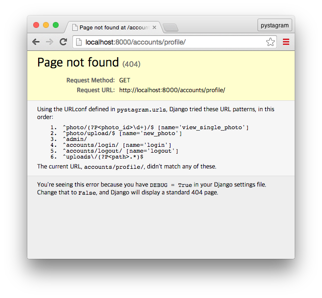

## 8. 로그인, 로그아웃하기

* 마지막 갱신일시 : 2017년 1월 30일 0시 20분

이번 편에서는 Django 이용자 인증 체계을 알아보고, 이 인증 체계에서 로그인을 어떻게 처리하는지 살펴 보겠습니다.

### 1. Django 이용자 인증 체계

Django 이용자 인증 체계는 크게 두 가지 요소로 구분합니다.

- 인증 (Authentication)
- 권한 (Authorization)

인증은 “나 누구인데 확인 좀...”이라면 권한은 “나 이거 해도 돼요?”라 보면 됩니다. 누구인지 신원이 확인되지 않은 존재에게 권한을 세밀하게 부여하진 못합니다. 신원이 확인된, 즉, 인증된 이용자인지 아닌지로 구분하는 정도로 권한을 부여합니다. 그래서, 권한 체계를 비롯하여 이용자 인증 체계 자체는 인증(Authetication)을 바탕으로 합니다.

#### (1) Django 내장 인증 기능

Django는 이용자 인증 체계를 내장하고 있으며, 우리는 이미 이 기능을 사용해봤습니다. [4. Photo 모델로 Admin 영역에서 데이터 다루기](http://blog.hannal.com/2014/10/start_with_django_webframework_04/) 편에서 최고 권한 이용자로 Admin 영역에 로그인하여 사진 게시물을 입력 했었거든요.

Django에 내장된 인증 체계는 `django.contrib.auth`라는 경로(name space)인 Python 패키지에 모여 있으며, Django 개념으로는 Django App입니다. `settings.py` 파일에 있는 `INSTALLED_APPS` 설정 항목을 보면 `'django.contrib.auth',`가 있는데, 우리가 만드는 Pystagram에 사용할 Django App에 Django 인증 체계가 앱 형태로 기본 내장되어 있는 것입니다.

Django webframework으로 제품을 만든다면 Django 인증 체계를 사용하는 게 좋습니다. 오랜 기간 개발되어 보안 수준은 성숙하고 안전하며, 확장 가능하게 유연합니다. Django에서 제공하는 다른 여러 기능이 내장된 인증 기능 구조를 따르기 때문에 Django가 제공하는 기능을 유기성 있고 풍부하게 쓰기에도 Django 인증 체계를 쓰는 게 좋습니다.

#### (2) Django 내장 권한 기능

권한 검사 기능도 Django에 내장되어 있습니다. 뷰(View) 단위 행동(behaviour), 데이터 단위 행동에 권한을 부여하여 운용 가능하며, 권한을 그룹 단위로 묶어서(grouping) 이용자에게 지정하는 기능도 제공합니다. 자세한 내용은 권한 기능을 적용할 때 다루겠습니다.

### 2. 로그인 기능 구현

#### (1) URL 패턴 추가

Django에서 제공하는 인증 기능을 이용하여 로그인, 로그아웃 기능을 구현 하겠습니다. `settings.py` 파일이 있는 시작패키지에서 `urls.py` 파일을 열고, 다음 내용을 추가합니다.

```
from django.contrib.auth import views as auth_views  # 이 줄 추가.

urlpatterns = [
    # 중략
    url(
        r'^accounts/login/',
        auth_views.login,
        name='login',
        kwargs={
            'template_name': 'login.html'
        }
    ),
    url(
        r'^accounts/logout/',
        auth_views.logout,
        name='logout',
        kwargs={
            'next_page': settings.LOGIN_URL,
        }
    ),
]
```

`r'^accounts/login/'`은 로그인 하는 URL이고, 로그인 화면을 출력하거나 로그인 인증 처리를 하는 뷰 함수는 Django에 내장된 `login` 뷰 함수를 사용합니다. 이 함수 객체는 `django.contrib.auth.views` 모듈에 존재합니다. 이 URL 패턴의 이름을 `name` 키워드 인자를 이용하여 `login`이라고 지었는데, 이 인자를 사용하지 않아도 무방합니다. `kwargs`는 URL 패턴에 연결한 뷰 함수에 추가로 전달할 인자를 사전형(`dict`) 객체로 전달합니다. 키가 `'template_name'`이고 값이 `'login.html'`인 사전형 객체인데, Django에서 제공하는 `login` 뷰 함수에 `template_name` 이름으로 키워드 인자를 지정하면 로그인 화면을 출력하는 데 사용할 템플릿으로 사용합니다. `'login.html'`이라는 문자열을 지정했으니 우리가 `settings.py`에서 `TEMPLATE_DIRS`에 지정한 템플릿 디렉터리 중 최상위 순위에 있는 `login.html` 파일을 찾아서 로그인 화면을 출력하는 데 사용합니다.

`r'^accounts/logout/'`은 로그아웃 하는 URL이며, 로그아웃 기능 역시 로그인 기능과 마찬가지로 Django에 내장된 뷰 함수를 사용합니다. 키워드 인자 `next_page`는 로그아웃 하고 난 뒤에 이동할 URL을 의미합니다. 이 항목이 없으면 로그아웃 화면이 출력됩니다. `template_name`: 'logout.html' 등으로 지정하지 않으면 Django에 내장된 로그아웃 화면이 나타납니다.

#### (2) 로그인 템플릿 파일

이번엔 로그인 화면에 사용할 `login.html` 템플릿 파일을 만듭니다. `templates` 디렉터리에 `login.html` 파일을 만들고 다음 내용을 담습니다.

```





<p>ID나 비밀번호가 일치하지 않습니다.</p>


<form method="post" action="">

<input type="hidden" name="next" value="{{ next }}" />

{{ form.as_p }}

<button type="submit">로그인</button>
</form>


```

Django에서 견본으로 제공하는 [login.html 템플릿 파일](https://docs.djangoproject.com/en/1.10/topics/auth/default/#django.contrib.auth.views.login)에서 따와서 약간 고쳤습니다. 따로 뷰 함수에서 템플릿으로 로그인 폼을 템플릿 컨텍스트로 전달하지 않았지만, Django에서 관례로 많이 쓰는 이름인 `form`을 사용했습니다. form.errors`엔 입력한 폼 양식에 문제가 있는 경우에 문제 내용이 담겨 있습니다. ID(`username`)나 비밀번호를 입력하지 않거나 형식에 맞지 않는 등 여러 오류 종류가 있겠지만, 간결하게 ID와 비밀번호가 일치하지 않는다고만 안내합니다. 로그인에 대해서는 굳이 친절하게 뭐가 문제인지 자세히 알려줄 필요는 없습니다.

``에서 `next`는 로그인을 한 후 이동할 URL을 뜻합니다. 예를 들어, 로그인을 하지 않은 채 사진에 달린 댓글을 삭제하려 하면 로그인하는 URL로 이동하고 로그인을 하고 나면 로그인하기 전에 접근하려는 URL으로 이동하는데, 이동할 URL이 GET이나 POST 방식으로 전달된 Query String 키인 `next`에 담깁니다. 대개는 URL이 `https://pystagram.com/accounts/login/?next=/redirect_to_here/`와 같이 표현됩니다.

그외엔 [7. 사진 게시물 제출하여 게시하기](http://blog.hannal.com/2015/05/start_with_django_webframework_07/) 편 내용과 비슷합니다. `form`은 `django.contrib.auth.forms` 모듈에 있는 `AuthenticationForm` 폼 클래스로 생성한 인스턴스 객체입니다.

이제 `http://localhost:8000/accounts/login/`에 접속하면 로그인 화면이 나옵니다. 잘못된 `username`과 `password`을 제출하면 이에 대한 안내도 나오고요.

현재 구현한 로그인 기능으로 로그인을 하면 “Page not found” 오류를 만나게 됩니다. 이에 대해서는 곧 처리하겠습니다.

### 3. 로그인 과정

Django가 제공하는 로그인 뷰 함수가 어떤 과정을 거쳐 이용자 인증을 처리하는지 좀 더 살펴 보겠습니다. 이 부분을 몰라도 로그인 기능을 이용하는 데 문제 없습니다.

#### (1) Form 검증

웹 페이지에서 폼 양식으로 넘어오는 값은 Form을 이용해 값을 검증합니다. Django는 로그인 절차에 `AuthenticationForm` 폼을 사용하며, 이 폼은 `django.contrib.auth.forms` 모듈에 있습니다. 이쯤되면 눈치 채셨을텐데, Django는 인증 관련 모델, 폼, 뷰, 미들웨어 등을 `django.contrib.auth` 패키지 안에 담아 놨습니다. 인증과 관련된 소스 코드를 보려면 이 패키지를 살펴 보시면 됩니다.

`AuthenticationForm` 폼은 현재 이용자 정보와 HTTP 요청 정보를 담은 `request` 객체도 함께 인자로 전달 받는데, 세션 처리에 필요하기 때문에 그렇습니다. 폼 양식 값이 유효하면(`is_valid()`) 이용자가 로그인 후에 이동할 URL 문자열이 안전한 지 검사합니다. 그런 뒤 `auth_login()` 함수를 이용해 로그인 인증 처리를 마무리하고 나서 이용자를 다음 URL로 이동(redirect) 시킵니다.

`auth_login()` 함수는 이름과는 달리 실제로는 인증 과정 마무리 단계를 담당합니다. 로그인 양식을 토대로 이용자 정보를 가져와서 HTTP Request(`request`) 정보와 함께 사용해 서버 세션 정보를 만듭니다. 세션 정보를 만들지 않으면 로그인 정보는 유지되지 않아서 다른 페이지에 방문할 때마다 매번 로그인을 해야 합니다.

로그인 양식, 그러니까 로그인 하려고 제출한 `username`과 `password`에 정확히 일치하는 이용자를 찾는 과정은 `AuthenticationForm` 폼에서 이뤄집니다. 이 폼의 `clean()` 메서드에서 `username`과 `password` 내용을 토대로 `authenticate()` 함수를 이용해 인증을 시도합니다. 일치하는 이용자가 없으면 Form 오류를 일으키고, 우리는 “ID나 비밀번호가 일치하지 않습니다.”라는 안내를 화면에서 만납니다. 일치하는 이용자가 있으면 이 이용자 계정이 활성화 된 상태인지(`is_active`) 검사하는 걸로 폼 안에서 처리하는 인증 과정을 마칩니다.

#### (2) 인증 체계 기반으로 처리

`authenticate()` 함수는 `settings`의 `AUTHENTICATION_BACKENDS` 항목에 등록된 인증 체계 기반 클래스를 하나씩 가져와서 `authenticate()` 메서드를 호출하여 인증을 시도합니다. 우리가 `settings.py` 파일에 따로 이 항목을 설정하지 않아도 문제가 없는 건, Django에 기본으로 내장된 `global_settings.py`에 이 항목이 설정되어 있기 때문입니다. 이 항목에 있는 내용은 `'django.contrib.auth.backends.ModelBackend'` 이름영역인 클래스가 튜플 객체로 담겨 있습니다.

데이터베이스에서 `username`와 `password`로 이용자를 찾는 과정이 비로소 이 단계에서 이뤄집니다. 이용자 모델을 가져오고, 이 모델을 이용해 `username`으로 먼저 이용자 데이터를 가져오고, 이 이용자 데이터에 저장된 비밀번호와 이용자가 로그인하며 제출한 `password`를 비교합니다. 비밀번호까지 일치하면 해당 이용자 데이터, 그러니까 이용자 모델로 생성한 인스턴스 객체를 반환하고, 그렇지 않으면 `None`을 반환합니다.

`settings`의 `AUTHENTICATION_BACKENDS` 항목에 `django.contrib.auth.backends.ModelBackend`이 튜플에 담겨져 있다는 말은 다음 두 가지를 의미합니다.

1. Django 인증 체계 기반(backend)을 꼭 사용하지 않아도 된다.
2. 인증 체계 기반을 여러 개 이상을 사용하는 게 가능하다.

인증 체계 기반의 클래스 규칙대로 인터페이스를 만들기만 한다면 우리가 직접 만든 인증 체계를 사용하거나 Facebook, Twitter처럼 인증 API를 제공하는 서비스나 플랫폼을 기반으로 인증 체계를 운용해도 됩니다.

#### (3) 이용자 모델 가져오기

인증 체계 기반을 Django에서 제공하는 기본 인증 `ModelBackend`를 다른 것으로 갈아끼우거나 추가한다면, 이용자 정보를 데이터베이스에서 다루는 이용자 모델도 대체하여 쓸 수 있습니다. Django에 내장된 이용자 모델은 `django.contrib.auth.models`에 `User` 모델 클래스입니다. 이 이용자 모델엔 모델 필드이 간결하게 담겨 있습니다.

- `username` : 이용자 ID 역할. 다른 값과 중복되지 않는 고유한 값만 허용합니다(`unique=True`).
- `password` : 비밀번호. `PasswordField` 모델 필드.
- `first_name` : 성씨. `CharField` 모델 필드이며 생략 가능.
- `last_name` : 이름. `CharField` 모델 필드이며 생략 가능.
- `email` : 전자우편 주소. `EmailField` 모델 필드.
- `is_staff` : 관리자 여부. `BooleanField` 모델 필드.
- `is_active` : 활성화 된 계정인지 여부. `BooleanField` 모델 필드.

이외에도 `is_superuser`나 `groups` 같은 모델 필드 몇 가지가 더 있지만, 이 모델 필드의 값을 직접 다룰 일은 드물고, 이 강좌 내용을 이해하시면 이런 모델 필드를 직접 찾아 다루는 건 어렵지 않으므로 이 강좌에선 다루지 않겠습니다.

만약, 필명이나 사용하는 언어, 거주 지역처럼 정보를 추가로 이용자로부터 입력 받아 관리하려면 이용자 모델 클래스를 **확장**해야 합니다. Django에서 제공하는 이용자 모델을 변경해도 되지만, Django 소스 파일을 직접 고쳐서 쓰지 않는 게 좋습니다. Django 판을 올릴 때마다 직접 수정한 부분을 매번 챙겨야 하고, 연계되어 동작하는 다른 기능에 부작용을 일으킬 여지도 있습니다. 그래서 변경하지 않고 **확장**해야 합니다.

확장하는 자세한 방법은 다른 편에서 따로 다루기로 하고[^1], 여기에선 확장 방법 종류만 간단히 언급하겠습니다.

1. 따로 이용자 모델을 만들고, Django의 이용자 모델에 연결(Model relationship).
2. 이용자 모델과 모델 매니저, 이용자 폼 등을 모두 구현하여 이용자 모델 부분을 대체.

2번 방법에서 “모델 부분을 대체”한다는 표현을 눈 여겨 보세요. 일일이 Django 소스에서 이용자 모델 관련 부분, 가령, `django.contrib.auth.models.User`를 `pystagram_auth.models.User`와 같이 교체하는 건 아닙니다. `settings`의 `AUTH_USER_MODEL` 항목에 지정하기만 하면 됩니다.

이 항목 역시 우리가 따로 설정한 적이 없는데, Django의 `global_settings`에 설정되어 있으며, 기본 값으로 `'auth.User'` 문자열이 할당되어 있습니다. `auth`는 Django 앱 이름(Python 패키지)이고, `User`는 모델 클래스 이름입니다. Python 이름영역(name space)으로 풀어 쓰면 `auth.models.User`인 셈입니다.

`settings`의 `AUTH_USER_MODEL` 설정 항목을 참조하여 이용자 모델을 실제로 가져오는 역할은 `get_user_model()` 함수가 맡으며, `django.contrib.auth`에 있습니다. 이 함수를 이용하면 이용자 모델이 어떤 것으로 바뀌든 코드를 일관되게 유지하게 됩니다. `AUTH_USER_MODEL = 'auth.User'`라고 설정하고 `get_user_model()` 함수를 실행하면 `auth.models.User`를 반환하고, `AUTH_USER_MODEL = 'pystagram_auth.MyUser'`로 설정하고 실행하면 `pystagram_auth.models.MyUser`를 이용자 모델로 반환합니다. 그러므로 `get_user_model()` 함수로 이용자 모델을 가져오는 게 좋습니다.

인증 체계 기반(backend)과는 달리 기본 이용자 모델은 하나만 가능합니다.

#### (4) 정리하면

로그인 과정을 정리하면 다음과 같습니다.

- `django.contrib.auth.views.login`
    + `django.contrib.auth.forms.AuthenticationForm`
        - `django.contrib.auth.authenticate()` 
            + `settings.AUTHENTICATION_BACKENDS`에서 인증 기반 하나씩 가져옴
            + `django.contrib.auth.backends.ModelBackend`의 `authenticate()` 메서드로 인증 처리
    + `django.contrib.auth.auth_login` (정확히는 `django.contrib.auth.login`를 `auth_login`으로 import 한 것.)으로 인증 관련 세션 처리
- 로그인 이후 이동할 URL로 이동 처리(redirect)

### 4. 로그인 관련 설정 항목

`settings.py`에 설정하는 로그인 관련 항목이 몇 가지 있습니다.

#### (1) `LOGIN_URL`

`LOGIN_URL`은 로그인 URL을 뜻합니다. Django에서 제공하는 장식자(decorator) 중 `login_required`는 뷰 함수에 접근할 때 로그인 여부를 검사하고, 로그인하지 않으면 로그인 URL로 이용자를 이동시키는데, 이 로그인 URL을 `settings.LOGIN_URL`에서 가져 옵니다. `global_settings`에 설정된 기본값은 `/accounts/login/`입니다. 로그인 URL을 다른 것으로 쓴다면 이 항목에 URL을 지정하면 제3자(3rd party) 도구 등에서 참조합니다.

#### (2) `LOGOUT_URL`

`LOGIN_URL`과 비슷한 역할을 합니다. 기본값은 `/accounts/logout/`입니다. 그런데 사용할 일은 거의 없어서 사실상 죽은 설정 항목이나 마찬가지입니다. 이런 게 있다는 정도로 알아 두시면 됩니다.

#### (3) `LOGIN_REDIRECT_URL`

로그인을 하고 나서 이동할 URL을 설정합니다. 로그인 하고나서 이동할 URL이 지정된 경우 그 URL로 이동하지만, 이동할 URL이 지정되지 않았거나 지정한 URL이 보안상 문제가 있는 경우 `settings.LOGIN_REDIRECT_URL`를 사용합니다.

현재 구현한 기능으로는 로그인을 마치면 “Page not found” 오류를 만납니다.



웹 브라우저 주소입력란을 잘 보면 `http://localhost:8000/accounts/profile/`과 같이 전혀 본 적 없는 URL로 되어 있습니다. 이는 Django 기본 `LOGIN_REDIRECT_URL` 설정값이 `/accounts/profile/`이라서 그렇습니다. 아직 우리는 프로필 페이지를 만들지 않았으니 임시로 `/photos/upload/`로 이동하도록 설정하겠습니다. 시작패키지에서 `settings.py` 파일을 열고 다음 코드를 추가합니다.

```
LOGIN_REDIRECT_URL = '/photos/upload/'
```

이제 로그인을 마치면 `/photos/upload/`로 이동하여 사진을 올리라는 압박을 줍니다.


--------

강좌 8편을 마칩니다.

* [8편까지 진행한 전체 소스 코드](https://github.com/hannal/start_with_django_webframework/tree/l08)

----

[^1]: 다른 편에서 다루겠다는 내용이 늘어가니 불안해지네요. 까먹고 다루지 않을까봐요.
