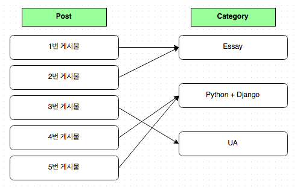
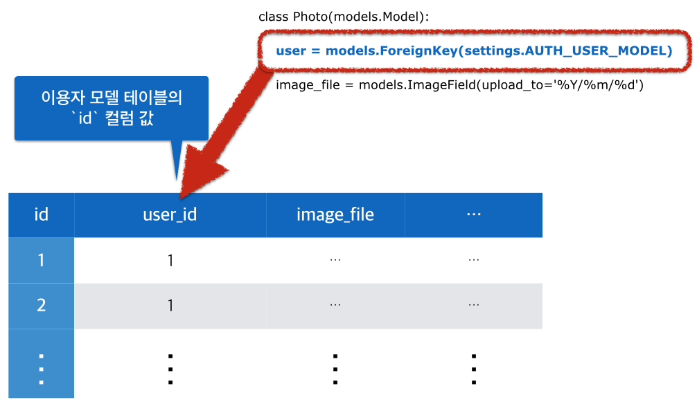

## 9. 로그인한 이용자만 사진 게시물 게시하기

* 마지막 갱신일시 : 2017년 1월 30일 0시 50분

지난 편에서는 Django 이용자 인증 체계을 알아봤으니 이번 편에서는 인증 기능을 이용하여 로그인한 이용자만 사진 게시물을 게시하는 기능을 만들어 보겠습니다.

### 1. 사진 게시물에 이용자 정보 연결

#### (1) 기본키 (Primary Key)

로그인한 이용자만 사진 게시물을 게시한다면 각 사진 게시물엔 사진을 게시한 이용자 정보를 담아야 합니다. 누가 게시한 사진인지 알아야 하니까요. 이용자 ID(`username`)을 문자열로 담아도 되지만, 대개는 고유하며 변하지 않을 정보인 기본키(Primary Key)를 담습니다. 

이용자가 따로 기본키 역할을 하는 모델 필드를 지정하지 않으면 Django는 관례대로 `id`라는 모델 필드를 알아서 만들고 이를 기본키로 사용합니다. 사진 모델인 `Photo`로 사진 게시물 데이터를 `photo01`이라는 인스턴스 객체로 할당하면 이 객체엔 `id`라는 멤버 변수가 속성으로 존재하고 이 속성에 정수(`int`) 값이 할당되어 있습니다.

```
>>> photo01 = Photo.objects.last()
>>> print(photo01.pk)
```

모델의 인스턴스 객체엔 `pk` 속성도 존재하는데, 이 속성은 기본키를 가리키고 있습니다. 이용자가 `id` 모델 필드를 기본키로 하지 않고 `uuid`라는 모델 필드를 만들어 이 필드를 기본키로 지정하면 `pk`는 이 모델 필드를 가리킵니다. 우리는 각 모델의 기본키로 설정된 모델 필드의 이름이 무엇인지 신경쓰지 않고 `pk` 속성을 사용하면 됩니다.

#### (2) 모델 관계 필드 (relationship fields)

`Photo` 모델로 데이터베이스에 저장할 데이터에 이용자 모델의 기본키 값을 저장하려면 다음과 같이 하면 됩니다.

```
class Photo(models.Model):
    user_id = models.IntegerField()
```

그런 뒤에 `Photo` 모델로 데이터를 저장하는 과정에서 이용자의 기본키 값을 `user_id`에 할당하면 됩니다. 각 게시물을 게시한 이용자가 누구인지 아니까 각 사진 게시물 정보를 가져오면서 이용자 정보도 함께 가져오면 좋겠군요.

```
from django.contrib.auth import get_user_model
User = get_user_model()

class Photo(models.Model):
    # 중략
    def get_user(self):
        return User.objects.get(pk=self.user_id)
```

이 코드들엔 문제가 있습니다. 모델의 기본키 모델 필드가 `IntegerField`가 아닌 경우에 제대로 대응하지 못하고, `get_user()` 메서드를 호출할 때마다 매번 이용자 모델에서 이용자 데이터를 탐색해 반환하며, 이용자 모델과 연결하는 모델마다 매번 저런 구현을 중복 적용해야 합니다. 이런 문제들에 대응하는 구현체를 만들어야 하는데, Django는 [관계 모델 필드](https://docs.djangoproject.com/en/1.8/ref/models/fields/#module-django.db.models.fields.related)로 제공합니다. 총 세 종류입니다.

- `ForeignKey` : 1 대 다(1 to n) 관계
- `OneToOneField` : 1 대 1 관계
- `ManyToManyField` : 다 대 다(n to n) 관계

이용자와 사진 게시물 관계로 세 관계 필드를 살펴 보겠습니다. `OneToOneField`는 이용자는 오직 사진 게시물을 하나만 게시하고 소유합니다. `ManyToManyField`는 이용자가 사진 게시물을 여러 개 올릴 수 있는데, 각 사진 게시물을 여러 이용자가 소유하는 게 가능합니다. 1번 사진을 Hannal 이용자 뿐만 아니라 Kay, Yuna 이용자가 소유하는 관계가 맺어지므로 소유한 누구나 사진 게시물을 변경하거나 지울 수 있습니다. 마지막으로 `ForeignKey`는 한 이용자가 여러 사진 게시물을 게시하고 소유하는 관계입니다. 우리에게 필요한 모델 관계군요. `ForeignKey`에 대한 건 본 편 “2. `ForeignKey` 모델 필드”를 참고하시고, 연결부터 해보겠습니다.

#### (3) `Photo` 모델에 이용자 기본키 정보 연결하기

```
from django.conf import settings

class Photo(models.Model):
    user = models.ForeignKey(settings.AUTH_USER_MODEL)
    # 후략
```

`ForeignKey` 모델 필드(클래스)는 `django.db.models` 모듈에 있어서 다른 모델 필드처럼 `models` 객체에서 접근하여 사용하면 됩니다. 첫 번째 인자로 관계 지을 모델을 모델 객체나 경로를 문자열로 전달합니다. `settings`의 `AUTH_USER_MODEL` 설정 항목은 현재 프로젝트에서 사용하는 인증용 이용자 모델이 위치한 경로를 문자열로 지정하고 있습니다. [8. 로그인, 로그아웃 하기](http://blog.hannal.com/2015/06/start_with_django_webframework_08/)편에서 이에 대한 내용을 참조하세요.

##### 마이그레이션 수행

`Photo` 모델이 변경됐으니 데이터베이스에 반영해야 합니다. 마이그레이션을 수행합니다.

```
$ python manage.py makemigrations photos
You are trying to add a non-nullable field 'user' to photo without a default;
we can't do that (the database needs something to populate existing rows).
Please select a fix:
 1) Provide a one-off default now (will be set on all existing rows)
 2) Quit, and let me add a default in models.py
Select an option:
```

긴 영어 문장이 나오며 뭔가를 물어 보는데 당황하지 말고 내용을 잘 살펴 보세요. 

- 당신은 Null(`None`)을 허용하지 않는(non-nullable) `user`라는 필드를 추가하려 하는데, 값이 주어지지 않는 경우에 기본으로 저장될 기본값(default)이 없다.
- 데이터베이스가 기존에 저장된 데이터(populate existing rows)에 Null 외 값을 필요로 해서 우린(Django) 이 작업을 바로 수행하지 못한다.
- 그러니 뭔가 조치를 취해달라.
    1. 이 자리에서 기본값을 제공해주든
    2. 마이그레이션 수행 과정에서 빠져 나간 뒤에 `models.py`에 기본값 지정 인자(`default`)를 추가해달라.

그 자리에서 기본값을 제공해줄테니 `1`을 입력합니다. Django가 뭔가를 요구하네요.

```
Please enter the default value now, as valid Python
The datetime module is available, so you can do e.g. datetime.date.today()
>>> 
```

기본값으로 유효한 Python의 객체를 입력하라는 말입니다. 일단 `1`을 입력합니다.

이제야 마이그레이션 수행에 필요한 마이그레이션 작업 파일이 만들어 졌습니다. 두 번째 입력한 `1`은 이용자 모델의 기본키 값이 `1`을 뜻합니다. 기존에 저장한 사진 게시물의 이용자를 기본키 값이 `1`인 이용자로 지정한 것입니다. 만약, 기존에 소유자가 없는 사진 게시물을 위해 별도 이용자를 만들어서 연결하고자 한다면, 그 이용자를 만들어서 그 이용자의 기본키 숫자값을 지정하면 됩니다.

왜 기본키 값을 넣는지 첫 번째 이유는 앞서 설명을 하였고, 두 번째 이유는 “(2) ForeignKey 모델 필드”에서 설명하겠습니다.

이제 `makemigrations` 명령어로 만든 마이그레이션 작업 내용을 `migrate` 명령어로 데이터베이스에 반영합니다.

### 2. 로그인한 이용자만 사진 게시물 게시하기

`Photo` 모델에 이용자 모델 연결을 마쳤으니 이번엔 사진 게시물을 저장하는 과정에 로그인한 이용자 정보를 적용하겠습니다. 간단히 말해서 로그인한 이용자만 사진 게시물을 게시하는 것이지요.

#### (1) 현재 이용자를 사진 게시물에 적용

현재 웹 서비스에 연결된(requested) 접속 정보는 `request` 객체에 담겨 있습니다. `request`는 뷰(view) 함수가 첫 번째 인자로 전달받는 객체입니다. 개별 사진을 보는 `detail` 뷰 함수는 `def detrail(request, pk):`와 같이, 사진 게시물을 새로 저장하는 `create` 뷰 함수는 `def create(request):`와 같이 첫 번째 인자로 `request`를 전달 받습니다.

`reuqest` 객체엔 `user` 속성이 존재하는데, 이 속성은 접속한 이용자에 정보가 담겨 있습니다. 로그인한 이용자라면 이용자 모델 클래스로 생성한 인스턴스 객체가, 로그인하지 않은 이용자라면 `AnonymousUser` 모델 클래스로 생성한 인스턴스 객체가 할당됩니다. 

그럼 로그인한 이용자만 사진을 게시하도록 코드부터 작성해 보겠습니다.

```
def create(request):
    if request.method == "GET":
        form = PhotoForm()
    elif request.method == "POST":
        form = PhotoForm(request.POST, request.FILES)

        if form.is_valid():
            obj = edit_form.save(commit=False)
            obj.user = request.user
            obj.save()

            return redirect(obj)

    # 후략
```

한 줄은 조금 바뀌었고, 두 줄이 추가됐습니다. 

```
if form.is_valid():
    obj = form.save(commit=False)
    obj.user = request.user
    obj.save()
```

두 번째 줄 `obj = form.save(commit=False)`에서 `form` 객체는 사진 게시물 생성과 관련된 폼(Form)인 `PhotoForm` 폼 클래스입니다. 첫 번째 줄에서 `is_valid()`로 웹에서 전달받은 자료를 검증한 그 객체입니다. 이 객체가 모델 폼인 경우, 그러니까 `ModelForm` 클래스를 상속받아 만든 폼인 경우 `save()` 인스턴스 메서드를 포함하고 있는데, 이 메서드는 모델의 `save()` 메서드와 동일한 역할을 합니다. 데이터를 모델에 연결된 데이터베이스 테이블에 저장하는 것이지요. 모델의 `save()` 메서드와 마찬가지로 저장한 내용이 반영된 모델의 인스턴스 객체를 반환합니다. 즉 `form.save()`로부터 반환받은 객체를 할당한 `obj`는 모델 폼의 인스턴스 객체가 아니라 `PhotoForm` 모델 폼 클래스에 연결되어 있는 `Photo` 모델로 생성한 인스턴스 객체입니다.

`save()` 메서드에 인자로 전달한 `commit`은 실제로 데이터베이스에 반영할 것인지 여부를 정합니다. `True`를 전달하면 바로 데이터베이스에 저장하고, `False`라고 하면 모델 클래스로 생성한 인스턴스 객체만 반영하고 데이터베이스에 실제로 반영하진 않습니다. 따로 반영 여부를 정해주지 않으면 기본값은 `True`이어서 바로 데이터베이스에 반영합니다. 데이터베이스에 저장하지 않을 거면서 뭐하러 `save()` 메서드를 호출했으며, `save()` 메서드엔 실제로 반영할 것인지 여부를 정하는 `commit` 인자가 필요한 이유는 무엇일까요? 답은 그 바로 다음에 나오는 두 줄에 있습니다.

`obj.user = request.user`는 `obj` 객체의 `user` 속성에 현재 로그인한 `request.user` 속성을 할당하는 것입니다. `PhotoForm` 폼 클래스는 웹에서 폼 양식 자료가 담긴 `request.POST`와 `request.FILES`만 전달 받았지, 현재 이용자 정보가 담긴 `request.user`를 전달받은 적이 없습니다. 그래서 `save()` 메서드가 반환한 `obj` 인스턴스 객체의 `user`에는 이용자 정보가 없습니다. `Photo` 모델에 `auth.User`에 있는 이용자 모델을 `ForeignKey` 관계로 연결했는데, 뷰 함수에서는 관련 정보를 `Photo` 모델의 `user`에 반영하지 않았습니다.

만약, `edit_form.save()`나 `edit_form.save(commit=True)`처럼 바로 데이터베이스에 반영하려고 하면 `IntegrityError` 예외 오류가 발생하며, `NOT NULL constraint failed: photo_photo.user_id`라 안내 받습니다.

겁먹지 말고 오류 안내말을 잘 보세요. 정확히 이해하지 않은 채 추측만 하려는 태도는 안 좋지만, 여러분은 이 강좌 나머지 내용을 그냥 건너뛰지 않을테니 예외 오류 내용을 보고 상황을 추측해 보겠습니다. `NOT NULL`, `failed`, `photos_photo.user_id` 이 세 가지 표현이 눈에 들어오지요? `photos_photo`는 `photos` 앱의 `Photo` 모델과 연관되어 보이고, `user_id`는 우리가 만든 적이 없지만 `user` 모델 필드와 관련되어 보입니다. `Photo` 모델의 `user` 모델 필드에 `NOT NULL`과 관련된 문제가 발생하여 진행하던 작업(`save()`)이 실패했다는 뜻이군요. `NOT NULL`은 `NULL`이면 안 된다는 의미니까 `Photo` 모델의 `user` 모델 필드에 `NULL`이 들어가서 오류가 생긴 겁니다.

웹페이지의 폼 양식에서 이용자 모델의 기본키 값을 직접 전달하면 안 됩니다. 예를 들어, `hannal` 이용자의 기본키 값이 `1023`이고 이 값을 웹 폼 양식에서 `user_id`로 담아서 서버로 전달한다면, 이용자는 기본키 값 숫자를 고쳐서 마치 다른 이용자가 사진 게시물을 올린 것처럼 왜곡할지도 모릅니다. 이런 정보는 서버에서 알아내서 다뤄야 합니다. 그게 `request.user`입니다. 아하, `request.user`를 `PhotoForm` 폼 클래스에 전달하면 되겠구나.

```
form = PhotoForm(request.POST, request.FILES, request.user)
```

`request.POST`처럼.

아닙니다. 그렇게 알아서 동작(magic behaviour)해주지 않고, 그래서도 안 됩니다. 이용자 정보가 필요한 폼 클래스라면 이용자 정보를 따로 전달받도록 처리해야 합니다. Python 클래스는 실행 가능한(callable) 객체이므로 함수처럼 소괄호를 사용하여 실행하고 실행 결과로 인스턴스 객체를 반환 받는데, 인스턴스 초기화를 수행하는 메서드가 `__init__()`입니다. 이용자 정보인 `request.user`를 인자로 전달 받는 `__init__()` 메서드를 `PhotoForm` 폼 클래스에 만들면 됩니다. 이건 Class based view를 다룰 때 살펴보기로 하고, 이번 편에서는 `save()` 메서드에 `commit` 인자를 `False`로 전달하여 처리합니다.

`Photo` 모델의 `user` 모델 필드는 `user = models.ForeignKey(settings.AUTH_USER_MODEL)`로 만들었고, 이 모델 필드는 NULL을 허용하지 않습니다. 데이터베이스 테이블에도 `NOT NULL`로 정의되어 있습니다. 그래서 데이터베이스에 실제로 반영하지 말고 우선 모델로 생성한 인스턴스 객체를 `edit_form` 객체로부터 받으려고 `save(commit=False)` 메서드를 수행했습니다.

`PhotoForm`이 반환하는 `Photo` 모델의 인스턴스 객체를 `obj`에 할당받고, 이 객체의 `user` 속성에 이용자 정보인 `request.user`를 할당합니다. `obj.user = request.user` 코드입니다. 이제 `obj.save()`를 수행하여 데이터베이스에 저장합니다. `obj.save(commit=True)`와 동일합니다.

이제 로그인한 이용자 정보가 사진 게시물에 반영되어 저장됩니다.

#### (2) `obj` 뷰 함수에 로그인한 이용자만 접근하도록 제한

로그인하지 않은 이용자가 사진 게시물을 저장하려 하면 오류가 발생할 겁니다. 로그인하지 않은 이용자는 이용자 모델로 생성한 인스턴스 객체에 기본키 값이 없을테니 `IntegrityError` 예외 오류가 발생할 것 같습니다. 이렇게 예상하셨다면 훌륭합니다. 한 번 시도해보세요.

실제로 발생하는 예외는 `ValueError`가 발생하며, 안내말은 `User` 모델 클래스로 만든 인스턴스여야 한다는 내용입니다. 앞서 설명드린 바와 같이 로그인하지 않은 경우 `request.user`엔 `AnonymousUser` 모델 클래스로 생성한 인스턴스 객체가 할당되어 있습니다. `django.contrib.auth.models`에 있는데, 코드를 보면 아시겠지만 껍데기 역할을 할 뿐입니다.

로그인한 이용자인지 여부는 `request.user`의 `is_authenticated()` 메서드를 실행하면 `bool` 객체를 반환받아 구분합니다. `True`이면 로그인한 이용자, `False`이면 로그인하지 않은 이용자입니다. 코드도 아주 간단합니다.

```
from django.conf import settings

def create(request):
    if not request.user.is_authenticated():
        return redirect(settings.LOGIN_URL)
    # 후략
```

로그인하지 않은 이용자가 `create` 뷰 함수로 접근하면 `settings.LOGIN_URL`에 지정되어 있는 URL로 이동(redirect) 시킵니다. `LOGIN_URL`은 `global_settings`에 `/accounts/login/`으로 기본 지정되어 있습니다.

`@login_required` 장식자(decorator)를 사용하면 앞서 구현한 부분을 더 명확하고 간결하게 표현할 수 있습니다.

```
from django.contrib.auth.decorators import login_required

@login_required
def create(request):
    # 후략
```

더 친절하게도 로그인한 후 이동할 도착지도 `next` 인자로 지정됩니다. 로그인 주소를 `settings.LOGIN_URL`에 따로 지정해주면 자동으로 변경한 주소로 이동해 줍니다.


### 3. 모델 관계에 더 자세히 알아보기

우리는 이용자 모델을 `Photo` 모델의 `user` 모델 필드에 `ForeignKey` 관계로 연결했습니다. 그리고 `user` 모델 필드에 이용자 모델로 생성한 인스턴스 객체(`request.user`)를 할당하지 않자 `photo_photo.user_id`에 NULL을 저장하려 해서 저장하지 못했다는 예외 오류도 접했습니다. 이 중에서 `user_id` 정체를 살펴 보겠습니다.

#### (1) ForeignKey 모델 필드

`ForeignKey`, 그러니까 Many to one 관계는 “One”쪽에 “Many”쪽 데이터 여러 개가 연결되는 구조입니다.



한 이용자가 여러 게시물을 남기거나, 한 글갈래(category)에 여러 글이 속하는 관계입니다. Django 모델로는 `ForeignKey` 모델 필드로 모델 클래스를 지정한 것인데, 이 관계 정보를 데이터베이스엔 어떻게 저장할까요?

일단 각 모델은 데이터베이스에 Django 앱 이름과 모델 이름을 조합하여 테이블로 만듭니다. `photos_photo`는 `photos` 앱에 있는 `Photo` 모델을 뜻합니다. `hello`라는 앱의 `Hannal` 모델은 `hello_hannal` 테이블을, `KayCha` 모델은 `hello_kay_cha` 테이블을 만들어 연결합니다. 앞서 발생한 `IntegrityError` 예외 오류에서 `photos_photo` 정체가 무엇인지 이제 아시겠죠?

Django의 모델 필드는 데이터베이스의 컬럼(column)이 됩니다. `image` 모델 필드는 같은 이름을 갖는 테이블 컬럼이 됩니다. 모델 필드형(type)은 테이블 컬럼형을 결정합니다. 그런데 `ForeignKey`와 같은 모델 관계 필드는 컬럼 이름이 조금 다릅니다.

`Photo` 모델의 `user` 모델 필드는 컬럼 이름이 `user_id`입니다. `user_id` 정체는 `user` 모델 필드가 맞습니다. 그런데 `user`가 아니라 `user_id`인 이유는 무엇일까요? 질문 아니니 대답 안 하셔도 됩니다. :)

이번 9회 초반에 모델 간 연결은 기본키로 한다고 설명했습니다. Django는 Many쪽이 One쪽을 연결하는 경우, Many쪽 모델 필드 이름에 One쪽의 기본키 이름을 덧붙입니다.

기본키는 관례에 따라 `id`라는 모델 필드가 되며, 모델 필드는 데이터베이스 테이블 컬럼과 이름이 같으므로 테이블 컬럼도 `id`입니다. `Photo` 모델의 `user` 모델 필드는 이용자 모델을 Many to one으로 가리키는데, 이용자 모델의 기본키인 모델 필드도 `id`입니다. `Photo` 모델 데이터가 Many쪽이고 이용자 모델이 One쪽이므로, `Photo` 모델의 `user` 모델 필드는 이용자 모델 필드의 기본키 모델 필드인 `id` 이름을 덧붙여서 `user_id`가 됩니다.



만약 기본키 모델 필드 이름이 `id`가 아니라 `uid`라면 `_uid`가 덧붙게 됩니다. Django는 이 데이터베이스 컬럼 값을 참조하여 서로 분리된 모델의 데이터 연결 관계를 알아냅니다.


#### (2) 모델 관계를 나중에 맺기 (lazy relation)

모델 관계를 맺을 대상 모델 클래스 객체를 직접 전달해도 됩니다. 

```
from django.contrib.auth import get_user_model
User = get_user_model()

class Photo(models.Model):
    user = models.ForeignKey(User)
    # 후략
```

`models.ForeignKey(User)`는 `ForeignKey` 클래스에 `User`라는 객체를 첫 번째 인자로 전달하여 호출(call)하고, 모델 필드의 인스턴스 객체를 반환받아 `user`에 할당하는 것입니다. Python은 소스 파일 맨 윗 줄부터 아래로 실행하므로 저 구문을 실행하여 모델 필드를 만드는 시점에 실제로 존재하는 `User` 객체를 사용합니다.

그렇다면 관계 맺을 모델이 있는 경로를 문자열로 담아 인자로 전달하는 경우는 언제일까요? 이용자 모델처럼 상황에 따라 연결할 모델이 바뀌는 경우가 있습니다. 지난 편에서 예를 든 것처럼 이용자 모델이 바꾸면 이 모델을 가져오는(`import`) 모든 코드에도 영향이 미칩니다. 그러나 `settings.AUTH_USER_MODEL`에 이용자 모델이 있는 위치를 지정하고, `AUTH_USER_MODEL` 내용을 참조하여 `get_user_model()` 함수로 이용자 모델을 가져오면 [한 의도를 한 구현체로 정리](http://blog.dahlia.kr/post/103101756957)할 수 있지요.

관계 맺을 대상 모델이 아직 만들어지기 전에 연결하려는 경우에도 문자열로 지정합니다. A 모델이(from) B 모델을(to) 관계를 맺는다면 다음과 같이 B 모델을 먼저 만들고 그 **이후**에 A 모델을 만들어야 합니다.

```
class B(models.Model):
    pass

class A(models.Model):
    b = models.ForeignKey(B)
```

B 모델은 C 모델을 관계 맺는다면 C 모델을 B 모델에 앞서 만들어야 합니다.


```
class C(models.Model):
    pass

class B(models.Model):
    c = models.ForeignKey(C)

class A(models.Model):
    b = models.ForeignKey(B)
```

그런데 C 모델은 A 모델에 관계를 지어야 한다고 가정하겠습니다. 

```
class C(models.Model):
    a = models.ForeignKey(A)

class B(models.Model):
    c = models.ForeignKey(C)

class A(models.Model):
    b = models.ForeignKey(B)
```

문제가 생깁니다. C 모델이 만들어지는 시점에 A라는 객체가 존재하지 않기 때문이죠. A 모델을 C 모델 코드 위로 올리면 안 됩니다. A 모델이 만들어지는 시점에 B 모델이 없기 때문이지요. 이런 경우에, C 모델에서 A 모델을 문자열 인자로 전달하면 됩니다.

```
class C(models.Model):
    a = models.ForeignKey('A')

class B(models.Model):
    c = models.ForeignKey(C)

class A(models.Model):
    b = models.ForeignKey(B)
```

문자열로 관계 맺을 대상 모델을 지정하면 관계 맺을 대상 모델이 만들어졌다는 신호가 오기 전까지 관계를 맺지 않은 채 관계 맺는 연산을 지연시켜 놓습니다. 비유가 아니라 정말로 대상 모델 클래스(예 : `A` 모델)가 초기화 되면 모델 신호(`ModelSignal`)인 `class_prepared`를 일으키고(fire), 대상 모델을 바라보던 모델은(예 : `C` 모델) 이 신호을 받고선 비로소 실제 관계를 맺습니다.

이런 연산 특성을 응용하여 관계 맺을 대상 모델로 자기 자신을 지정하는 것도 가능합니다. 순환 관계(recursive relationship)이라고 하는데, 문자열 `'self'`을 지정하면 됩니다. 추후에 기회가 닿으면 순환 관계 모델을 만들어 보겠습니다.

정리하면, 모델 관계 필드는 관계 맺을 대상을 세 가지 형태로 지정합니다.

- 관계 지을 모델 클래스 객체를 직접 인자로 전달
- 관계 지을 모델 클래스 객체가 있는 경로를 문자열로 전달
    + 형식 : `Django앱이름.모델이름`
- 자기 자신을 가리키는 경우 `'self'` 문자열 전달

--------

강좌 9편을 마칩니다.

* [9편까지 진행한 전체 소스 코드](https://github.com/hannal/start_with_django_webframework/tree/l09)

