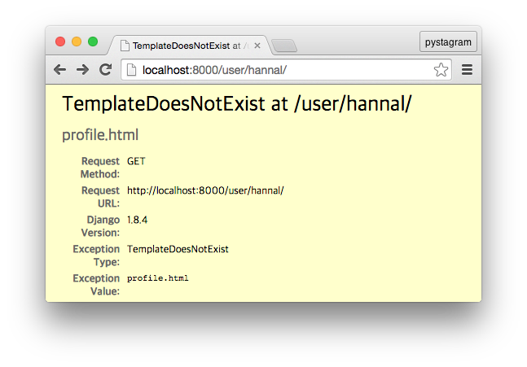
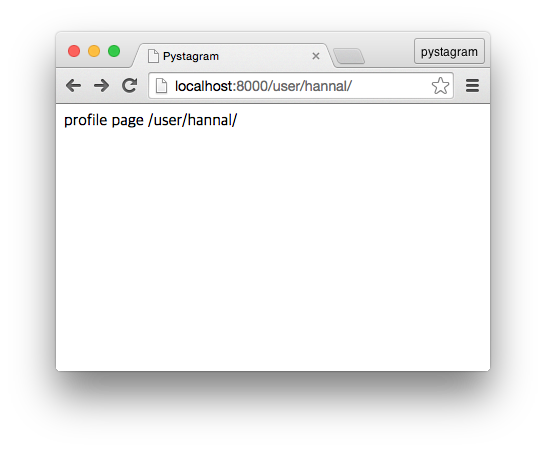
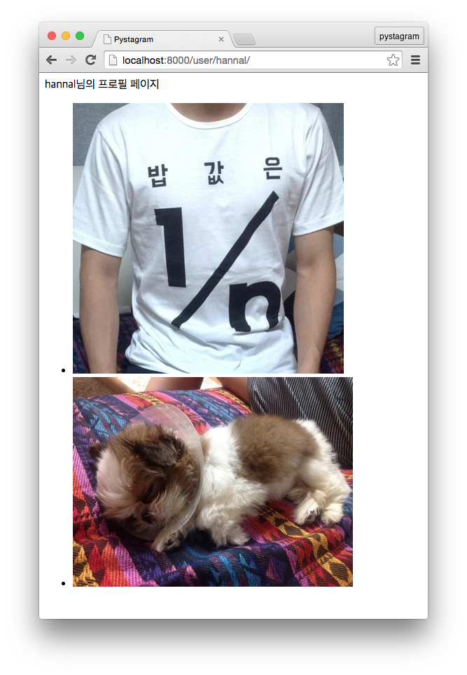

## 10. 이용자가 올린 사진 목록 보기

사진을 게시하였으니 저장된 사진을 가져와 나열하는 기능이 필요합니다. 로그인한 이용자가 사진을 게시하는 기능을 만들었으니 이용자 단위로 사진을 가져와 보여주는 개인 프로필 공간을 만들어 보겠습니다. 이번 편은 `QuerySet` 객체를 이용해 데이터를 찾는 방법을 다룹니다.

아참, 강좌를 연재하는 중에 Django 1.8판이 출시되었습니다. 그래서 [3편 Photo 앱과 모델 만들기](http://blog.hannal.com/2014/9/start_with_django_webframework_03/)과 [5편 url에 view 함수 연결해서 사진 출력하기](http://blog.hannal.com/2014/11/start_with_django_webframework_05/), [7편 사진 게시물 제출하여 게시하기](http://blog.hannal.com/2015/05/start_with_django_webframework_07/)에 관련 내용을 추가 반영했습니다.

### 개인 프로필 기능용 앱 만들기

강좌 [1편 Pystagram 기획](http://blog.hannal.com/2014/8/start_with_django_webframework_01/)에서 개인 프로필 공간(이하 프로필 페이지)은 다음 기능을 포함합니다.

- 간단한 소개
- 팔로잉, 팔로워
- 이용자가 올린 사진

프로필 페이지를 비롯해서 이용자의 대외 노출 기능은 모두 별도 Django 앱을 만들어 다루겠습니다. 꼭 앱으로 나누지 않아도 되지만, 같은 목적이나 맥락끼리 기능을 구분하여 앱으로 묶어 관리하는 게 낫습니다. 터미널 쉘에서 `manage.py` 파일을 이용해 앱을 추가합니다.

```
(pystagram) $ python manage.py startapp profiles
```

### URL 패턴 만들기

이번 편에서는 “이용자가 올린 사진”을 나열하는 기능을 구현하는데, 페이지 URL은 `/user/<이용자 ID>/` 패턴입니다. 이전 편까지는 URL 패턴을 `settings.py` 파일이 있는 시작 패키지의 `urls.py`에 등록하였는데, 프로필 공간에 들어가는 기능이나 페이지에 필요한 URL은 따로 분리하여 연결하는 방식을 쓰겠습니다. `profiles` 앱 디렉터리에 `urls.py` 파일을 만들어서 이 모듈에 프로필 관련 URL을 등록하고, 시작 패키지의 `urls.py`에서는 앱 `urls.py`를 `include()` 함수로 포함시키는 방식입니다. Django Admin에 사용하는 URL 패턴을 이 방식으로 포함시켜 사용합니다.

먼저 시작 패키지, 그러니까 `settings.py` 파일이 있는 디렉터리에 있는 `urls.py` 파일을 열고 다음 내용을 추가합니다.

```
    url(
        r'^user/',
        include(profile_urls, namespace='profiles'),
    ),
```

이 내용을 추가한 `urlpatterns` 변수는 다음과 같습니다[^1].

```
urlpatterns = [
    url(
        r'^photo/(?P<photo_id>\d+)/$',
        'photo.views.single_photo',
        name='view_single_photo'
    ),
    # 중략
    url(
        r'^user/',
        include(profile_urls, namespace='profiles'),
    ),
]
```

`user/`로 시작하는 URL인 경우 `profile_urls` 객체를 포함시켜 연결(매핑)하고, 이 영역의 이름공간(`namespace`)을 `profiles`으로 명명하였습니다. `profile_urls`가 뜬금없이 나타났는데, 이 객체는 `profiles` 앱의 `urls.py`에 있는 `urlpatterns` 객체를 `profile_urls` 이름으로 가져온 것입니다. `urlpatterns` 위에 다음 코드를 추가합니다.

```
from profiles.urls import urlpatterns as profile_urls

urlpatterns = [
    # 중략
]
```

이와 같은 방식은 `patterns()` 함수를 이용해 `prefix`를 지정하여 특정 URL 이하에 대해 뷰 함수를 연결하는 방식과 같습니다.

이번엔 `profile_urls`로 import 할 프로필 앱의 `urlpatterns`를 만듭니다. `profiles` 디렉터리에 `urls.py` 파일을 만들고 URL 패턴을 추가합니다. 

```
from django.conf.urls import url

from . import views

urlpatterns = [
    url(
        r'^(?P<username>[\w.@+-]+)/$',
        views.profile,
        name='profile'
    ),
]
```

URL 정규표현식 패턴은 `[\w.@+-]+)/$`인데, 영문자, 공백, `_`, `.`, `@`, `+`, `-` 문자가 하나 이상인 문자열입니다. 이 정규표현식은 Django에 내장된 `User` 모델의 `username`에 사용되는 패턴과 동일합니다. 이 정규표현식에 해당하는 문자열을 `username`으로 받아 뷰 함수에 인자로 전달합니다. 이 URL은 `user/`로 시작하는 경우에 해당되니 종합하면 `/user/[\w.@+-]+)/`인 경우에 `profile` 뷰 함수를 호출합니다. 이 URL 패턴의 이름은 `url()` 함수에 `name` 인자로 `profile`이라 명명하였습니다.

`urls.py` 파일이 있는 현재 경로(`.`)에 있는 `views` 모듈을 읽어온 뒤 이 객체에 있는 `profile` 속성을 뷰 함수로 연결합니다. 즉, 현재 앱의 `views.py`를 사용하는 것이며, 사용할 뷰 함수를 직접 읽어와(`import`) 함수 객체를 `url()` 함수에 인자로 직접 전달합니다.

### 뷰 함수와 템플릿 뼈대 만들기

이번엔 `profiles` 앱의 `views.py` 파일에 `profile()` 뷰 함수를 추가합니다.

```
# coding: utf-8

from __future__ import unicode_literals

from django.shortcuts import render

def profile(request, username):
    return render(request, 'profile.html', {})
```

`urls.py`에서 이용자 이름(ID) 문자열을 `username`으로 받아내어 뷰 함수로 전달하도록 하였으므로 `profile()` 함수에서도 두 번째 인자로 `username`을 지정해야 합니다.

뷰 함수는 뼈대부터 만들 것이므로 뷰 함수에서 사용할 뷰 함수 템플릿을 `'profile.html'`로 지정합니다.

`profile.html` 템플릿 파일은 앱용 템플릿 디렉터리(`APP_DIRS`[^2])에 만듭니다. `profiles` 앱 디렉터리 안에 `templates` 디렉터리를 새로 만들고, 그 안에 `profile.html` 템플릿 파일을 만든 뒤 다음 내용을 추가합니다.

```



profile page

```

드디어 뼈대를 만들었습니다. `manage.py runserver`로 개발용 내장 웹서버를 구동하고 `http://localhost:8000/user/hannal/`과 같은 URL로 접근하면 프로필 페이지가 나타납니다.

하지만, 이 글 내용 그대로 수행했다면 반갑지 않은 화면이 나타납니다.



`profile.html` 템플릿 파일이 존재하지 않는다는 내용입니다. 이 파일이 분명히 있는데 저 오류가 발생한다면 `settings.py`에 `INSTALLED_APPS` 설정에 우리가 새로 생성한 `profiles` 앱을 추가하지 않아서 그렇습니다. `profile.html` 템플릿 파일은 **`profiles` 앱 디렉터리**의 `templates` 디렉터리에 있습니다. 앱 디렉터리에 있다는 의미는 Django가 앱 디렉터리라는 걸 인식해야 한다는 의미입니다. 그래서 `INSTALLED_APPS`에 추가하는 것입니다. `settings.py`의 `INSTALLED_APPS` 항목에 `'profiles'` 문자열을 추가하면 됩니다.

```
INSTALLED_APPS = (
    'django.contrib.admin',
    'django.contrib.auth',
    'django.contrib.contenttypes',
    'django.contrib.sessions',
    'django.contrib.messages',
    'django.contrib.staticfiles',
    'photo',
    'profiles',
)
```



### 접속한 페이지의 이용자 정보 가져오기

접속한 프로필 페이지의 이용자 이름은 뷰 함수에 `username` 인자로 전달됩니다. 우리는 Django에서 제공하는 `User` 모델을 사용하므로 이 모델의 `username` 모델 필드를 검색(lookup)하는 데 사용하여 이용자를 찾습니다.

```
from django.shortcuts import get_object_or_404
from django.contrib.auth import get_user_model

def profile(request, username):
    User = get_user_model()
    user = get_object_or_404(User, username=username)

    return render(request, 'profile.html', {
        'current_user': user,
    })
```

`get_user_model()` 함수는 `settings.py` 모듈의 `AUTH_USER_MODEL` 설정 항목을 기준으로 Django 프로젝트가 사용하는 이용자 모델을 가져옵니다. 자세한 내용은 [8편 로그인, 로그아웃 하기](http://blog.hannal.com/2015/06/start_with_django_webframework_08/) 편을 참고하세요.

`get_object_or_404()` 함수는 지정한 모델과 검색 조건으로 데이터를 가져오려 해보고 없으면 HTTP 404 오류를 일으키는 함수입니다. 두 종류 인자를 필요로 하는데, 첫 번째 인자는 데이터를 찾고 가져올 대상 모델 클래스를 받고, 나머지 인자는 검색에 사용합니다. `get_object_or_404(User, username=username)`는 `User` 모델에서 `username` 모델 필드의 값이 뷰 함수에 인자로 전달된 `username`과 같은 것을 찾는 내용입니다. `/user/hannal/` URL로 접근하면 뷰 함수의 `username` 인자의 값은 `'hannal'` 문자열이므로 `get_object_or_404(User, username='hannal')`을 실행합니다. 이 함수는 데이터 하나를 특정 지어 반한하므로 여러 데이터가 조건에 해당되선 안 됩니다. 데이터가 없는 경우 `django.http` 모듈에 있는 `Http404` 예외 오류를 일으킵니다.

데이터가 있는 경우 `user`에 할당하고, 이 객체는 `profile.html` 템플릿에 템플릿 맥락 요소(context)로 전달하며, 템플릿 안에서 템플릿 변수로 사용할 이름은 `current_user`입니다.

이번엔 `profile.html` 템플릿 파일을 수정합니다.

```



{{current_user}}님의 프로필 페이지

<ul>

    <li></li>

    <li>게시한 사진이 없습니다.</li>

</ul>


```

눈여겨 볼 부분은 `current_user.photo_set.all`입니다. 이 부분은 Python 코드로 표현하면 `current_user.photo_set.all()`입니다. Django 템플릿 엔진은 Python의 함수나 클래스와 같이 호출 가능한(callable) 객체를 템플릿 안에서 소괄호를 쳐서 직접 호출하는 걸 허용하지 않습니다. 객체 이름이나 메서드 이름만 명시하면 Django가 대상의 자료형을 검사해서 호출 가능한 객체인 경우 대신 호출하여 수행합니다. 소괄호를 사용하지 못하므로 함수나 메서드에 인자를 전달하지도 못합니다. 인자를 전달하려면 Django 템플릿 필터나 태그를 직접 만들어 사용해야 합니다.



### QuerySet 객체

#### 연관 객체 참조 (related objects reference)

`current_user.photo_set.all()`는 접속한 프로필 페이지의 이용자(`current_user`)가 소유한(own) 모든 사진 게시물을 가져오는 코드입니다. 하나씩 살펴 보겠습니다.

먼저 `current_user`는 뷰 함수에서 `user`입니다. `user`는 `User` **모델** 클래스로 데이터를 가져와 연결시켜(mapping) Python 인스턴스 객체로 생성한 것입니다. 그런데 `User` 모델은 우리가 앞서 만든 `photo` 앱의 `Photo` 모델이 `ForeignKey`로 연결되어 있습니다. 이용자 한 명이 사진을 여러 개 가지므로 `User` 모델이 1, `Photo` 모델은 다수(n) 관계라서 `User` 모델 기준으로는 1:N(OneToMany) 관계입니다.

이 관계가 중요한데요. Django는 모델이 관계(relationship)를 맺고 있으면 연결 당한 쪽에 **연관 객체 참조 속성**이라는 특별한 속성을 만듭니다. 연결하는 쪽은 모델 필드로 연결하는 대상 모델을 가리키고 있지만, 연결 당하는 쪽은 Python 코드상으로는 알 도리가 없습니다. `User` 모델과 `Photo` 모델을 놓고 보면, `Photo` 모델엔 `user = models.ForeignKey(settings.AUTH_USER_MODEL)` 모델 필드를 만들어서 연결하는 모델이 `User` 모델이라는 것이 드러나지만, `User` 모델엔 아무런 조치를 취하지 않으므로 Python 코드만으로는 `Photo` 모델이 자신을 연결하는지는 알지 못합니다. 하지만 Django는 모델 관계를 파악하여 연결 당하는 쪽에 연결하는 모델에 대한 접근 경로를 객체 속성(attribute)으로 만들어 줍니다.

일 대 다(`ForeignKey`)나 다 대 다(`ManyToManyField`) 관계는 연결 당하는 특정 데이터에 연결하는 쪽의 여러 데이터가 관계를 맺습니다. 이처럼 **1**쪽에 **N**으로 연결되는 경우, **1**쪽에 N쪽 모델 이름을 참조하여 속성을 만듭니다. 이 속성은 따로 지정하지 않으면 N쪽 모델 이름을 소문자 Snake case 표기로 만들고 `_set`을 덧붙인 이름을 갖습니다. `User` 모델과 `Photo` 모델로 놓고 보면 `User` 모델의 인스턴스 객체에 `photo_set` 속성이 만들어 집니다.

#### QuerySet 객체

연관 객체 참조 속성은 Django 모델의 `QuerySet` 객체입니다. `QuerySet`은 이름에서 드러나듯이 Query 집합(set)입니다. Django model manager는 크게 두 종류 객체를 반환하는데, 하나는 `QuerySet` 객체이고 다른 하나는 `QuerySet` 객체가 아닌 객체입니다. `QuerySet`엔 다음과 같은 특징이 있습니다.

- Model manager의 API를 포함 (정확히는 QuerySet API를 manager가 상속 받아 사용)
-  꼬리에 꼬리를 무는 연산(evaluation). 일명 chaining 연산.
    + 단 QuerySet(또는 model manager)의 메서드가 반환하는 객체가 QuerySet이어야 함.
- 지연 평가 연산과 캐쉬 처리
- 순서열(`str`, `list`, `tuple`) 연산 지원

이러한 특성은 `QuerySet`의 역할에 기인합니다. `QuerySet`은 사용자의 요청을 받아 질의(query)를 생성합니다. 이 요청이 데이터베이스에서 데이터를 가져와야만 하는 것이면 생성한 질의를 데이터베이스로 보냅니다. 그렇지 않으면 생성한 질의는 그대로 보관한 `QuerySet` 객체를 복제하여 새로 반환합니다. 이 경우 반환한 객체도 `QuerySet` 객체이므로 또 다시 model manager API를 이용해 요청을 보낼 수 있습니다. 이런 과정을 반복합니다. 데이터베이스에 질의를 보내 데이터를 가져오면 그 데이터를 보관해두며, 이 `QuerySet` 객체의 데이터를 사용하는 경우 보관된 데이터를 사용합니다. 몇 번을 접근하더라도 보관된 데이터를 그대로 재사용합니다.

- 지연 평가 연산 : 데이터베이스에 접근해야 할 때까지 질의를 보내지 않고 질의를 생성해 조합하며 쌓는 동작
- 캐쉬 처리 : 보관한 데이터를 재사용해 데이터에 접근할 때마다 데이터베이스에 질의를 요청하지 않음
- chaining : `QuerySet` 객체를 반환하는 경우, 그 객체를 이용해 요청을 이어나감

우리가 앞서 만든 `Photo` 모델 클래스로 예를 들겠습니다.

```
qs = Photo.objects.filter(pk__in=(1, 2, 3, 4, ))  # 첫 번째 요청.
qs = qs.filter(description__contains='te')  # 두 번째 요청.
qs.count()  # 세 번째 요청.
qs.count()  # 네 번째 요청.
```

총 네 번 `QuerySet` 객체의 메서드를 호출했습니다.

1. 첫 번째 요청은 `pk` 모델 필드(기본키, primary key)가 1, 2, 3, 4인 데이터를 가져오라는 질의를 만듭니다. SQL 질의문으로 `SELECT * FROM "photo_photo" WHERE "photo_photo"."id" IN (1, 2, 3, 4)`을 생성한 채 일단 기다립니다.
2. 두 번째 요청은 `description` 모델 필드로 `te` 문자열을 포함하는 데이터를 가져오라는 질의를 만듭니다. 기존 질의문을 조합한 만드므로 질의문은 `SELECT * FROM "photo_photo" WHERE ("photo_photo"."id" IN (1, 2, 3, 4) AND "photo_photo"."description" LIKE %te% ESCAPE '\')`가 됩니다. 여전히 데이터베이스에 질의를 보내지 않고 기다립니다.
3. 세 번째 요청은 여태까지 누적한 탐색(lookup) 조건에 해당하는 모든 데이터의 개수를 가져오는 `count()` 메서드입니다. 데이터베이스에 질의를 보내야만 확인 가능한 데이터입니다. 여태까지 만든 질의문을 비로소 데이터베이서에 요청합니다.
4. 네 번째 요청도 `count()` 메서드입니다. 이미 캐쉬된 데이터가 있어서 데이터베이스에 질의하지 않고 보관하고 있는 데이터에서 개수를 가져와 반환합니다.

`count()` 메서드는 개수를 숫자로 반환하며, 숫자는 정수형(`int`) 객체여서 더이상 `QuerySet` 객체의 특성을 사용하지 못합니다. 이렇게 `QuerySet` 객체를 반환하지 않는 model manager API는 다음과 같습니다.

| 메서드 | 반환하는 객체 | 설명 |
|----|------|------|
| `get()` | 모델 클래스의 인스턴스 객체 | 조건에 해당하는 특정 데이터를 가져온다. |
| `first()` | 모델 클래스의 인스턴스 객체 | `QuerySet`에 보관된 데이터 중 첫 번째 데이터를 가져온다. |
| `last()` | 모델 클래스의 인스턴스 객체 | `QuerySet`에 보관된 데이터 중 마지막 데이터를 가져온다. |
| `earliest()` | 모델 클래스의 인스턴스 객체 | 인자로 전달해 지정한 모델 필드를 기준으로 가장 첫 번째 데이터를 가져온다. |
| `latest()` | 모델 클래스의 인스턴스 객체 | 인자로 전달해 지정한 모델 필드를 기준으로 가장 마지막 데이터를 가져온다. |
| `count()` | `int` 객체 | `QuerySet`에 보관된 질의를 기준으로 개수를 가져오거나 보관된 데이터의 개수를 가져온다. |
| `exists()` | `bool` 객체 | `QuerySet`에 보관된 질의 또는 보관된 데이터를 기준으로 데이터가 존재하는 지 여부를 가져온다. |
| `get_or_create()` | 모델 클래스의 인스턴스 객체 | 조건에 해당하는 특정 데이터를 가져오고 없으면 인자로 전달한 내용으로 데이터를 저장한 후 가져온다. |
| `update_or_create()` | 모델 클래스의 인스턴스 객체 | 특정 데이터를 수정하고, 그 데이터가 없으면 인자로 전달한 내용으로 데이터를 저장한 후 가져온다. |

이외에도 몇 가지 더 있는데 강좌 진행 중 사용하면 자세히 다루겠습니다. 

`QuerySet` 객체를 반환하는 메서드도 살펴 보겠습니다.

| 메서드 | 설명 |
|----|------|
| `all()`  | 전체 데이터를 가져온다. |
| `filter()`  | 인자로 전달한 조건에 해당하는 데이터를 가져온다. |
| `exclude()`  | 인자로 전달한 조건에 해당하지 않는 데이터를 가져온다. |
| `order_by()`  | 지정한 모델 필드로 정렬하여 가져온다. |
| `reverse()`  | `QuerySet`에 저장된 데이터를 뒤집어서 가져온다. |
| `select_related()`  | N:1(ManyToOne, `ForeginKey`)으로 연결된 데이터를 함께 가져온다. 데이터베이스의 `JOIN` 처리. |
| `prefetch_related()`  | N:N(`ManyToManyField`)으로 연결된 함께 데이터를 가져온다. 데이터베이스의 `JOIN` 처리 |
| `using()`  | 지정한 데이터베이스에서 데이터를 가져온다. 기본은 `default`로 지정된 데이터베이스. |

이번 편에서는 `all()`, `filter()`와 `order_by()`을 다루며, 다른 메서드는 사용할 때 자세히 다루겠습니다.

#### `filter()` 메서드

`photo_set`을 설명하려고 먼 길 다녀왔네요. `photo_set` 속성은 `QuerySet` 객체입니다. 그냥 객체는 아니고 조건이 걸려있는 `QuerySet`입니다. `photo_set`은 `User` 모델의 인스턴스 객체에서 사용하는데, 이 말은 `User` 모델로 가져온 이용자 데이터를 담고 있는 인스턴스 객체, 즉 특정 이용자에 연결된 `photo_set`입니다. 이를 `Photo` 모델로 풀어쓰면 다음 코드와 같습니다.

```
current_user = User.objects.get(username='hannal')
photos = Photo.objects.filter(user=current_user)
```

이 코드는 `username`이 `'hannal'`인 이용자를 `current_user`에 할당하고, 소유주(`user`)가 `current_user`인 모든 사진 게시물(`Photo`)을 찾아서 `photos`에 할당합니다. 간단히 말해 `username`이 `'hannal'`인 이용자의 모든 사진 게시물을 가져오는 것이지요.

`filter()` 메서드는 검색(lookup) 조건을 [키워드 인자](http://blog.hannal.com/2015/03/keyword-only-arguments_and_annotations_for_python3/)를 받습니다. 인자 이름(key)는 모델 필드의 탐색 방식이고 전달하는 객체(value)는 검색할 값입니다. `filter(description='hannal')`로 키워드 인자를 전달하면 모델 필드 `description`의 값이 `hannal`과 일치하는 데이터를 찾습니다.

하지만 검색 방식이 이렇게 단순하진 않습니다. `hannal` 문자열과 일치하는 게 아니라 `hannal` 문자열을 포함한다든지 지정한 숫자보다 큰 값을 갖는 데이터를 찾는 식으로 다양한 검색 방식이 필요한데, Django는 모델 필드 이름에 `__탐색키워드`를 덧붙인 인자 이름으로 이러한 검색을 지원합니다. 예를 들어 `hannal` 문자열을 포함하는 데이터를 찾는 조건이라면 `filter(description__contains='hannal')`와 같이 `__contains`를 모델 필드인 `description`에 덧붙입니다.

| 탐색 키워드 | 설명 |
|----------|-----|
| `contains` | 지정한 문자열을 포함 |
| `in` | 리스트나 튜플에 담긴 값들에 해당 |
| `gt` | 지정한 값을 **초과** |
| `gte` | 지정한 값 **이상** |
| `lt` | 지정한 값 **미만** |
| `lte` | 지정한 값 **이하** |
| `year` | 지정한 연도. `DateField`나 `DateTimeField` 필드에 한함 |
| `month` | 지정한 월. `DateField`나 `DateTimeField` 필드에 한함 |
| `day` | 지정한 일. `DateField`나 `DateTimeField` 필드에 한함 |

탐색 키워드 역시 자주 쓰는 것만 소개하였으며, 이외 탐색 키워드는 사용할 때 자세히 다루겠습니다.

여러 탐색 조건을 지정해도 되는데, 함수에 키워드 인자 여러 개를 넣는 방법과 동일합니다.

```
Photo.objects.filter(user=current_user, description__contains='te')
Photo.objects.filter(user=current_user).filter(description__contains='te')
```

두 코드는 동일한 역할을 합니다. 이 코드는 사진 게시물의 `user`가 `current_user`이고(AND), `description`에 `'te'` 문자열이 포함된 모든 데이터를 가져옵니다. 쉼표로 구분해 여러 키워드 인자를 전달하든 `filter()` 메서드를 체인으로 반복해서 부르든 동일하게 `AND` 조합으로 데이터를 찾습니다. `OR` 조합으로 찾으려면 별도 조치를 취해야 하는데, 나중에 다루겠습니다.

정리하면, `User` 모델 클래스의 인스턴스 객체에 있는 `photo_set` 속성은 `Photo` 모델 클래스와 연결되어 만들어졌으며, `QuerySet` 객체로 만들어졌는데 이 `QuerySet` 객체는 `photo_set` 속성이 속한 `User` 인스턴스 객체의 데이터를 기반으로 합니다. `photo_set`은 `QuerySet` 객체이므로 체인 연결하듯이 후속 `QuerySet`의 메서드를 사용할 수 있습니다. `current_user.photo_set.all()`은 `all()` 메서드를 쓴 것입니다. `Photo.objects.filter(user=current_user).all()`과 동일한 역할을 합니다.

### 사진 정렬하여 나열하기

프로필 페이지에서 사진은 저장된 등록된 순서대로 나열됩니다. 별도로 지정하지 않으면 기본키(primary key)를 기준으로 하여 순서대로 나열되기 때문입니다. `QuerySet`으로 가져오는 데이터를 정렬하는 방법은 크게 두 가지입니다.

- `order_by()` 메서드로 정렬할 모델 필드 이름 지정
- 모델에 정렬할 기본(default) 기준을 지정

`order_by()`는 [위치 인자](http://blog.hannal.com/2015/03/keyword-only-arguments_and_annotations_for_python3/)로 정렬 기준으로 삼을 모델 필드 이름을 문자열로 받습니다. 여러 개를 지정하면 정렬 우선순위에 따라 정렬합니다.

```
Photo.objects.order_by('created_at')  # created_at 순서대로.
Photo.objects.order_by('-created_at')  # created_at 역순으로.
```

첫 번째 구문은 전체 사진 게시물을 `created_at` 모델 필드 기준으로 하여 순서대로 가져옵니다. 역순으로 가져오려면 모델 필드 이름 앞에 `-`를 덧붙이면 되며 두 번째 구문이 `created_at` 역순으로 정렬하는 것입니다. 만약 `created_at`, 즉 생성일시가 완전히 동일한 경우에는 기본키 역순으로 정렬하도록 하려면 인자를 추가하면 됩니다.

```
Photo.objects.order_by('-created_at', `-pk`)
```

무작위 순서로 정렬하려면 `Photo.objects.order_by('?')`처럼 `'?'`를 인자로 전달하면 되는데, 주의할 점은 상당히 느립니다. 되도록이면 쓰지 않길 권합니다.

모델에 정렬할 기본 기준을 정하려면 모델에 `Meta` 클래스를 만들고, `Meta` 클래스 안에 `ordering` 속성을 만들어 정렬할 모델 필드 이름을 나열하면 됩니다.

```
class Photo(models.Model):
    user = models.ForeignKey(settings.AUTH_USER_MODEL)
    image_file = models.ImageField(upload_to='%Y/%m/%d')
    filtered_image_file = models.ImageField(
        null=True,
        upload_to='static_files/uploaded/%Y/%m/%d'
    )
    description = models.TextField(max_length=500, blank=True)
    created_at = models.DateTimeField(auto_now_add=True, auto_now=False)

    class Meta:
        ordering = ('-created_at', '-pk', )

    # 후략
```

나중에 자세히 다루겠지만, 템플릿에서는 함수 호출하듯이 소괄호(`(`과 `)`)를 사용하여 객체 호출을 직접 하지 못합니다. `profile.html` 템플릿 파일에서 ``와 같은 구문을 ``와 같이 쓰지 못합니다. 그래서 정렬하려면 뷰 함수에서 정렬한 데이터를 별도 변수에 할당하여 이 변수를 템플릿에 전달해야 합니다.

```
# photo/views.py

def profile(request, username):
    User = get_user_model()
    user = get_object_or_404(User, username=username)
    photos = user.photo_set.order_by('-created_at', '-pk')

    return render(request, 'profile.html', {
        'current_user': user,
        'photos': photos,
    })
```

```
{# photo/templates/profile.html #}
<ul>

    <li></li>

    <li>게시한 사진이 없습니다.</li>

</ul>
```

또는 모델에서 정렬 기준을 정의하여 따로 `order_by()` 메서드를 쓰지 않더라도 기본으로 지정한 기준대로 정렬되도록 처리해도 됩니다.

이 강좌에서는 명시한 정렬 기준이 코드에 드러나는 차원에서 뷰 함수에서 정렬하겠습니다.

--------

강좌 10편을 마칩니다. 정말 오랜만에 연재했네요. 이제 몇 회만 더 연재하면 강좌 1부가 끝납니다. 강좌 분량이 많아지면서 처음 계획을 바꿨습니다.

- 1부 : Django 전반을 두루 겪기
- 2부 : 1부에서 다루지 않은 내용을 더 자세히 다루기
- 3부 : 앞단 만들고 배포하기

올해 안에 1부를 마치도록 노력하겠습니다.

* [10편까지 진행한 전체 소스 코드](https://github.com/hannal/start_with_django_webframework/tree/10-fullsource/pystagram)

----

[^1]: [5편 url에 view 함수 연결해서 사진 출력하기](http://blog.hannal.com/2014/11/start_with_django_webframework_05/) 부록에 변화한 `urlpatterns`에 대한 내용을 2015년 10월에 추가하였습니다.

[^2]: Django 1.8판부터 템플릿 설정 정책이 바뀌었으며, 이에 대한 내용은 [3편 Photo 앱과 모델 만들기](http://blog.hannal.com/2014/9/start_with_django_webframework_03/) 부록으로 2015년 10월에 추가하였습니다.
